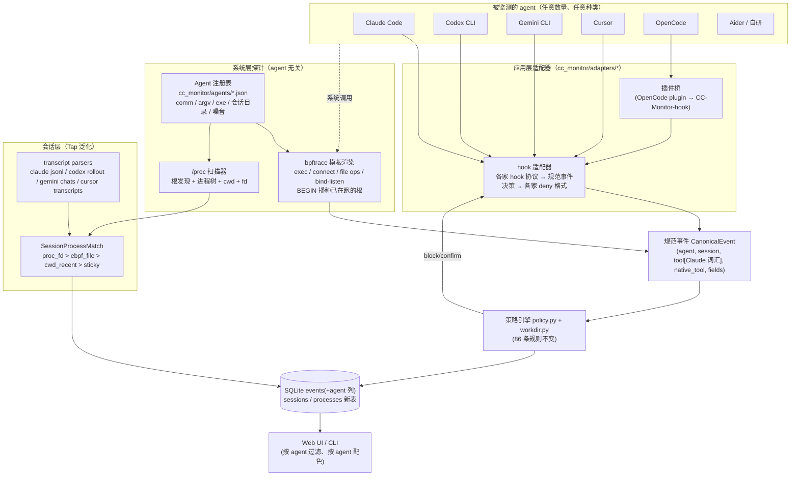

# CC-Monitor 检测面扩展技术方案：从"只看 Claude Code"到"看所有本机 AI Agent"

> 状态：2026-09-18 起草；同日在 `dev` 分支实施了 Phase A（注册表 + 五个 hook 适配器 + installer +
> 存储/规则/CLI/Web UI 的 agent 维度）和 Phase B 的前半段（探针模板化、`/proc` 播种、运行中发现
> 新根后重启、macOS 探针按注册表认进程）。同日稍后又完成了 Phase B 后半（文件级探点、监听端口、
> `CC-Monitor run --` 显式绑定，目录 fd 跟踪解决了相对路径解析，比 agentsight 更进一步）。**未实施**：Phase C（其它 agent 的会话文件解析、
> `sessions`/`processes` 表、带置信度的会话↔进程匹配）、Phase D（TLS 元数据、OTel、BCC 后端）。
> 各家 hook 协议按官方文档实现，本机只有 Claude Code 可实测，§8 的待验证事项仍然有效。配套阅读：[DESIGN.md](./DESIGN.md)（现有双层架构）、
> [SECURITY.md](./SECURITY.md)。参考对象：[eunomia-bpf/agentsight](https://github.com/eunomia-bpf/agentsight)
> （C / Rust / TypeScript，默认分支 `master`，2026-09-13 仍在活跃提交）及其论文
> [arXiv:2508.02736](https://arxiv.org/abs/2508.02736)。

## 0. 一页结论

**为什么现在只能检测 Claude Code**：不是某一处写死，而是三条主线同时耦合在 Claude Code 上——

1. **进程身份**：系统层探针进入监视集合的唯一入口是 `comm == "claude"`（`cc_monitor/probe_linux.bt:25`），
   macOS 探针和 Web UI 进程扫描同样只认可执行文件名 `claude`（`probe_darwin.py:55-57`、`webui/lib/processScan.js:40-44`）。
2. **应用层协议**：`install.py` 只会往 `~/.claude/settings.json` 写 Claude Code 的 9 个 hook 事件；`hook.py` 只认
   Claude Code 的 stdin 字段和输出格式（`exit 2` / `hookSpecificOutput.permissionDecision`）。
3. **工具词汇**：86 条规则的 `tools` 字段、`workdir.py` 的读写工具表、`webui/lib/audit.js` 里几十处 SQL 字面量，
   全部用的是 Claude Code 的工具名（`Bash` / `Read` / `Write` / `Edit` / `WebFetch` / `mcp__*`）。

外加两条次要耦合：会话记录路径（`~/.claude/projects/**/*.jsonl`，Claude Tap 的数据源）和账号/额度
（`~/.claude/.credentials.json`、`api.anthropic.com/api/oauth/usage`）。

**AgentSight 给我们的核心启发**（不是照搬它的代码，而是它的几条设计决策）：

| AgentSight 的做法 | 对 CC-Monitor 的意义 |
|---|---|
| **边界观测（boundary tracing）**：只在内核系统调用边界和 TLS 库边界看，不改 agent 一行代码，所以天然 agent 无关 | 我们的系统层探针本来就是这个思路，只是根进程识别写死了；把"识别谁是 agent"从 `.bt` 脚本里抽出来变成注册表，就是 agent 无关的 |
| **AgentRegistry + AgentSession + ProcessTree + SessionProcessMatch** 四个对象的最小模型，agent 差异全部收敛在 registry 里（`docs/design/view-session-process-model.md`） | 直接借用这套对象模型来组织新增代码，避免为每个 agent 复制一份 probe/hook/parser |
| **agent-native session 解析**：读 Claude / Codex / Gemini / Cursor 各自落盘的会话文件（`ext/session` crate），不抓包，macOS/Windows 也能用 | 这正是 Claude Tap 的路线，直接泛化成"每个 agent 一个 transcript parser" |
| **会话↔进程关联带证据和置信度**（`proc_fd` / `ebpf_file` / `cwd_recent` / `sticky`） | 我们目前靠 hook 里的 `cwd` 硬对 live 进程 cwd（`server.js:92-102`），多 agent 后要升级成这套带证据的匹配 |
| **文件变更类系统调用**（`unlinkat` / `renameat2` / `mkdirat` / `ftruncate` / `write` / `bind` / `listen`）+ 内核侧去重聚合 | 我们目前只有 `execve` / `connect`，对"不经 shell 直接写文件"的 agent（如 IDE 内置 agent、纯 API 写文件的 Python agent）是盲区 |
| **TLS 明文抓取**（`sslsniff`：`SSL_read/SSL_write` uprobe + 静态链接 BoringSSL/rustls 的字节模式匹配） | 可选、Linux only、高维护成本；作为"没有 hooks 也没有会话文件的 agent"的最后手段，而不是主路线 |
| `record -- <cmd>` 零配置启动 + 二进制解析器（PATH 查找、符号链接、shebang、`docker://`、`k8s://`） | 借用为 `CC-Monitor run -- <agent>` 显式绑定模式，解决 node/python 托管型 agent 进程名不可辨的问题 |
| 只观测、不拦截（它自己的市场文档明确说"第一版不要大面积 hard block"） | 我们的差异化恰恰是**拦截 + 审批台**；扩展检测面时必须保住这一点，所以应用层 hook 适配器仍是主力 |

**方案骨架**：引入一个 **Agent 注册表**（`cc_monitor/agents/*.json`）+ 三类 **适配器**（hook 适配器、探针根识别、会话解析器），
并把内部事件统一到 **以 Claude Code 工具词汇为规范词汇** 的规范事件（其它 agent 的工具名映射过来，原名保留在 `detail.native_tool`）。
这样 86 条规则、`workdir.py`、审批台、Web UI 分类基本不用动，就能一次接入 Codex CLI、Gemini CLI、Cursor、OpenCode，
再往后接 Aider 这类无 hook 的 agent 时只靠系统层 + 会话文件。

分四期落地，第一期（注册表 + Codex/Gemini hook 适配器）改动集中在 `hook.py` / `install.py` / `policy.py` 三个文件外加新增模块，
不动 SQLite 表结构以外的任何存储语义。

---

## 1. 现状分析：耦合点清单

下面按"要让第二个 agent 跑起来必须改哪里"的顺序列，file:line 以 HEAD `3be0768` 为准。

### 1.1 进程身份（系统层）

| 位置 | 现状 | 问题 |
|---|---|---|
| `cc_monitor/probe_linux.bt:23-32` | `sys_enter_execve` 里 `if (comm == "claude") @watch[pid]=1`，之后靠 `sched_process_fork` 传播 | 只有一个根名字；且依赖"agent 自己 exec 过一次"这个技巧才能把主进程放进 `@watch`（现有 DB 里 `os_net` 的 comm 有 `claude`、`HTTP Client`、`libuv-worker`，说明对 Claude Code 是成立的，但换一个不自我 exec 的 agent 就不成立） |
| `cc_monitor/probe.py:26` | `SHELL_COMMS` 假定 agent 通过 `<shell> -c` 跑命令 | Codex 用 `bash -lc`（同样成立），OpenCode / Gemini 也是 shell 起；Python agent 可能直接 `subprocess.run([...])` 不经 shell |
| `cc_monitor/probe.py:31-40` | `INFRA_NOISE_PATTERNS` 全是 Claude Code CLI 自身的基础设施噪音 | 每个 agent 有自己的噪音（Codex 的 `apply_patch`、Gemini 的 `git` 探测……），必须按 agent 配置 |
| `cc_monitor/probe.py:93-123` | 绕过判定只比对 `hook_pre` + `tool_name=='Bash'`，并假定 Claude Code 的 `eval '<cmd>'` 快照包装 | 需要按 agent 配置"包装剥离"规则，或改成比对规范事件里的 `command` |
| `cc_monitor/probe_darwin.py:55-57, 81` | `basename(argv[0]) == "claude"` | 同上 |
| `webui/lib/processScan.js:40-44` | `isClaudeProcess()` 精确匹配 `claude` | 同上 |

**本机实测的两个约束**（决定了根识别的设计）：

- `comm` 来自 `execve` 传入的文件名 basename，对 `#!/usr/bin/env node` 这类 shebang 脚本，因为 `env` 会再 exec 一次，
  最终 `comm` 是 `node` / `python3` 而不是脚本名（本机用一个 `#!/usr/bin/env python3` 脚本验证，`/proc/self/comm` 输出 `python3`）。
  npm 全局安装的 Gemini CLI、Codex 的 npm 启动器都是这种情况，**纯 `comm` 匹配识别不了它们**。
- 本机 bpftrace 是 v0.20.2，没有 `strcontains()`（0.21 才有），在 `.bt` 里对 argv 做子串匹配不可行。

### 1.2 应用层协议（hooks）

| 位置 | 现状 |
|---|---|
| `install.py:33-45, 116-127` | 9 个 Claude Code 事件（`PreToolUse` / `PostToolUse` / `PermissionRequest` / `UserPromptSubmit` / `SessionStart` / `SessionEnd` / `PreCompact` / `Stop` / `SubagentStop`），`{"matcher":"*","hooks":[{"type":"command","command":…}]}` 形状，写入 `~/.claude/settings.json`（`install.py:96`） |
| `cc_monitor/hook.py:7-14, 18-22` | stdin 读 `tool_name` / `tool_input` / `session_id` / `cwd` / `transcript_path` |
| `cc_monitor/hook.py:94-106, 186-195` | 拦截 = `exit 2` + stderr；我们接管过的确认 = stdout `hookSpecificOutput.permissionDecision=allow`；`PermissionRequest` 用 `decision.behavior` |
| `cc_monitor/hook.py:299-322` | 按 `argv[1]` 分发 9 种模式，全部对应 Claude Code 事件 |
| `bin/CC-Monitor-hook` | 单一入口，没有"我是哪个 agent 调用的"这个维度 |

### 1.3 工具词汇（规则引擎 / 越界检测 / Web UI）

| 位置 | 现状 |
|---|---|
| `cc_monitor/default_rules.json` | 86 条规则 `tools` 全用 Claude 名：`["Bash"]`×62、`["Write","Edit","NotebookEdit"]`×10、`["Read"]`×3、`WebFetch` / `WebSearch` / `AskUserQuestion` 各 1…… |
| `cc_monitor/policy.py:16-24` | `FIELD_CANDIDATES`：`command` / `file_path|path|notebook_path` / `url` / `content|new_string|new_source`，都是 Claude 工具的入参字段名 |
| `cc_monitor/policy.py:340-344` | `field=="tool_name"` 特判，靠 `mcp__<server>__<tool>` 命名抓可疑 MCP 工具 |
| `cc_monitor/workdir.py:56-58, 445` | `READ_TOOLS` / `WRITE_TOOLS` / `FILE_TOOL_FIELDS` / `if tool_name == "Bash"` |
| `cc_monitor/hook.py:143` | `PERMISSION_SUMMARY_FIELDS` |
| `cc_monitor/format.py:9-29` | `TOOL_LABELS` |
| `webui/lib/audit.js:466, 496, 885-896, 913, 1168-1409` | SQL 字面量 `tool_name = 'Bash'`、`IN ('Edit','MultiEdit','NotebookEdit')`、`LIKE 'mcp\_\_%'`…… |

结论：**这一层不要去改规则，而是让其它 agent 的工具名在进入引擎前映射成 Claude 名**。Claude Code 的工具词汇是几家里最细
（区分 Read/Glob/Grep、Write/Edit/NotebookEdit、WebFetch/WebSearch、Task/Agent），其它 agent 的词汇都能无损映射进来；反过来不行。

### 1.4 会话记录与账号（次要耦合）

| 位置 | 现状 |
|---|---|
| `cc_monitor/transcript.py`、`webui/lib/transcript.js`、`webui/lib/staleSessions.js:11` | 只解析 `~/.claude/projects/**/<session>.jsonl` 的 `user` / `assistant` / `attachment` 三种行 |
| `webui/lib/credentials.js:23-24, 74`、`webui/lib/usage.js:15-16, 93`、`webui/lib/account.js:13, 81, 90` | Anthropic OAuth 凭证与额度接口 |
| `cc_monitor/workdir.py:69, 77, 186-188` | `HOME_IGNORE=(".claude/projects",)`、`PROJECT_MARKERS` 含 `CLAUDE.md`/`.claude`、读 `.claude/settings*.json` 的 `additionalDirectories` |
| `cc_monitor/default_rules.json:867-880, 776, 791` | `claude_config_tamper`、`history_read` 的正则里写死 `.claude/...` 路径 |
| `webui/lib/sessions.js:24-30, 93-100, 118` | PTY 里自动敲 `claude`、剥 `CLAUDE_CODE_*` 环境变量、自动回答"trust this folder" |

### 1.5 检测能力本身的盲区（与 agent 无关，但扩面时要一起补）

- 系统层只有 `execve` + `connect` + TCP 字节数，没有文件级系统调用。任何不经 shell 的写文件（agent 进程内直接 `open(O_WRONLY)`）
  在系统层不可见，只能靠 hook。对 Claude Code 这是可接受的（Write/Edit 有 hook），但对没有文件 hook 的 agent 就是盲区。
- 没有 `bind` / `listen`：agent 起了一个本地监听端口（反连中转、调试服务）看不到。
- 探针启动前已经在跑的 agent 进程树不会进入 `@watch`（没有 BEGIN 播种）。
- `verify` 的绕过判定粒度是"顶层 shell 命令有没有对应 hook 记录"，没有把 `os_exec` 事件归到具体 session，多 agent 并行时会串。

---

## 2. AgentSight 深度分析

### 2.1 它是什么

定位（引其自己的话）："lightweight system-level observability for AI Agents"——**只观测、归因、留证据，不做拦截**。
核心论点是"语义鸿沟"：SDK/日志层知道 agent *想*做什么，EDR 层知道机器*发生*了什么，两边对不上；解法是在两个稳定边界观测：
内核系统调用边界（进程 / 文件 / 网络）和 TLS 库边界（明文 prompt / response），再用时间和进程树把两边关联起来。

### 2.2 组件与探针清单（按仓库目录）

| 目录 | 语言 | 内容 |
|---|---|---|
| `bpf/process.bpf.c` + `process_ext/*.h` | C (libbpf CO-RE) | `tp/sched/sched_process_exec`、`sched_process_exit`、`sys_enter_openat/open`、`uretprobe:/usr/bin/bash:readline`；扩展头：`unlinkat/unlink/renameat2/renameat/rename/mkdirat/mkdir/ftruncate/chdir`（`bpf_fs.h`）、`bind/listen/connect`（`bpf_net.h`）、`write/pwrite64/writev` 进出各一（`bpf_write.h`）、内存/CPU/信号/COW 统计 |
| `bpf/process_filter.h` | C | 用户态 PID 哈希表（4096 槽、线性探测）维护"被跟踪进程集合"，三种过滤模式（all / proc / filter），`-c "claude,python,node"` 逗号分隔 comm 列表 |
| `bpf/sslsniff.bpf.c` + `sslsniff.c` | C | `uprobe/uretprobe SSL_read / SSL_write / SSL_read_ex / SSL_write_ex / do_handshake`；对符号被剥离的静态链接库用**字节模式匹配**找函数偏移：BoringSSL（Claude Code / Bun，模式"来自 Bun v1.3.x profile build"）、rustls（Codex、Grok，`codex_offsets.h` 里是 rustc 1.92 生成的函数序言字节）；也支持 GnuTLS / NSS |
| `bpf/stdiocap` | C | 抓指定 PID 的 stdin/stdout/stderr 载荷，用于本地 stdio MCP server |
| `bpf/browsertrace` | C | Chrome/Firefox 明文 |
| `agentsight-capture/src/binary_resolver.rs` | Rust | `record -- <cmd>` 的二进制解析：PATH 查找（`sudo` 下回退到 `$SUDO_USER` 的 `~/.local/bin`、`~/.nvm`）、符号链接、shebang → 解释器 ELF、Codex npm 启动器 → `@openai/codex-linux-x64/vendor/codex-x86_64-unknown-linux-musl`、`docker://` / `k8s://` → 容器进程树里第一个内嵌 SSL 的进程 |
| `ext/analysis/src/analyzers/*` | Rust | 流水线：`ssl_filter` → `http_decompressor` → `http_parser`（含 HTTP/2 帧）→ `sse_processor`（合并流式 SSE 块）→ `auth_header_remover` → `materializing`；`sinks/sqlite.rs`、`sinks/otel.rs` |
| `ext/session/`（`agent-session` crate） | Rust | agent 原生会话发现与解析：`~/.claude/projects`、`$CODEX_HOME/sessions/YYYY/MM/DD/rollout-*.jsonl`、`~/.gemini/tmp/<hash>/chats/session-*.json`、`~/.cursor/projects/<ws>/agent-transcripts/`（+ Cursor 的 `state.vscdb`）；统一成 prompts / responses / tools / files / tokens 的 IR；`process_match.rs` 做会话↔进程树匹配 |
| `collector/` | Rust | CLI（`record` / `top` / `report` / `vis` / `debug trace`）、内存物化视图、Web 服务（`127.0.0.1:7395`）、`export` 快照 |
| `frontend/` | TypeScript (Next.js) | overview / sessions / timeline / tree / logs / metrics 六个视图 |
| `controller/` | TypeScript | 多机中继 / 控制面（企业向，与本方案无关） |
| `ext/pprof/` | Rust + Go | 把 token / 文件 / 网络 / 时间做成 pprof 火焰图 |

### 2.3 它怎么做到 agent 无关（值得抄的四个设计决策）

**(a) 根进程识别是数据不是代码。** `-c` 传 comm 列表，`record -- <cmd>` 自动推导；`process_filter.h` 维护 PID 集合，
子进程通过 `sched_process_exec` 时查父 PID 是否在集合里继承。我们的 `.bt` 把 `"claude"` 写死在探针里，是同一机制的退化版。

**(b) 会话文件优先于抓包。** 文档里明确写 Cursor 这类 Electron IDE 三重不可行（平台、attach 到 Electron Framework、Connect/protobuf
载荷不是 JSON），于是走"agent-native session path"——读 IDE 自己写的会话文件。这条路"不需要 eBPF、不需要 sudo、macOS/Windows 都能用"。
我们的 Claude Tap 就是这条路，只是只写了 Claude 一种格式。

**(c) 会话↔进程匹配带证据类型和置信度。** `SessionProcessMatch { session_id, process_tree_id, confidence, evidence_type }`，
证据类型：`proc_fd`（`/proc/<pid>/fd` 里打开着会话文件）> `ebpf_file`（eBPF 看到进程写过会话文件）> `cwd_recent`（cwd 相同且时间接近）> `sticky`（上次高置信绑定仍有效）。
PID 复用靠 `pid + starttime_ticks` 做身份。

**(d) 事件模型扁平、视图物化。** `raw Event → normalize_event() → MaterializedView → Snapshot / SQLite / API`，
进程树存扁平节点 + 父引用而不是递归结构。我们的 `events` 单表 + `detail` JSON 也是扁平的，可以直接加列。

### 2.4 它没有、而我们有的（扩面时必须保住的差异化）

- **实时拦截与人工确认**：AgentSight 的 `record-only / warn / require-approval / deny` 四档只是市场文档里的提案，代码里没有 enforcement。
  CC-Monitor 的 `block / confirm / notify / log` 四种 action + tty/网页/桌面三路审批竞速是现成的。
- **规则库与越界检测**：86 条带中英文说明的规则、`workdir.py` 的 cwd 感知分层，AgentSight 都没有（它的 `policy suggest` 也是提案）。
- **应用层 hook 深度集成**：它完全不用 hook。hook 的价值是"在动作发生之前就能 deny"，系统层做不到（eBPF 除非上 LSM 否则只能事后看）。
- **无外部依赖的核心**：`cc_monitor/` 纯标准库；AgentSight 要 Rust 工具链 + libbpf + clang 编译 BPF。

### 2.5 它的 TLS 明文抓取值不值得做

本机验证：Claude Code 2.1.276 的二进制（`~/.local/share/claude/versions/2.1.276`，Bun 静态链接 BoringSSL）`nm` 里 SSL 相关符号为 0，
只有 `.symtab` 里 1234 个导入符号。要 attach 只能走 AgentSight 那种"函数序言字节模式"，而它的模式注明"derived from Bun v1.3.x profile builds"，
Codex 的 rustls 模式注明"rustc 1.92"——**每次 Bun / rustc 升级都可能失效**，这是持续维护负担。

而我们已经有不抓包的等价物：Claude Tap 从会话文件重建完整对话（含 tool_use / tool_result / usage / model），Codex / Gemini / Cursor 也都有会话文件。
TLS 抓取只在两种情况下有独立价值：(1) agent 不落盘会话（自研 Python agent、容器里的 agent）；(2) 要抓"agent 声称的"和"实际发出的" API 请求不一致（例如被注入后偷偷带走的数据在 request body 里）。

**结论：TLS 层做成可选插件（Phase D），Linux only，默认关闭，且只保留元数据（域名、路径、方法、大小、模型名、token 数），不默认落明文 prompt。**
AgentSight 自己的安全市场文档也建议"默认最小化内容捕获，把 OS effect 证据作为核心"。

---

## 3. 目标 agent 与各自可接入的面

以下是第一批要覆盖的 agent 及每个 agent 三条接入面的现状（"待验证"表示本机没装、只查了官方文档，实施前要实测）。

| Agent | 进程形态（Linux） | 应用层 hook | 会话文件 | TLS 库 |
|---|---|---|---|---|
| **Claude Code** | Bun 单文件 ELF，`comm=claude`；子线程 `HTTP Client`、`libuv-worker` | `~/.claude/settings.json` 9 事件（已接） | `~/.claude/projects/<cwd-hash>/<session>.jsonl` | BoringSSL 静态，无符号 |
| **Codex CLI** | npm 启动器（`comm=node`）→ 原生子进程 `codex-x86_64-unknown-linux-musl`（`comm` 截断为 `codex-x86_64-un`）；也可能直接装原生二进制 `codex` | `~/.codex/hooks.json` 或 `config.toml [hooks]`；事件 `PreToolUse/PostToolUse/PermissionRequest/UserPromptSubmit/SessionStart/SessionEnd/PreCompact/PostCompact/SubagentStart/SubagentStop/Stop/Interrupt`；stdin 字段与 Claude Code 同名（`tool_name`=`Bash`/`mcp__*`、`tool_input.command`、`session_id`、`cwd`、`transcript_path`、`hook_event_name`、`permission_mode`，多一个 `turn_id`）；deny = `hookSpecificOutput.permissionDecision=deny` 或 `exit 2`；**不支持 `ask`**；需 `[features] hooks` 开关（默认值待验证） | `$CODEX_HOME/sessions/YYYY/MM/DD/rollout-*.jsonl`，另有 `history.jsonl` | rustls 静态 |
| **Gemini CLI** | npm 包，`comm=node`，argv 含 `@google/gemini-cli/dist/index.js` | `~/.gemini/settings.json` 或项目 `.gemini/settings.json`；事件 `BeforeTool/AfterTool/BeforeAgent/AfterAgent/BeforeModel/AfterModel/BeforeToolSelection/SessionStart/SessionEnd/PreCompress/Notification`；stdin `session_id/transcript_path/cwd/hook_event_name/timestamp/tool_name/tool_input(/tool_response)/mcp_context`；工具名 `run_shell_command/read_file/write_file/replace/web_fetch/mcp_<server>_<tool>`；deny = `{"decision":"deny","reason":…}`（exit 0 或 2）；`BeforeTool` 可改写 `tool_input` | `~/.gemini/tmp/<project-hash>/chats/session-*.json` | Node 内置 OpenSSL 静态 |
| **Cursor（IDE Agent）** | Electron，网络在 helper 进程；eBPF 路线不可行（AgentSight 文档结论） | `~/.cursor/hooks.json`（`"version":1`）或项目 `.cursor/hooks.json`；事件 `beforeShellExecution/afterShellExecution/beforeMCPExecution/afterMCPExecution/beforeReadFile/afterFileEdit/beforeSubmitPrompt/preToolUse/postToolUse/sessionStart/sessionEnd/subagentStart/subagentStop/stop/afterAgentResponse`；stdin 基础字段 `conversation_id/generation_id/model/hook_event_name/cursor_version/workspace_roots/user_email/transcript_path`，`beforeShellExecution` 给 `command/cwd`，`afterFileEdit` 给 `file_path/edits[]`，`beforeReadFile` 给 `file_path/content`；输出 `{"permission":"allow|deny|ask","user_message","agent_message"}`，`exit 2` = deny，其它非 0 fail-open | `~/.cursor/projects/<ws>/agent-transcripts/`（jsonl）+ `state.vscdb`（模型、时间、cwd、旧版本的 token） | 不适用 |
| **Cursor CLI**（`cursor-agent`） | 待验证 | 官方文档只说 cloud agents 会读仓库 `.cursor/hooks.json`，CLI 是否本地执行 hook **待验证** | 同上 | 待验证 |
| **OpenCode** | Bun 编译单文件，`comm=opencode` | 无 command hook；有 **插件**（`.opencode/plugins/` 或 `~/.config/opencode/plugins/`，JS/TS）：`tool.execute.before/after`、`permission.asked/replied`，`before` 里 `throw` 可阻断、可改 `output.args`；另有 `opencode.json` 的 `permission` 块（`edit/bash/webfetch` 的 `ask/allow/deny` + pattern） | 存储目录待验证（文档只给了配置目录 `~/.config/opencode/`） | BoringSSL（Bun）静态 |
| **Aider** | Python，`comm=python3`（pipx 下也是），argv 含 `aider` | 无 hook | 项目目录下 `.aider.chat.history.md`（Markdown，非结构化） | 动态 `libssl.so`（CPython `_ssl`） |
| **通用 / 自研 agent**（LangChain 脚本、容器里的 OpenClaw 等） | 任意 | 无 | 无 | 任意 |

从表里可以直接读出分层策略：

- **第一梯队（有 hook、有会话文件）**：Codex CLI、Gemini CLI、Cursor IDE——三层全能接，且 Codex 的 hook 协议几乎就是 Claude Code 协议，适配成本最低。
- **第二梯队（有插件或权限配置，无 command hook）**：OpenCode——需要写一个几十行的 JS 插件把 `tool.execute.before` 转发给 `CC-Monitor-hook`。
- **第三梯队（什么都没有）**：Aider、自研脚本、容器 agent——只能系统层 + 显式 `CC-Monitor run --` 绑定，规则只对 `Bash`（exec）和文件系统调用生效。

---

## 4. 目标架构



### 4.1 规范事件（CanonicalEvent）与工具词汇

规范工具词汇 = Claude Code 的工具名。理由见 §1.3。适配器必须产出：

```
CanonicalEvent
  agent          "claude-code" | "codex" | "gemini-cli" | "cursor" | "opencode" | "aider" | "generic"
  agent_version  可选
  session_id     agent 自己的会话 id（Cursor 用 conversation_id）
  cwd
  transcript_path 可选
  hook_event     规范生命周期名：pre_tool | post_tool | permission | prompt | session_start | session_end | pre_compact | stop | subagent_stop
  tool_name      规范名（Bash / Read / Write / Edit / NotebookEdit / Glob / Grep / WebFetch / WebSearch / Task / AskUserQuestion / mcp__<server>__<tool>）
  tool_input     规范字段（command / file_path / content / new_string / url / query / prompt …）
  native_tool    原始工具名（run_shell_command / apply_patch / beforeShellExecution …）
  native_input   原始入参（原样保留进 detail，便于取证）
```

工具名映射表（放在各 agent 的注册表 JSON 里，不放代码）：

| 规范名 | Codex | Gemini CLI | Cursor | OpenCode |
|---|---|---|---|---|
| `Bash` | `Bash`（同名）、`shell` | `run_shell_command` | `beforeShellExecution`（事件即工具） | `bash` |
| `Read` | `Read`（若有） | `read_file` / `read_many_files` | `beforeReadFile` | `read` |
| `Write` | `Write` | `write_file` | — | `write` |
| `Edit` | `Edit` / `apply_patch`（patch 文本 → 逐文件 `file_path` + `content`） | `replace` | `afterFileEdit`（事后，只能记录不能拦） | `edit` / `patch` |
| `Glob` / `Grep` | — | `glob` / `search_file_content` | — | `glob` / `grep` |
| `WebFetch` | `WebFetch`（若有） | `web_fetch` | — | `webfetch` |
| `WebSearch` | — | `google_web_search` | — | — |
| `mcp__S__T` | `mcp__S__T`（同名） | `mcp_S_T` → 转成双下划线 | `beforeMCPExecution` 的 `mcp_server_name` + `tool_name` | `S_T`（待验证） |
| `Task` | `SubagentStart` 事件 | — | `subagentStart` 事件 | — |

映射不到的原始工具名一律保留原名进入引擎（只会命中 `tools:["*"]` 和 `field=="tool_name"` 的规则），并计入"未知工具"统计，这样新工具不会被静默丢掉。

`policy.py:16-24` 的 `FIELD_CANDIDATES` 在映射后可以不变；Codex 的 `apply_patch` 这种"一个调用改多个文件"的入参，
适配器要拆成多条规范事件（每个文件一条），否则 `workdir.py` 的路径提取和 `file_path` 类规则都失效。

### 4.2 Agent 注册表

新增 `cc_monitor/agents/<id>.json`，每个 agent 一份，示例（Gemini CLI）：

```json
{
  "id": "gemini-cli",
  "display": "Gemini CLI",
  "process": {
    "comm": ["gemini"],
    "argv_patterns": ["@google/gemini-cli/dist/index\\.js", "(^|/)gemini(\\.js)?( |$)"],
    "exe_basename": ["gemini"],
    "infra_noise": ["^git (rev-parse|status|diff)"],
    "shell_wrappers": ["^(ba|z|da)?sh -c "]
  },
  "hooks": {
    "protocol": "gemini",
    "config_paths": ["~/.gemini/settings.json", "<project>/.gemini/settings.json"],
    "events": {"BeforeTool": "pre", "AfterTool": "post", "BeforeAgent": "prompt",
               "SessionStart": "session_start", "SessionEnd": "session_end", "PreCompress": "precompact"}
  },
  "tools": {"run_shell_command": "Bash", "read_file": "Read", "read_many_files": "Read",
            "write_file": "Write", "replace": "Edit", "glob": "Glob", "search_file_content": "Grep",
            "web_fetch": "WebFetch", "google_web_search": "WebSearch"},
  "sessions": {"glob": "~/.gemini/tmp/*/chats/session-*.json", "parser": "gemini_chats"},
  "home_ignore": [".gemini/tmp"],
  "project_markers": ["GEMINI.md", ".gemini"],
  "config_tamper_paths": ["(^|/)\\.gemini/settings\\.json$", "(^|/)GEMINI\\.md$"]
}
```

注册表驱动的四处消费者：

1. **hook 适配器**：按 `hooks.protocol` 选解析器和输出格式，按 `tools` 映射工具名。
2. **探针**：`process.comm` 渲染进 `.bt` 模板；`argv_patterns` 给 `/proc` 扫描器和 `CC-Monitor run --` 用；`infra_noise` / `shell_wrappers` 替代 `probe.py:26, 31-40` 的常量。
3. **workdir**：`home_ignore` 并入 `HOME_IGNORE`，`project_markers` 并入 `PROJECT_MARKERS`。
4. **规则**：`config_tamper_paths` 由 `claude_config_tamper` 规则的泛化版（`agent_config_tamper`）在加载时拼进正则；`history_read` 同理。

### 4.3 应用层：hook 适配器

`hook.py` 的改法是把"读 stdin → 判定 → 输出"拆成三段，中间那段（`handle_pre` 的判定逻辑、`notify.confirm`、`storage.log_event`）不动：

```
bin/CC-Monitor-hook <mode> [--agent <id>]
        │
        ▼
adapters/<protocol>.parse(stdin_json, mode) → CanonicalEvent
        │
        ▼
core.decide(event) → Decision {allowed|blocked, handled_via_confirm, reason}
        │
        ▼
adapters/<protocol>.emit(decision, mode) → stdout JSON / exit code
```

`--agent` 由 `install.py` 在注册 hook 命令时写死（`"command": "CC-Monitor-hook pre --agent codex"`），
这样即使两家 stdin 字段同名也不会靠猜。没有 `--agent` 时默认 `claude-code`，完全向后兼容现有安装。

各协议 `emit` 的差异（全部来自官方文档，实施时逐个实测）：

| 协议 | 拦截 | 我们接管过的确认（跳过原生弹窗） | `PermissionRequest` 类事件 |
|---|---|---|---|
| claude | `exit 2` + stderr | `hookSpecificOutput.permissionDecision=allow` | `decision.behavior=allow/deny` |
| codex | 同 claude（`permissionDecision=deny` 或 `exit 2`） | 同 claude；**无 `ask`**，所以 `confirm` 规则要么我们自己问完给 allow/deny，要么放行让 Codex 自己的 approval_policy 处理 | 有 `PermissionRequest` 事件，格式待实测 |
| gemini | `{"decision":"deny","reason":…}` | `{"decision":"allow"}`（Gemini 没有"跳过原生确认"语义，待实测） | 无 |
| cursor | `{"permission":"deny","user_message":…}` 或 `exit 2` | `{"permission":"allow"}` | `permission: "ask"` 可以把决定交还 Cursor 弹窗 |
| opencode（插件桥） | 插件里 `throw new Error(reason)` | 插件不 throw | `permission.asked` 事件只读 |

`install.py` 泛化为 `install.py --agent codex|gemini|cursor|opencode|all`：

- codex：写 `~/.codex/hooks.json`（形状与 Claude 的 `hooks` 块一致），并检查 `config.toml` 的 `[features] hooks`。
- gemini：写 `~/.gemini/settings.json` 的 `hooks` 块（`"sequential": false`，`timeout` 给足审批竞速的 90 s）。
- cursor：写 `~/.cursor/hooks.json`（`"version": 1`）。
- opencode：把 `cc_monitor/adapters/opencode_plugin.js` 复制到 `~/.config/opencode/plugins/cc-monitor.js`。插件内容：在 `tool.execute.before` 里 `spawnSync("CC-Monitor-hook", ["pre","--agent","opencode"], {input: JSON.stringify(...)})`，退出码 2 则 `throw`。

`merge_hooks()`（`install.py:22-45`）的"幂等、不覆盖已有条目"逻辑保留，只是目标文件和事件表从注册表来。

### 4.4 系统层：探针泛化

**根识别改成三路合一**（对应 §1.1 的两个实测约束）：

1. **`comm` 白名单**：从所有注册表的 `process.comm` 收集，渲染进 `.bt` 模板：
   `if (comm == "claude" || comm == "codex" || comm == "opencode" || strncmp(comm, "codex-x86_64", 12) == 0) { @watch[pid] = 1; }`
   覆盖所有编译型 agent。
2. **BEGIN 播种**：探针启动时 `probe.py` 扫一遍 `/proc`，用 `exe_basename` + `argv_patterns` 找出已经在跑的根进程及其全部后代，
   渲染成 `BEGIN { @watch[1234] = 1; @watch[1250] = 1; ... }`。这同时修掉"探针启动前已在跑的 agent 看不到"和"主进程必须自我 exec 一次"两个既有问题。
3. **运行中发现**：`probe.py` 每 2 s 扫一次 `/proc`（只看新 PID，成本很低），发现匹配 `argv_patterns` 但不在监视集合里的根进程
   （典型：探针启动后用户新开了一个 `gemini`，它的 `comm` 是 `node`），就**重新渲染模板并重启 bpftrace**，播种集合 = 上一轮已知 + 新根的后代。
   重启窗口约 1 s，期间事件丢失，这是 bpftrace 没有用户态可写 map 的代价；`.bt` 输出改为在 READY 后带一个 epoch 号，`probe.py` 据此做重启前后的去重。

   *中期替代方案*：改用 BCC（`python3-bpfcc`）或 libbpf CO-RE 编译的探针，用户态直接 `bpf_map_update_elem` 往 `watch` map 里塞 PID，
   不需要重启。代价是引入 kernel-headers / BTF 依赖和一份 C 代码，接近 AgentSight `bpf/process.bpf.c` + `process_filter.h` 的做法。
   本方案第一版不走这条路，把接口留好（`probe.py` 里"根集合变更"抽象成一个方法，bpftrace 实现是重启，BCC 实现是写 map）。

4. **显式绑定**：`CC-Monitor run [--agent <id>] -- <cmd...>`，借 AgentSight `record --` 的形态：解析 `<cmd>`（PATH、符号链接、shebang，
   逻辑照抄 `binary_resolver.rs` 的前三条），fork 出 agent 后把 PID 和 agent id 通过一个 Unix socket 报给正在跑的探针（走第 3 路的"根集合变更"接口），
   同时给子进程设 `CC_MONITOR_AGENT=<id>` `CC_MONITOR_SESSION=<uuid>`，hook 适配器读到就能把 hook 事件和系统层事件用同一个 session 键关联。
   对 Aider / 自研脚本这类什么都没有的 agent，这是唯一可靠的入口。

**新增探针点**（借 AgentSight `process_ext`，全部按 `@watch[pid]` 过滤，只看被监视树）：

| 探针 | 事件 | 用途 |
|---|---|---|
| `tracepoint:syscalls:sys_enter_openat` 带 `O_WRONLY|O_RDWR|O_CREAT|O_TRUNC` | `FILE_W path` | 不经 shell 的写文件（IDE agent、Python agent）；跟 hook 的 Write/Edit 交叉验证 |
| `sys_enter_unlinkat` / `sys_enter_renameat2` / `sys_enter_mkdirat` | `FILE_RM` / `FILE_MV` / `FILE_MKDIR` | 删除、覆盖、重命名——最需要留证据的操作 |
| `sys_enter_bind` / `sys_enter_listen` | `LISTEN port` | agent 起监听端口 |
| `uprobe:libc:getaddrinfo`、`sys_enter_connect`、`tcp_sendmsg` / `tcp_cleanup_rbuf` | 现有 | 不变 |

文件事件噪音控制照抄 AgentSight `FILE_OPS_FILTERING_DESIGN.md` 的第一阶段：路径前缀排除（`/proc`、`/sys`、`/dev`、`/usr/lib`、`*.so`、
`node_modules/.cache`、agent 自己的状态目录如 `~/.claude/projects`）、只报写不报读、同 `(pid, path, op)` 60 s 滑动窗口内首个立即报、
后续聚合计数。读操作完全不上系统层（hook 层已有 Read 事件，系统层 `openat(O_RDONLY)` 的量级是每秒上千条）。

**事件归属**：`os_exec` / `os_net` / 新的 `os_file` 事件写库时带 `agent` 和 `root_pid`（哪个根进程的后代），
再由 §4.6 的匹配器补 `session_id`。`verify` 的比对从"全库最近 300 条 hook_pre"缩到"同 agent、同 session 的 hook_pre"，多 agent 并行不再串。

**macOS**：`probe_darwin.py` 的 `_is_claude_argv` 改为读注册表（`exe_basename` + `argv_patterns`），进程树 BFS 不变。
文件 / exec 级观测仍需 Endpoint Security Framework，本方案不处理，维持 DESIGN.md §6 的既有声明。

### 4.5 会话层：Tap 泛化为多格式解析器

`cc_monitor/transcript.py` 拆成 `cc_monitor/transcripts/{claude_jsonl,codex_rollout,gemini_chats,cursor_transcript}.py`，
统一输出现有 `describe_entry()` 的结构（`kind` / `blocks[]` / `usage` / `model`），CLI `tap` 和 Web UI `/api/transcript` 不用改渲染。
格式细节以 AgentSight `ext/session/src/parser.rs` 为对照实现（它已经踩过四种格式的坑，包括 Cursor 的子代理会话折叠进父会话、
Codex `rollout-*.jsonl` 只读尾部 1 MiB 做摘要、Gemini 会话 JSON 不是 jsonl）。

会话发现（`staleSessions.js` 的泛化）：按注册表 `sessions.glob` 扫描，产出 `AgentSession {agent, id, path, cwd?, start, end, mtime}`，
写入新表 `sessions`。这一层**不需要 hook 也不需要 root**，是 macOS 和"hook 没装"场景下的基础可见性。

### 4.6 会话 ↔ 进程关联

照 AgentSight 的 `SessionProcessMatch` 实现，放在 `cc_monitor/procmatch.py`，由 `/proc` 扫描器每 2 s 调一次：

| 证据 | 置信度 | 来源 |
|---|---|---|
| `env`：进程环境里有 `CC_MONITOR_SESSION`（`run --` 模式）或 Claude Code 自带的 `CLAUDE_*` | 0.99 | `/proc/<pid>/environ`（同用户可读） |
| `proc_fd`：进程 fd 里打开着某个会话文件 | 0.95 | `/proc/<pid>/fd` |
| `ebpf_file`：新增的 `openat(O_WRONLY)` 探针看到进程写了会话文件 | 0.90 | 系统层 |
| `hook`：hook 事件带 `session_id` + `cwd`，且 cwd 与某根进程的 cwd 相同 | 0.80 | 现有 `server.js:92-102` 的逻辑 |
| `cwd_recent`：cwd 相同且会话 mtime 与进程启动时间接近 | 0.60 | `/proc/<pid>/cwd` + `stat` |
| `sticky`：上一轮高置信绑定仍有效 | 继承 | 内存 |

进程身份用 `(pid, starttime_ticks)`（`/proc/<pid>/stat` 第 22 字段）防 PID 复用。结果写 `processes` 表，Web UI 的"进程"面板和会话生命体征直接读这张表，
替代现在每次请求 `ps -A` 再猜的 `processScan.js`。

### 4.7 存储改动

全部是加列 / 加表，沿用 `storage.py:95-109` 的 `ALTER TABLE ... ADD COLUMN` 幂等升级方式：

```sql
ALTER TABLE events ADD COLUMN agent TEXT;          -- 默认 'claude-code'，老数据回填
ALTER TABLE events ADD COLUMN native_tool TEXT;    -- 原始工具名
ALTER TABLE events ADD COLUMN root_pid INTEGER;    -- os_* 事件：所属根进程
ALTER TABLE pending_approvals ADD COLUMN agent TEXT;
ALTER TABLE session_always_allow ADD COLUMN agent TEXT;   -- 主键语义上加 agent，实际用 (agent||session_id) 拼

CREATE TABLE IF NOT EXISTS sessions (
  agent TEXT NOT NULL, session_id TEXT NOT NULL, transcript_path TEXT, cwd TEXT,
  started_at TEXT, ended_at TEXT, last_seen TEXT, model TEXT,
  PRIMARY KEY (agent, session_id));

CREATE TABLE IF NOT EXISTS processes (
  pid INTEGER NOT NULL, starttime_ticks INTEGER NOT NULL, ppid INTEGER, root_pid INTEGER,
  agent TEXT, comm TEXT, argv TEXT, cwd TEXT, uid INTEGER,
  first_seen TEXT, last_seen TEXT, exited_at TEXT,
  session_id TEXT, match_confidence REAL, match_evidence TEXT,
  PRIMARY KEY (pid, starttime_ticks));

CREATE INDEX IF NOT EXISTS idx_events_agent_session_ts ON events(agent, session_id, ts);
```

`source` 取值新增 `os_file`；`detail` JSON 里 `native_input` 保留原始入参。`network_traffic` 表加 `agent` 列（按 agent 看出网目的地是最直观的扩面收益）。

### 4.8 规则引擎改动

- `evaluate(tool_name, tool_input, rules, cwd)` 签名加可选 `agent=None`；规则 JSON 新增可选字段 `agents: ["codex"]`（缺省 = 所有 agent），
  给以后写 agent 特定规则留口子，第一版不新增任何 agent 特定规则。
- `claude_config_tamper`（`default_rules.json:867-880`）泛化为 `agent_config_tamper`：正则由注册表 `config_tamper_paths` 拼接（`.claude/settings*.json`、
  `.codex/hooks.json` / `config.toml`、`.gemini/settings.json`、`.cursor/hooks.json`、`~/.config/opencode/plugins/`……）。
  这条规则的意义在多 agent 后更大：**篡改任何一家的 hook 配置都等于关掉那一家的应用层监测**。
- `kill_monitoring_process`（`default_rules.json:370-378`）加上 `cc-monitor.js`（OpenCode 插件文件名）。
- `history_read` 系列把 `.claude/history.jsonl` 扩到 `.codex/history.jsonl`、`.gemini/tmp`、`.cursor/projects`。
- `tests/test_doc_rule_count.py` 的 86 这个数字会变，README/官网 hero 区一起改。

### 4.9 Web UI 改动

- 所有列表 / 统计接口加 `?agent=` 过滤；首页统计卡按 agent 分组显示（一个 agent 时退化为现状）。
- 顶栏"进程"面板改读 `processes` 表；`/api/claude-processes` 保留为别名，新增 `/api/agent-processes`。
- 会话列表来自 `sessions` 表，每行带 agent 徽标；Tap 页按 agent 选解析器。
- 额度卡：只对 `claude-code` 有效，其它 agent 显示"该 agent 不提供本地额度接口"（Codex 的 `rollout` 里有订阅信息，AgentSight `codex_latest_subscription()` 解析过，可作为二期）。
- PTY 终端"新建会话"增加 agent 选择（`claude` / `codex` / `gemini` / `opencode`），`sessions.js:118` 敲的命令从注册表取；剥环境变量的列表按 agent 配置。
- `audit.js` 的 SQL 字面量不用改（工具名已归一化），但 `bypass_count` 要按 `(agent, session_id)` 聚合。

---

## 5. 借鉴清单（逐项：AgentSight 的东西 → 我们怎么落地 → 优先级）

| # | AgentSight | CC-Monitor 落地方式 | 优先级 |
|---|---|---|---|
| 1 | `-c` comm 列表 + `record --` 自动推导根进程 | 注册表 `process.*` + `.bt` 模板渲染 + `CC-Monitor run --` | P0 |
| 2 | `agent-session` crate 的四种会话解析 | `cc_monitor/transcripts/*`，逐格式移植（Python 重写，不引 Rust） | P0（Codex、Gemini）/ P1（Cursor） |
| 3 | `SessionProcessMatch` 证据模型 | `cc_monitor/procmatch.py` + `processes` 表 | P1 |
| 4 | `process_ext` 的文件 / bind / listen 探针 + 60 s 去重聚合 | `.bt` 新增探点 + `probe.py` 聚合 | P1 |
| 5 | `binary_resolver.rs` 的 PATH / symlink / shebang / `$SUDO_USER` 解析 | `CC-Monitor run --` 和 `install.py` 的 agent 探测共用 | P1 |
| 6 | BEGIN 前的进程树扫描（`find_ssl_target_in_tree` 走 `/proc/<pid>/task/<pid>/children`） | `/proc` 扫描器 | P0（播种）|
| 7 | 用户态可写 PID map（`process_filter.h`） | 二期换 BCC/libbpf 时实现；一期用重启 bpftrace 模拟 | P2 |
| 8 | `sslsniff` TLS 明文 + BoringSSL/rustls 字节模式 | 可选插件 `cc_monitor/tls/`，默认关，只存元数据 | P3 |
| 9 | `stdiocap`（stdio MCP server 载荷） | 不做。MCP 调用在 hook 层已有 `mcp__*` 事件和参数，比抓 stdio 语义更清楚 | 不做 |
| 10 | `sinks/otel.rs` OpenTelemetry 导出 | `CC-Monitor export --otel <endpoint>`，把 events 映射成 span/log；给 SIEM 接入 | P2 |
| 11 | 物化视图 / `export` 快照 JSON（`docs/snapshot-schema.md`） | 现有 `archives.js` 已有 SQLite 备份快照，补一个 JSON 导出即可 | P2 |
| 12 | `docker://` / `k8s://` 容器内 agent | `run --` 支持 `docker://<name>`：`docker inspect` 拿 init PID，BFS 后代找根；探针本身在宿主机跑，不用改 | P2 |
| 13 | `policy suggest`（从历史行为推荐 allow/ask/deny） | 它自己也只是提案。我们有真实 `decision` 数据，做"最近 N 天 confirm 规则的批准率"报表就够，暂不做自动改规则 | P3 |
| 14 | 火焰图 / Agent Nebula 可视化 | 不做，与安全监测目标无关 | 不做 |
| 15 | "approval UI 显示真实 syscall 参数而非 agent 摘要"（其市场文档第 9 条） | 审批台已经显示 `matched_value`，补上同一时间窗系统层看到的 exec / connect / file 事件作为旁证 | P1 |

---

## 6. 分阶段实施

### Phase A：抽象层 + 第一批 hook 适配器（预计 1–2 周）

目标：Codex CLI 和 Gemini CLI 的应用层监测达到与 Claude Code 同等能力（规则、审批台、审计日志、越界检测）。

1. 新增 `cc_monitor/agents/{claude-code,codex,gemini-cli,cursor,opencode,aider}.json` 与 `cc_monitor/registry.py`（加载、校验、合并）。
2. 新增 `cc_monitor/adapters/{base,claude,codex,gemini,cursor}.py`；`hook.py` 改为 parse → decide → emit 三段，`decide` 就是现在 `handle_pre` 的中段。
3. `install.py --agent`；`bin/CC-Monitor-hook` 透传 `--agent`。
4. `storage.py`：`events.agent` / `native_tool` 列 + 回填；`pending_approvals.agent`；`session_always_allow` 键加 agent。
5. `policy.py`：`evaluate(..., agent=None)`；`agent_config_tamper` 规则；`workdir.py` 从注册表并入 `HOME_IGNORE` / `PROJECT_MARKERS`。
6. Web UI：`?agent=` 过滤、agent 徽标、审批台显示 agent。
7. 测试：每个适配器一组 fixture（官方文档示例 JSON → 期望的 CanonicalEvent；Decision → 期望的 stdout / exit code）；`test_doc_rule_count` 更新。

改动文件：`hook.py`、`install.py`、`policy.py`、`storage.py`、`workdir.py`、`default_rules.json`、`webui/server.js`、`webui/lib/audit.js`、`webui/public/app.js`；新增 `registry.py`、`adapters/`、`agents/`。

### Phase B：探针泛化 + 文件事件（预计 1–2 周）

1. `.bt` 改模板（`probe_linux.bt.tmpl`），`probe.py` 渲染：comm 白名单、BEGIN 播种、epoch。
2. `/proc` 扫描器（`cc_monitor/procscan.py`）：根发现、进程树、cwd、starttime；根集合变更 → 重启 bpftrace。
3. 新探点：`openat(写)` / `unlinkat` / `renameat2` / `mkdirat` / `bind` / `listen`；路径排除表；60 s 聚合。
4. `os_*` 事件带 `agent` / `root_pid`；`verify` 按 `(agent, session)` 比对。
5. `CC-Monitor run [--agent] -- <cmd>`。
6. `probe_darwin.py` 读注册表。
7. 测试：`test_platform_caps.py` 扩到新探点；渲染后的 `.bt` 用 `bpftrace --dry-run`（或 `-d`）做语法校验放进 CI；`procscan` 用伪造的 `/proc` 目录做单测。

### Phase C：会话层 + 关联（预计 1–2 周）

1. `transcripts/{codex_rollout,gemini_chats,cursor_transcript}.py`，与 `webui/lib/transcript.js` 对应的 JS 版本（或让 Web UI 通过 CLI 子进程调 Python 解析，二选一，建议后者避免双实现）。
2. `sessions` 表 + 会话发现；`processes` 表 + `procmatch.py`。
3. Web UI：会话列表 / 进程面板改读新表；审批台旁证（借鉴项 15）。
4. OpenCode 插件桥 + Cursor `hooks.json`（若 Cursor CLI 本地 hook 验证通过一并接入）。

### Phase D：可选层（按需）

1. TLS 元数据插件（Linux）：先只 attach 动态 `libssl.so`（Python agent），静态链接的二进制字节模式匹配作为实验特性。
2. OpenTelemetry 导出；`docker://` 绑定。
3. 探针后端切换到 BCC/libbpf（可写 PID map，消除重启窗口）。

---

## 7. 风险与取舍

| 风险 | 说明 | 对策 |
|---|---|---|
| **误归属**：多个 agent 同时跑、或同一 agent 多实例，系统层事件归错 session | 现在靠 cwd 猜；多 agent 后更容易撞 | §4.6 的多证据匹配 + `run --` 的显式 session 环境变量；归属置信度 < 0.8 的事件在 UI 上标"归属不确定"而不是硬分 |
| **兼容性漂移**：各家 hook 协议都是 2026 年才稳定的东西，字段会变 | Codex 还有 feature flag；Gemini `BeforeTool` 可改写入参 | 适配器全部 fail-open（沿用 `hook.py:325-327` 的原则），未知字段进 `native_input`；每个适配器带"协议版本"字段并在 `CC-Monitor verify` 里做一次自检（发一个假事件看输出是否被 agent 接受） |
| **性能**：文件探点数量级远大于 exec | AgentSight 报告去重后仍需 80–95% 的削减 | 只报写、路径排除、内核侧只对 `@watch` 树生效、60 s 聚合；给 `probe.py` 加事件速率熔断（每秒超过 N 条自动降级为只计数） |
| **bpftrace 重启窗口** | 第 3 路根发现要重启 bpftrace | 大多数场景根进程通过 `comm` 白名单或 BEGIN 播种就能覆盖，重启只在"探针先启动、后开了 node/python 托管的 agent"时发生；Phase D 换 BCC 彻底消除 |
| **隐私**：会话文件解析会把其它 agent 的完整对话读进 Web UI | 现有 Claude Tap 已如此，只是范围扩大 | 沿用现有的本地绑定（`127.0.0.1`）+ 远程访问开关；TLS 层默认不落明文 |
| **绕过面变大**：每多接一家 agent 就多一个可篡改的 hook 配置文件 | 见 §4.8 `agent_config_tamper` | 探针的 `os_file` 事件对这些配置路径的写入直接标 high，与 hook 层互证 |
| **规则语义偏差**：Claude 词汇映射后，某些规则对其它 agent 的语义不完全一致（例如 Codex `apply_patch` 映射到 `Edit` 时 `content` 是 patch 文本） | 少数 `field=="content"` 规则可能误报 / 漏报 | 适配器拆 patch 为逐文件事件；对映射产生的事件在 `detail` 里标 `mapped_from`，方便用现有 `rematch` 机制回溯修正 |
| **macOS 能力不对称** | 系统层仍只有网络 | 会话层（§4.5）不依赖 root，是 macOS 上扩面的主要收益；文档如实标注 |

---

## 8. 实施前需要实测确认的事项

1. Codex CLI：`[features] hooks` 的默认值；`PermissionRequest` 事件的输入 / 输出格式；`apply_patch` 的 `tool_input` 结构；原生子进程的 `comm` 实际值（预期 `codex-x86_64-un`）。
2. Gemini CLI：`{"decision":"allow"}` 是否能跳过其自身的确认提示；`transcript_path` 指向的文件格式是否就是 `~/.gemini/tmp/*/chats/session-*.json`。
3. Cursor CLI（`cursor-agent`）是否在本地执行 `~/.cursor/hooks.json`。
4. OpenCode：会话存储目录；插件 `tool.execute.before` 里同步 `spawnSync` 阻塞 90 s 是否会被其超时机制打断；MCP 工具在插件里的命名。
5. `bpftrace --dry-run` 在 v0.20.2 是否可用作模板语法校验（否则用 `-e` 空跑）。
6. 在同时跑 Claude Code + Gemini CLI 的机器上，`/proc` 扫描 + 重启方案的事件丢失量。

---

## 附：与 AgentSight 的定位关系（一句话）

AgentSight 是"agent 的独立运行回执"，CC-Monitor 是"agent 的门卫 + 回执"。本方案借它的**观测面组织方式**（注册表、边界探针、会话解析、会话-进程匹配）
来扩大我们的检测面，但**不**把我们的拦截 / 审批 / 规则能力换成它的纯观测模式，也**不**把它的 TLS 明文抓取当主路线。
