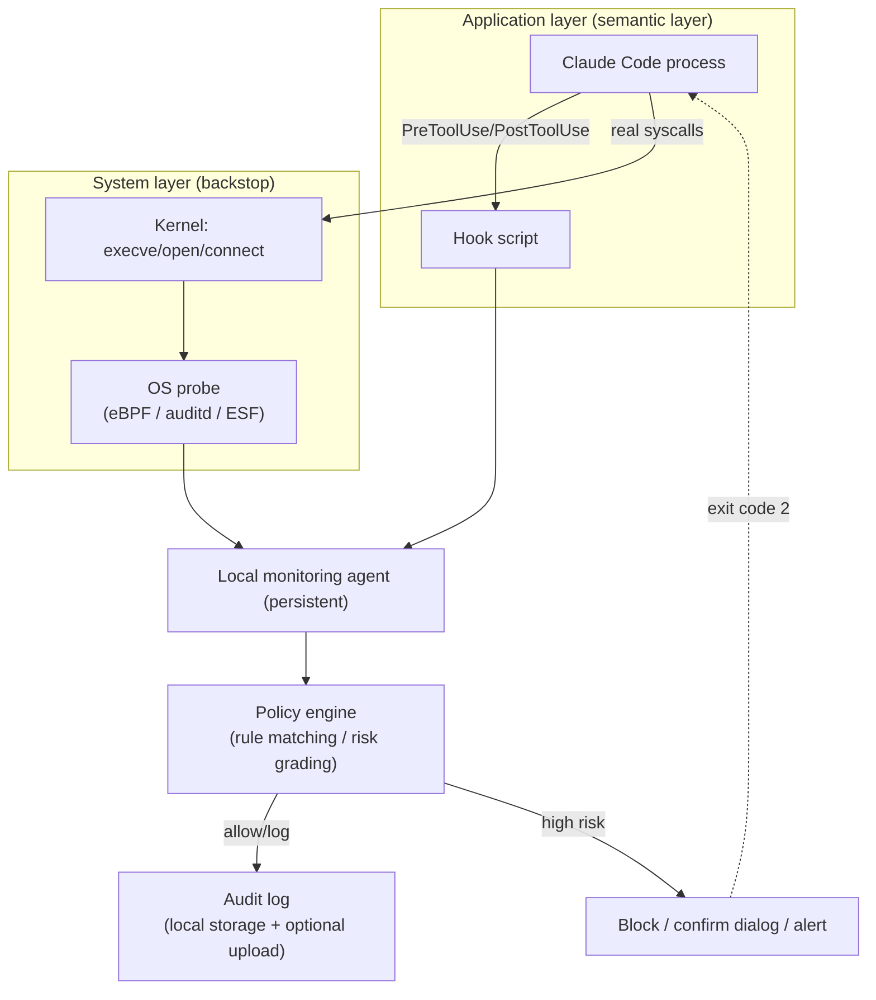

# AI Operation Monitoring Tool — Technical Design

[简体中文](./DESIGN.md) | English

## 1. Background and Goals

Monitoring target: every operation Claude Code performs on this machine that could affect system
or data security — file reads/writes, command execution, network access, and anything else a
Claude Code tool can trigger.

Goals:
- **Visibility**: record what Claude Code did (who, when, on what, what action, what result).
- **Control**: high-risk operations can be blocked/alerted/require human confirmation, not just
  audited after the fact.
- **Hard to bypass**: the monitoring capability must not be easy to disable by Claude Code itself
  (whether through normal behavior or after being hijacked by prompt injection).
- **Cross-platform**: works on both Linux and macOS, sharing as much core logic as possible.

## 2. Monitoring Scope

Claude Code's operations fall into four categories:

| Category | Specific operations | Corresponding Claude Code tools |
|---|---|---|
| File I/O | Read files, write/overwrite files, edit (diff), batch replace | Read / Write / Edit / NotebookEdit |
| Command execution | Shell commands, background processes, scripts | Bash |
| Network access | Fetch web pages, call external APIs/MCP services | WebFetch / WebSearch / MCP tools |
| Meta operations | Spawn subagents, cross-session messages, permission mode switches | Agent / SendMessage / permission mode changes |

Two outcomes need to be guarded against above all: **damaging the system** (deleting files,
changing config, running dangerous commands) and **leaking data** (reading credentials/secrets
and exfiltrating them over the network).

## 3. Overall Approach: Two-Layer Monitoring Architecture

Relying solely on Claude Code reporting on itself (hooks) has a fundamental problem: if the
Claude Code process is bypassed, the hooks config is tampered with, or an attacker disables
monitoring through some other path (e.g. tricking the user into editing the config directly),
monitoring becomes worthless. The design therefore uses two lines of defense — **application
layer + system layer**:

- **Application layer (primary, semantically rich)**: uses Claude Code's built-in Hooks mechanism
  (`PreToolUse` / `PostToolUse`, etc.) to intercept before and after every tool call, getting
  structured information (tool name, arguments, cwd, session_id). The advantage is clear semantics
  ("Bash ran `rm -rf /tmp/x`") at low cost (a handful of cross-platform shell/Python scripts). The
  downside is that this layer runs inside the monitored subject's own framework, and can in theory
  be bypassed by tampering with its configuration.

- **System layer (backstop, anti-bypass)**: audits/sandboxes the Claude Code process tree at the
  OS level, independent of whether Claude Code cooperates. Even if the application layer is
  bypassed, the system layer still sees the real `execve`/`open`/`connect` syscalls, serving as
  the last line of defense.

Both layers report independently to the same local agent and cross-check each other (e.g. if the
system layer observes a file write but the application layer has no corresponding event, that
mismatch is itself a high-risk signal that monitoring has been bypassed).



## 4. Core Component Design

### 4.1 Hook Interceptor (application-layer entry point)
- Registers `PreToolUse` and `PostToolUse` hooks in `~/.claude/settings.json` (global) or a
  project's `.claude/settings.json`, with a matcher covering `Bash|Write|Edit|Read|WebFetch|...`.
- The stdin JSON the hook receives includes `session_id`, `cwd`, `tool_name`, `tool_input` (e.g.
  the raw command text / file path).
- Implemented as Python or a compiled Go binary (cross-platform, no dependencies), forwarding
  events to the local agent (Unix domain socket — low latency, permissions controllable).
- If a `PreToolUse` hook judges an operation to be high-risk, it denies it with a specific exit
  code; Claude Code aborts that tool call and reports the denial reason back to the model.

### 4.2 System-Layer Probe (OS layer — Linux portion implemented in Phase 2)

| Capability | Linux approach | macOS approach |
|---|---|---|
| Process event auditing (`execve`-level bypass detection) | **Implemented**: a `bpftrace` script (`cc_monitor/probe_linux.bt`) tracks `execve`/`connect` across the entire descendant process tree spawned by the `claude` process, without depending on auditd | Endpoint Security Framework (`eslogger` allows quick validation without writing a custom System Extension; a production build needs a signed ES client + user-granted Full Disk Access) — not yet implemented; this layer underlies `CC-Monitor verify`'s bypass detection, which remains Linux-only |
| Mandatory sandbox (blocking, not just auditing) | Landlock LSM (kernel ≥5.13, restricts reads/writes by path) or wrapping the process with bubblewrap/firejail, restricting writable directories and mounting a read-only root — not yet implemented | `sandbox-exec` (with a custom profile) or running inside a container/lightweight VM (OrbStack/Docker Desktop) — not yet implemented |
| Network monitoring | **Implemented**: captures the destination IP:port of `connect()` syscalls directly via eBPF (+ a `uprobe:libc:getaddrinfo` that records the hostname the moment the application resolves it, reverse DNS as a fallback), plus `tcp_sendmsg`/`tcp_cleanup_rbuf` kernel probes for upload/download byte counts — no TLS termination, no CA certificate needed; the Web UI has a dedicated Network tab with a detail table, IP geolocation (local MaxMind/DB-IP Lite database), and a WebGL2 world map | **Implemented** (`cc_monitor/probe_darwin.py`): samples the claude process tree's connections every 2s with the built-in `nettop`, recording destination IP:port and upload/download byte deltas into the same `network_traffic` table as Linux — **no root required**; unlike the Linux version it has no `getaddrinfo` hostname capture (falls back to reverse DNS) and no `execve` observation (the bypass detection in the row above doesn't apply on macOS) |

**How the process tree is identified**: after a child process forks but before it actually execs
a new program, its `comm` hasn't changed yet — it still inherits the parent's ("claude"). The
moment that child execve's into something else is evidence it descends from Claude Code;
`sched_process_fork` propagates this "lineage" to every subsequent descendant. In practice this
cleanly separates Claude Code's own activity from the noise of other desktop processes (conky,
gnome-shell, etc.).

**Cross-verification**: `CC-Monitor-probe` fuzzy-matches the top-level shell invocations it observes
(things like `bash -c "..."`) against recent `hook_pre` Bash records (time window + substring
match after stripping quotes, since Claude Code's Bash tool often wraps the original command in a
`eval '<command>'` shell-snapshot script before executing it). Anything that doesn't match gets
flagged as `hook_bypass_suspected` — the typical scenario being "the approved command itself was
short, but at runtime it went on to exec something that was never reviewed at all." Inspect these
with `CC-Monitor verify`.

On Linux, requires root to run (bpftrace needs `CAP_BPF`/`CAP_PERFMON` or plain root); the macOS
`nettop` network probe **does not** require root. Both platforms are currently started manually,
not yet packaged as an autostart persistent service (whether to install one as a systemd/launchd
service is an operational decision — during the MVP phase it's run manually).

Recommendation for the MVP phase: have the system layer do **auditing only** at first (no
mandatory blocking — low cost, no kernel extension/signing needed); file and command **blocking**
is handled primarily by the application-layer hooks; the network layer is managed uniformly via a
local proxy (this approach is identical on Linux/macOS and offers the best cost/benefit ratio).
The system layer's mandatory sandbox (Landlock/sandbox-exec/containerization) is an optional
"high-security mode" reserved for Phase 2.

### 4.3 Policy Engine
Example rules (configurable, stored as YAML/JSON):

- **High risk (deny + alert by default)**: `rm -rf`, `dd`, `chmod -R 777 /`, `curl|bash`,
  `sudo`/`su`/`pkexec` privilege escalation, writing to `~/.ssh/*`, `.env`, `~/.aws/credentials`,
  accessing a non-whitelisted domain combined with reading a sensitive file (a read + exfiltrate
  combination triggers higher risk), attempting to `kill`/`pkill` the monitoring's own
  probe/hook process (a concrete rule-level instance of the "two layers cross-check each other"
  idea from §3 — the act itself is a signal that bypass is being attempted), and database clients
  (`mysql`/`psql`/`redis-cli`/`mongo`/`sqlite3`, etc.) running `DROP`/`DELETE`/`TRUNCATE`/
  `FLUSHALL` directly (the same risk category as "deleting files," but entirely outside the
  filesystem monitoring's field of view), and reverse-shell/backdoor execution (the `-e`/`-c`
  variants of `nc`/`ncat`/`netcat`, `socat exec:`, and a `mkfifo`-plus-named-pipe reverse shell —
  coverage keeps expanding here since the sneaky ways to write one of these keep multiplying).
- **Medium risk (log + confirmation dialog)**: writes outside the project directory, modifying
  system config files (`/etc/*`), bulk file deletion.
- **Low risk (log only)**: routine reads/writes inside the project directory, git operations,
  reading shell history files or running a bare `history` command (command history can retain
  plaintext credentials typed in the past — a real but lesser risk than reading a key file
  directly, not high-risk but still worth a trail).

Matching approach: commands are matched with rules + keywords/regex, optionally combined with a
lightweight local model for semantic judgment (e.g. having it explain "what is this command
block's intent, does it match a known destructive pattern"); file paths use glob allow/deny lists.

### 4.4 Audit Log (tamper resistance)
- Stored locally as SQLite or append-only JSONL; the agent process's permissions are isolated from
  the Claude Code process (a different user, or at minimum directory permissions that only allow
  the agent to write while Claude cannot).
- On Linux, the log file can be marked `chattr +a` (append-only) for extra tamper resistance; logs
  are also forwarded asynchronously to a remote/separate host, to avoid the "logs get wiped too
  once the local machine is compromised" problem.
- Event schema (shared across both layers):
```json
{
  "ts": "2026-09-11T22:10:00Z",
  "session_id": "...",
  "source": "hook|os_probe",
  "tool_name": "Bash",
  "action": "execute",
  "detail": {"command": "rm -rf ./build"},
  "cwd": "/home/init3/project",
  "risk_level": "high",
  "matched_rule": "dangerous_delete",
  "decision": "blocked|allowed|pending_confirm"
}
```

### 4.5 Alerting and Human Confirmation
- High-risk operations: terminal/system notification (`notify-send` / macOS `osascript`) + an
  optional requirement that the user click "allow once / always allow / deny" in the notification
  or a local web page.
- A local CLI (e.g. `CC-Monitor tail`, `CC-Monitor rules`) for live-viewing the event stream and adjusting
  rules — the MVP phase originally didn't plan a web dashboard, but one got built anyway
  (`webui/`) and is now the most feature-complete entry point; see [README.md](./README.md)
  for what it covers. This design doc tracks architecture, not per-page detail.

## 5. Phased Roadmap

1. **MVP (done)**: hook interceptor + policy engine (rule matching) + local SQLite audit log + CLI
   viewer (`CC-Monitor tail/rules/stats`). Covers Linux/macOS, both verified: hooks / AI Approvals /
   usage display / Web Terminal have all been tested and confirmed working on macOS.
2. **Phase 2 (Linux portion done; macOS network portion done)**: `CC-Monitor-probe` (bpftrace on
   Linux, `nettop` on macOS) tracks the process tree's exec/connect activity or network connections
   for audit cross-verification; `CC-Monitor verify` detects "application layer bypassed"
   situations; the network layer captures `connect()` directly instead of a MITM proxy; high-risk
   operations already get both a web-based confirmation UI (AI Approvals, including mirroring
   Claude Code's own native `PermissionRequest` dialog) and desktop alerts (Electron: Dock bounce +
   badge + system notification). Still not done: `execve`-level bypass detection on macOS
   (Endpoint Security Framework, the first row of the §4.2 table above), and running it as a
   persistent service on either platform.
3. **Phase 3 (platformization, not started)**: an optional mandatory sandbox mode
   (Landlock/bwrap, sandbox-exec/containerization), cross-machine log aggregation, a
   community-shared rule set.

## 6. Known Limitations

- The application-layer hooks depend on Claude Code calling them honestly; if `settings.json` is
  tampered with (e.g. permission misconfiguration lets another process rewrite it), the hooks can
  be turned off — this is exactly why the system-layer backstop audit exists.
- macOS's mandatory sandbox, and its `execve`-level system audit (ESF), both require the user to
  manually approve them in System Settings (Full Disk Access, System Extension signing), so fully
  silent deployment isn't possible for those two pieces — neither is implemented yet. This doesn't
  affect what's already usable on macOS without ESF: hooks, AI Approvals, usage display, the Web
  Terminal, and the network-layer probe are all independent of it.
- Semantic-layer rules can't cover every "looks harmless but actually isn't" command combination —
  the rule set should keep iterating, with human confirmation kept as a backstop.
- The policy engine currently matches command text with plain `re.search` and has no quote/heredoc
  awareness — content inside a multi-line quoted argument or a heredoc body could in theory get
  misread as part of the command itself by a rule (the Web UI side solved the equivalent problem
  for its command-classification display with a small shell tokenizer,
  `splitShellSegments()`, but the policy engine hasn't been brought in line with that yet; this is
  a pre-existing characteristic shared by every rule, not something introduced by any single new
  rule).
