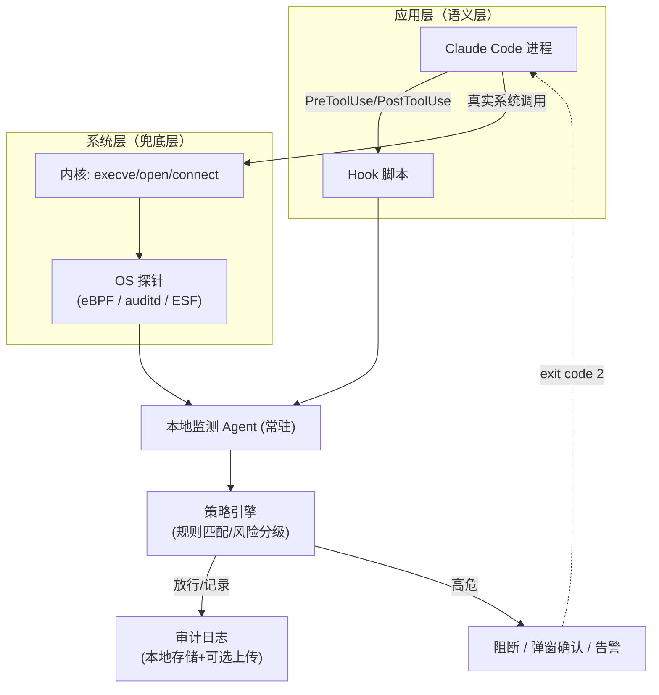

# AI 操作监测工具 —— 技术方案设计

[English](./DESIGN.en.md) | 简体中文

## 1. 背景与目标

监测对象：Claude Code 在本机执行的所有可能影响系统安全或数据安全的操作——文件读写、命令执行、网络访问、以及其它 Claude Code 工具能触发的操作。

目标：
- **可见**：记录 Claude Code 做了什么（谁、何时、对什么、做了什么操作、结果如何）。
- **可控**：对高危操作能够拦截/告警/需人工确认，而不是只能事后审计。
- **难绕过**：监测能力不能被 Claude Code 自身（无论是正常行为还是被提示注入劫持后的行为）轻易关闭。
- **跨平台**：Linux 和 macOS 都要能用，核心逻辑尽量共用一套代码。

## 2. 监测范围

对应 Claude Code 的操作可归纳为四类：

| 类别 | 具体操作 | 对应 Claude Code 工具 |
|---|---|---|
| 文件读写 | 读取文件、写入/覆盖文件、编辑（diff）、批量替换 | Read / Write / Edit / NotebookEdit |
| 命令执行 | Shell 命令、后台进程、脚本 | Bash |
| 网络访问 | 抓取网页、调用外部 API/MCP 服务 | WebFetch / WebSearch / MCP 工具 |
| 元操作 | 派生子 Agent、跨会话消息、权限模式切换 | Agent / SendMessage / 权限模式变更 |

需要重点防范的两类结果：**破坏系统**（删文件、改配置、执行危险命令）和**泄露数据**（读取凭据/密钥后通过网络外发）。

## 3. 总体思路：双层监测架构

单纯依赖 Claude Code 自身上报（hooks）有一个根本问题：如果 Claude Code 进程被绕过、hooks 配置被篡改，或者攻击者通过其它路径（比如诱导用户直接改配置）关闭监测，监测就形同虚设。因此设计上采用 **应用层 + 系统层** 两道防线：

- **应用层（主力，语义丰富）**：利用 Claude Code 内置的 Hooks 机制（`PreToolUse` / `PostToolUse` 等），在每次工具调用前后拦截，拿到结构化信息（工具名、参数、cwd、session_id）。优点是信息语义清晰（"Bash 执行了 rm -rf /tmp/x"），成本低（几个 shell/Python 脚本即可跨平台）。缺点是这一层运行在被监测对象自己的框架内，理论上可被篡改配置绕过。

- **系统层（兜底，防绕过）**：在 OS 层面对 Claude Code 进程树做审计/沙箱化，独立于 Claude Code 是否配合。即使应用层被绕过，系统层依然能看到真实的 `execve`/`open`/`connect` 系统调用，作为最后一道防线。

两层各自独立上报到同一个本地 Agent，互为校验（比如系统层看到了一次文件写入，但应用层没有对应事件，就说明监测被绕过，本身就是一个高危信号）。



## 4. 核心组件设计

### 4.1 Hook 拦截器（应用层入口）
- 在 `~/.claude/settings.json`（全局）或项目 `.claude/settings.json` 中注册 `PreToolUse` 和 `PostToolUse` hook，matcher 覆盖 `Bash|Write|Edit|Read|WebFetch|...`。
- Hook 收到的 stdin JSON 包含 `session_id`、`cwd`、`tool_name`、`tool_input`（如命令原文/文件路径）。
- 脚本用 Python 或编译好的 Go 二进制实现（跨平台、无依赖），把事件转发给本地 Agent（Unix Domain Socket，延迟低、权限可控）。
- `PreToolUse` hook 若判定为高危操作，直接以特定退出码拒绝，Claude Code 会中止该工具调用并把拒绝原因反馈给模型。

### 4.2 系统层探针（OS 层，Phase 2 已实现 Linux 部分）

| 能力 | Linux 方案 | macOS 方案 |
|---|---|---|
| 进程事件审计（`execve` 级绕过检测） | **已实现**：`bpftrace` 脚本（`cc_monitor/probe_linux.bt`），跟踪从 `claude` 进程派生出来的整棵子孙进程树的 `execve`/`connect`，不依赖 auditd | Endpoint Security Framework（`eslogger` 可无需自研 System Extension 快速验证；生产版本需签名的 ES 客户端 + 用户授权 Full Disk Access），暂未实现——这一层是 `CC-Monitor verify` 绕过检测的基础，目前仍是 Linux 独有 |
| 强制沙箱（拦截而非只审计） | Landlock LSM（内核 ≥5.13，按路径限制读写）或 bubblewrap/firejail 包一层，限制可写目录、挂载只读根——暂未实现 | `sandbox-exec`（配合自定义 profile）或跑在容器/轻量 VM（OrbStack/Docker Desktop）中——暂未实现 |
| 网络监测 | **已实现**：直接用 eBPF 抓 `connect()` 系统调用拿目标 IP:port（+ `uprobe:libc:getaddrinfo` 在应用层解析域名的那一刻记下来，反向 DNS 兜底），再加 `tcp_sendmsg`/`tcp_cleanup_rbuf` 两个内核探点统计上传/下载字节数，不解密 TLS、不用装 CA 证书；Web UI 有专门的"网络流量"页做明细表 + IP 归属地（本地 MaxMind/DB-IP Lite 数据库）+ WebGL2 世界地图 | **已实现**（`cc_monitor/probe_darwin.py`）：用系统自带的 `nettop` 每 2 秒采样 claude 进程树的连接，拿目标 IP:port 和上传/下载字节增量，写进跟 Linux 一致的 `network_traffic` 表，**不需要 root**；跟 Linux 版的差异是没有 `getaddrinfo` 域名捕获（域名只能靠反向 DNS 兜底）、也没有 `execve` 观测（上一行的绕过检测在 macOS 上不成立） |

**进程树识别方式**：子进程 fork 出来、真正 exec 新程序之前，`comm` 还没变，仍然继承自父进程
（"claude"）；一旦这个子进程 execve 到别的程序，就是它是 Claude Code 派生进程的证据，用
`sched_process_fork` 把这条"血统"持续传播给后续所有子孙进程，实测能干净地把 Claude Code 自己
的操作和桌面上其它进程（conky、gnome-shell 等）的噪音分开。

**交叉验证**：`CC-Monitor-probe` 把观测到的顶层 shell 调用（`bash -c "..."` 之类）跟最近的
`hook_pre` Bash 记录做模糊比对（时间窗口 + 去除引号后的子串匹配，因为 Claude Code 的 Bash 工具
经常会把原始命令包一层 `eval '<command>'` 的 shell 快照脚本再执行）。对不上的会标记成
`hook_bypass_suspected`，典型场景是"被批准执行的命令本身很短，但运行时自己又 exec 了一个完全
没被审查过的命令"——用 `CC-Monitor verify` 查看。

Linux 上需要 root 权限运行（bpftrace 需要 `CAP_BPF`/`CAP_PERFMON` 或直接 root）；macOS 上的
`nettop` 网络探针**不需要 root**。两个平台目前都是手动启动，还没有做成开机自启的常驻服务
（要不要装成 systemd/launchd service 属于运维决定，MVP 阶段先手动跑）。

MVP 阶段建议：系统层先只做**审计**（不强制阻断，成本低、无需内核扩展/签名），文件与命令的**拦截**主要靠应用层 Hook 完成；网络层用本地代理统一管控（这个方案 Linux/macOS 完全一致，性价比最高）。系统层的强制沙箱（Landlock/sandbox-exec/容器化）作为 Phase 2 的"高安全模式"可选开启。

### 4.3 策略引擎（Policy Engine）
规则示例（可配置，YAML/JSON 存放）：

- **高危（默认拦截+告警）**：`rm -rf`、`dd`、`chmod -R 777 /`、`curl|bash`、`sudo`、写入 `~/.ssh/*`、`.env`、`~/.aws/credentials`、访问白名单外域名并同时读取过敏感文件（读+外发组合触发更高风险）。
- **中危（记录+弹窗确认）**：跨项目目录写入、修改系统配置文件（`/etc/*`）、大批量删除文件。
- **低危（仅记录）**：项目目录内的常规读写、git 操作。

匹配方式：命令用规则+关键词/正则，必要时结合一个轻量本地模型做语义判断（比如把命令块解释一下"这条命令的意图是什么，是否匹配已知破坏性模式"），文件路径用 glob 黑白名单。

### 4.4 审计日志（防篡改）
- 本地落盘用 SQLite 或 append-only JSONL，Agent 进程权限与 Claude Code 进程隔离（不同用户或至少目录权限只允许 Agent 写、Claude 不可写）。
- Linux 上可对日志文件加 `chattr +a`（只追加）进一步防篡改；日志同时异步转发到远端/单独主机，避免"本机被攻陷后日志也被清"的问题。
- 事件 schema（贯穿两层）：
```json
{
  "ts": "2026-09-11T22:10:00Z",
  "session_id": "...",
  "source": "hook|os_probe",
  "tool_name": "Bash",
  "action": "execute",
  "detail": {"command": "rm -rf ./build"},
  "cwd": "/home/init3/project",
  "risk_level": "high",
  "matched_rule": "dangerous_delete",
  "decision": "blocked|allowed|pending_confirm"
}
```

### 4.5 告警与人工确认
- 高危操作：终端/系统通知（`notify-send` / macOS `osascript` 弹通知）+ 可选需要用户在通知或本地网页上点"允许一次/永久允许/拒绝"。
- 提供本地 CLI（如 `CC-Monitor tail`、`CC-Monitor rules`）实时查看事件流和调整规则——MVP 阶段
  本来不打算做 Web Dashboard，后来还是做了（`webui/`），并且是现在功能最全的入口，具体能力见
  [README.md](./README.md)，这份设计文档只记录架构思路，不追更每个页面细节。

## 5. 分阶段路线图

1. **MVP（已完成）**：Hook 拦截器 + 策略引擎（规则匹配）+ 本地 SQLite 审计日志 + CLI 查看器（`CC-Monitor tail/rules/stats`）。覆盖 Linux/macOS，两个平台都已验证：macOS 上 hooks / AI 审批台 / 额度显示 / Web 终端已实测跑通。
2. **Phase 2（Linux 部分已完成，macOS 网络部分已完成）**：`CC-Monitor-probe`（Linux 用 bpftrace，macOS 用 `nettop`）跟踪进程树的 exec/connect 或网络连接，做审计交叉验证，`CC-Monitor verify` 检测"应用层被绕过"的情况；网络层直接抓 `connect()`，不做 MITM 代理；高危操作的人工确认已经有了网页版（AI 审批台，含 Claude Code 原生 `PermissionRequest` 确认框的镜像）和桌面版通知（Electron：Dock 跳动 + 角标 + 系统通知）。剩余未做：macOS 上 `execve` 级别的绕过检测（Endpoint Security Framework，上面 4.2 节表格的第一行）、两个平台都还没做成持久化常驻服务。
3. **Phase 3（平台化，未开始）**：可选的强制沙箱模式（Landlock/bwrap、sandbox-exec/容器化）、多机日志集中上报、规则库社区化。

## 6. 已知局限性

- 应用层 Hook 依赖 Claude Code 诚实调用；`settings.json` 若被篡改（比如权限配置不当被其它进程改写），Hook 可被关闭——这正是需要系统层兜底审计的原因。
- macOS 的强制沙箱、以及 `execve` 级别的系统级审计（ESF）需要用户手动在系统设置里批准（Full
  Disk Access、System Extension 签名），无法做到完全静默部署，目前都还没做；但这不影响 macOS
  上已经能用的部分——hooks、AI 审批台、额度显示、Web 终端、网络层探针都不依赖 ESF，是独立
  实现的。
- 语义层规则无法覆盖所有"看起来无害实则有害"的命令组合，建议规则库持续迭代 + 保留人工确认兜底。
