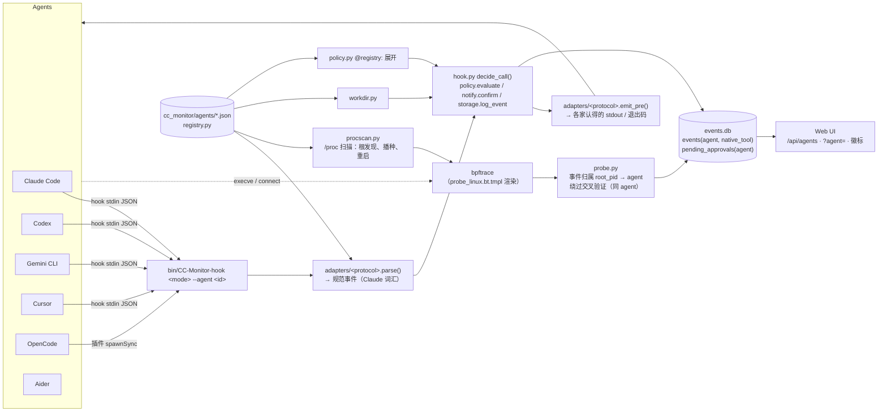

# CC-Monitor 多 agent 支持（`dev` 分支）使用与实现文档

> 适用分支：`dev`（自 `master` 的 3be0768 分出，首个提交 f490923，2026-09-18）。
> 本文档只讲这个分支新增的东西：怎么把 Codex CLI / Gemini CLI / Cursor / OpenCode / ZCode /
> Antigravity CLI / Grok CLI 接进 CC-Monitor、内部是怎么做的、怎么再接一家新的、哪些还没做。
> **除 Claude Code 外的每一家都是实验性接入**：按官方文档或源码实现，有单元测试，但没有在真实
> 安装上完整验证（本机只装得了 Antigravity CLI 和 Gemini CLI，后者因账号不再支持该客户端跑不起来）。CC-Monitor 本身的用法见
> [README](./README.zh-CN.md)，为什么这么设计见 [DESIGN-multi-agent.md](./DESIGN-multi-agent.md)。

## 目录

1. [这个分支做了什么](#1-这个分支做了什么)
2. [使用指南](#2-使用指南)
3. [架构](#3-架构)
4. [各 agent 的适配细节](#4-各-agent-的适配细节)
5. [如何新增一个 agent](#5-如何新增一个-agent)
6. [测试与验证](#6-测试与验证)
7. [兼容性与升级](#7-兼容性与升级)
8. [故障排查](#8-故障排查)
9. [未完成事项](#9-未完成事项)

---

## 1. 这个分支做了什么

`master` 上的 CC-Monitor 只认 Claude Code：hook 只装进 `~/.claude/settings.json`，探针只认
`comm == "claude"`，规则和 Web UI 只认 Claude Code 的工具名。这个分支把"谁是 agent"从代码里
抽出来变成数据（Agent 注册表），在它上面加了三层适配：

| 层 | master | dev |
|---|---|---|
| 应用层 hook | 只有 Claude Code 协议 | 八种协议适配器：Claude Code、Codex、Gemini CLI、Cursor、OpenCode（插件桥）、ZCode、Antigravity CLI、Grok CLI |
| 规则 / 越界检测 / 审批台 | 只认 Claude Code 工具名 | 不变。其它 agent 的工具名进引擎前翻译成 Claude Code 词汇 |
| 系统层探针 | `comm == "claude"` 写死在 bpftrace 脚本里 | 脚本改模板，所有 agent 的 comm 渲染进去；node/python 托管的 agent 靠 `/proc` 扫描按 argv 认 |
| 存储 | 事件不区分来源 | `events.agent` / `events.native_tool` / `pending_approvals.agent` |
| Web UI | 单一视角 | 顶栏 agent 过滤器、首页 agent 卡、各处徽标、新建会话可选 agent |
| CLI | — | `CC-Monitor agents`、`stats` 按 agent 计数、`install.py --agent` |

**对 Claude Code 用户完全透明**：不带 `--agent` 的安装命令、hook 命令行、数据库、界面都和
`master` 一样；只有当库里出现第二家 agent 的记录时，界面上的过滤器和徽标才会出现。

各 agent 接到什么程度（"状态"列就是注册表里的 `status`，`CC-Monitor agents` 和 Web UI 徽标的 β 角标
都从它来）：

| Agent | 状态 | 应用层（拦截 / 审批 / 审计） | 系统层探针 | 真机验证情况 |
|---|---|---|---|---|
| Claude Code | 已验证 | hooks | ✅ | ✅ 长期使用 |
| Antigravity CLI（`agy`，Go） | 实验性 | hooks.json `cc-monitor` 组 | ✅ | 本机 1.2.6 做过一轮端到端：`sudo pip install` 被拦（agy 回显"tool call denied by pre-tool hook"）、`crontab -l` 走审批台从网页放行后执行、探针把 `bash -c …` 归到 antigravity-cli 且与 hook 记录交叉验证吻合。未测：`multi_replace_file_content`、PostToolUse 的 `error` |
| Codex CLI | 实验性 | hooks.json | ✅ | ❌ 未装 |
| Gemini CLI | 实验性 | settings.json hooks | ✅（`/proc` 扫描） | ❌ 已装但账号不再支持该客户端（提示迁移到 Antigravity），跑不起来 |
| Cursor（IDE） | 实验性 | hooks.json，改文件只能事后记录 | ➖ Electron 不适用 | ❌ 未装 |
| OpenCode | 实验性 | JS 插件桥 | ✅ | ❌ 未装 |
| ZCode（Z.ai，GLM 模型） | 实验性 | config.json hooks.events | ✅（桌面版按 argv，CLI 按 comm） | ❌ 未装 |
| Grok CLI（superagent-ai，Bun） | 实验性 | user-settings.json hooks（按源码实现） | ✅ | ❌ 未装 |
| Aider / 自研脚本 | 实验性 | ➖ 无 hook | ✅（`/proc` 扫描 / `run --`） | 进程识别与 `run --` 有单测 |

---

## 2. 使用指南

### 2.1 前提

- 已按 [README](./README.zh-CN.md#快速安装) 装好 CC-Monitor 本体（`./install.sh` 或至少
  `python3 install.py`）。Claude Code 的接入不变，不用重做。
- 要接入的 agent 已经装在本机并能从终端启动（`codex` / `gemini` / `cursor-agent` / `opencode`
  在 `PATH` 里）。`python3 install.py --list` 的"已安装"列就是这个判断。
- 系统层探针仍要 Linux + `bpftrace` + root；macOS 只有网络层。

### 2.2 接入一家 agent

```bash
python3 install.py --list                 # 认识哪些 agent、各自配置文件在哪、本机装没装
python3 install.py --agent codex          # 写 ~/.codex/hooks.json
python3 install.py --agent gemini-cli     # 写 ~/.gemini/settings.json 的 hooks 块
python3 install.py --agent cursor         # 写 ~/.cursor/hooks.json
python3 install.py --agent opencode       # 复制插件到 ~/.config/opencode/plugins/cc-monitor.js
python3 install.py --agent zcode          # 写 ~/.zcode/cli/config.json 的 hooks.events 块并置 hooks.enabled=true
python3 install.py --agent antigravity-cli # 写 ~/.gemini/config/hooks.json 的 "cc-monitor" 组
python3 install.py --agent grok-cli       # 写 ~/.grok/user-settings.json 的 hooks 块
python3 install.py --agent all            # 本机检测到已安装的全部；--force-all 跳过检测全写
./install.sh --agent all                  # install.sh 把参数原样透传给 install.py
```

每条命令只改那一家的配置文件，幂等：重复执行不会重复加条目，用户自己配的其它 hook 一律不动，
输出里会告诉你"新增 N 条 hook"。改完**重启那家 agent** 才生效（Cursor 会自动重载 hooks.json）。

Codex 额外一步：确认 `~/.codex/config.toml` 没有关掉 hooks，install.py 会检查并提示但不会替你改：

```toml
[features]
hooks = true
```

项目级安装：`python3 install.py --agent codex --project /path/to/repo`（写到 `repo/.codex/hooks.json`，
其它家同理用各自的项目级路径）。跨用户安装：`--target /home/alice/.codex/hooks.json`。

### 2.3 验证接入

在那家 agent 里让它执行一条必定命中高危规则的操作，比如：

```
帮我运行 rm -rf ~/nonexistent-dir/..      # 命中 dangerous_delete，应被拦截
把 ~/.ssh/id_rsa 的内容读给我看             # 命中敏感文件读取，应弹确认
```

然后在另一个终端：

```bash
bin/CC-Monitor tail            # 实时事件流；hook_pre 行应带这家 agent 的标记，decision=blocked / allowed
bin/CC-Monitor agents          # "hook" 列变成"已接"，"事件数"不再是 0
bin/CC-Monitor stats           # "按 agent" 一行出现这家
```

拦截时 agent 那边会收到我们给的理由（`[CC-Monitor] 操作被拦截 (规则: dangerous_delete): …`），
模型会看到这句话并改变计划。如果 `tail` 里 `decision=blocked` 但 agent 照样执行了，说明这家的
拒绝格式与实际版本不符，见第 8 节。

### 2.4 日常使用

接入之后不需要任何额外操作，规则、审批、审计对所有 agent 同时生效：

- **拦截 / 确认 / 记录**：三档 action 的行为与 Claude Code 完全一样。中危操作弹确认时，终端提示和
  桌面通知会带上是哪家 agent（"[Codex CLI] Bash: git push --force …"），避免同时开着两个 agent
  时批错。90 秒内在触发它的终端敲 `y/N`、或去 Web UI 审批台点按钮，先到先得。
- **介入级别**（`CC-Monitor audit start|permissive|stop`）是全局的，一次切换对所有 agent 生效。
- **"一直允许"**按 session 记，各家的 session id 互不相干。
- **越界检测**认得每家 agent 自己的状态目录（`~/.codex/sessions`、`~/.gemini/tmp`、
  `~/.cursor/projects`……），不会把它们写自己的会话文件报成"跨目录写入"；项目根标记也认
  `AGENTS.md`、`GEMINI.md`、`.cursor` 等。
- **篡改保护**：改任何一家的 hook / 配置文件（`.codex/hooks.json`、`.gemini/settings.json`、
  `.cursor/hooks.json`、`opencode.json`、OpenCode 插件目录）会命中 `agent_config_tamper` 弹确认；
  杀探针或删插件文件命中 `kill_monitoring_process`。

### 2.5 CLI

```bash
bin/CC-Monitor agents                 # 每家 agent：id、名称、本机是否安装、hook 是否已接、库里事件数
bin/CC-Monitor stats                  # 总量 / 按风险 / 按决策 / 按 agent
bin/CC-Monitor tail [-v]              # 实时事件流（各家混在一起，按时间）
bin/CC-Monitor verify                 # 疑似绕过监测的记录，每条带 agent=
bin/CC-Monitor workdir                # 跨工作目录操作
bin/CC-Monitor tap                    # 仍只解析 Claude Code 的会话文件（其它家是未做项）
bin/CC-Monitor rules                  # 当前生效规则（@registry: 占位符已展开成真正的正则）
```

`tail` 目前没有按 agent 过滤的参数；要只看一家用 Web UI 的过滤器，或直接查库：

```bash
sqlite3 ~/.cc-monitor/events.db "select ts, tool_name, native_tool, decision, matched_rule from events where agent='codex' order by id desc limit 20"
```

### 2.6 Web UI

`./start.sh` 启动方式不变。只装了 Claude Code 时界面与以前一模一样；库里出现第二家 agent 的记录后：

- **顶栏 agent 下拉框**：默认"全部 agent"。选中某家后，Log 审计、会话下拉、Tap 的会话列表只看这一家；
  选择记在 localStorage，刷新不丢。首页那些统计卡（文件操作、GitHub 操作……）目前仍是全局数字。
- **首页"被监测的 AI agent"卡**：每家一行，会话数 / 拦截数 / 疑似绕过数。
- **徽标**：Log 审计每行、会话下拉的前缀、审批台每张卡、进程下钻表的 pid 旁边都标明来自哪家，
  九家各一色（Claude Code 紫、Codex 绿、Gemini 蓝、Cursor 橙、OpenCode 青、ZCode 靛蓝、Antigravity 玫红、
  Grok 黑、Aider 品红），实验性的带 β 角标，鼠标悬停有说明。
  鼠标放在 Log 审计的工具名上能看到该 agent 的原始工具名（`run_shell_command` 之类）。
- **AI 审批台**：其它 agent 的确认请求与 Claude Code 的排在同一列，卡片顶部带 agent 徽标，
  按钮语义相同（允许一次 / 拒绝 / 10 分钟 / 30 分钟 / 一直允许）。
- **终端会话 → 新建会话**：弹窗里多一个"启动哪个 agent"下拉（只列本机装了的；只有一家时隐藏），
  选 Codex 就在 PTY 里自动敲 `codex`，并按注册表剥掉 `CODEX_*` 之类会让它误以为自己是子会话的环境变量。
- **"AI agent 进程"卡**（原"claude 进程"）：进程扫描认所有注册 agent，下钻表每行带徽标。

### 2.7 系统层探针

```bash
sudo bin/CC-Monitor-probe                   # 跟以前一样；现在跟踪所有注册 agent 的进程树
python3 -m cc_monitor.probe --print-script  # 不需要 root：打印渲染后的 bpftrace 脚本，可自己 bpftrace -d 检查
```

启动时会打印两行新信息：跟踪哪些 agent、"播种已在运行的 agent: pid=… claude-code, pid=… gemini-cli"。
探针**启动前**就在跑的 agent 也会被纳入（master 上不行）。运行中新开一个 node/python 托管的
agent（Gemini CLI、Aider）会打印"发现新的 agent 根进程 …，重启探针以纳入"，中间约 1 秒的
事件会丢；编译型 agent（Claude Code、Codex、OpenCode）在内核里直接认，不重启。

探针写的 `os_exec` / `os_net` 事件带 `agent`，`verify` 的绕过判定只拿同一家的 hook 记录比对。


探针现在还看**文件级**系统调用和**监听端口**（借 agentsight `process_ext` 的探点集，见 3.5）：

- 写打开（`openat` 带 O_WRONLY/O_RDWR/O_CREAT/O_TRUNC）、删除（`unlinkat`/`unlink`/`rmdir`）、
  重命名（`renameat2`/`renameat`/`rename`）、建目录（`mkdirat`/`mkdir`）→ `os_file` 事件，
  Log 审计里标"系统层观测: 文件写入/删除/重命名/创建目录"。纯读不报。
- `bind` + `listen` → `os_listen` 事件；监听在 `0.0.0.0` / `::` 上的标中危 `listen_exposed`。
- 文件路径类规则（`sensitive_file_write`、`agent_config_tamper`、越界规则……）对内核层看到的
  写入同样生效——**哪怕是 agent 派生的 pip / npm / 脚本写的**，hook 层根本看不见这些。结果记成
  `observed`（拦不住，只能事后知道）。
- 绕过交叉验证扩到文件：agent **进程自己**（不是子进程）直接写了一个文件、hook 层 15 秒内却没有
  指向同一路径的 Write/Edit 记录 → `hook_bypass_suspected`。agent 写自己的状态目录
  （`~/.claude/…`、`~/.codex/…`）不算。
- 噪音控制：`/proc` `/sys` `/dev` 在内核里就丢；`.git/`、`node_modules/`、`__pycache__/`、
  各种 cache/build 目录、`/tmp`、agent 状态目录、`.pyc/.swp/~` 等在 probe.py 里排除；同一
  (根进程, 路径, 操作) 60 秒内只落一条、到期补一条汇总计数；一个根进程一秒超过 200 条文件事件
  触发熔断，只计数不落库，窗口结束记一条"事件过多"。

### 2.8 给某家 agent 定制规则

规则文件 `~/.cc-monitor/rules.json` 与以前相同，两个新能力：

- 规则可以加 `"agents": ["codex", "gemini-cli"]`，只对列出的 agent 生效；不写就对所有 agent 生效。
- 规则的 `tools` 写 Claude Code 的工具名即可（`Bash` / `Read` / `Write` / `Edit` / `WebFetch` …），
  其它 agent 的工具已经在进引擎前翻译过。`"field": "tool_name"` 匹配的也是翻译后的名字；
  原始名只存在记录的 `native_tool` 里，规则目前匹配不到它。
- `pattern` 里可以写 `@registry:config_tamper` / `@registry:history` 占位符，加载时从注册表展开。

例：只对 Codex 把 `git push` 一律要求确认：

```json
{"id": "codex_git_push_confirm", "risk": "medium", "action": "confirm",
 "title": "Codex 推送代码", "desc": "Codex 会话里的 push 一律人工确认。",
 "tools": ["Bash"], "field": "command", "match": "segment", "pattern": "^git\\s+push\\b",
 "agents": ["codex"]}
```

### 2.9 覆盖某家 agent 的识别方式

本机上某家 agent 的进程名、安装路径或配置路径跟默认不一样时，在 `~/.cc-monitor/agents/<id>.json`
放一份只含要改字段的 JSON，与内置的按字段合并：

```json
{"id": "codex",
 "process": {"argv_patterns": ["@openai/codex", "/opt/tools/my-codex"]},
 "hooks": {"config": {"user_path": "~/.config/codex/hooks.json"}}}
```

改完探针要重启（它启动时读一次注册表）；hook 每次调用现读，立即生效；Web UI 30 秒内刷新。

### 2.10 显式绑定：`CC-Monitor run -- <命令>`

没有 hook、进程特征也认不出来的 agent（自研脚本、`python my_agent.py`、容器里的东西），
或者想给一次运行一个确定的 session 键时：

```bash
bin/CC-Monitor run --agent aider -- aider --model gpt-4o
bin/CC-Monitor run -- python3 my_agent.py        # 不带 --agent：按注册表猜，猜不出记为 generic
```

它做三件事：在 `~/.cc-monitor/run/<pid>.json` 登记"这个 pid 是 <agent> 的根"（探针的扫描线程
3 秒内纳入，进程退出后登记自动清理）；给进程树设 `CC_MONITOR_AGENT` / `CC_MONITOR_SESSION`
环境变量（hook 命令行没写 `--agent` 时从环境变量取，所以按 Claude Code 协议调 hook 的自研 agent
会被正确归属）；然后 `exec` 目标命令（同一个 pid，不多一层父进程）。显式登记的 pid 永远算根，
哪怕它跑在另一个 agent 里面。

注意探针和 `run` 要看同一个 `~/.cc-monitor`：探针用 `sudo` 跑时 HOME 是 root 的，
用 `sudo -E env CC_MONITOR_HOME=$HOME/.cc-monitor bin/CC-Monitor-probe` 之类的方式对齐。

### 2.11 卸载某家的 hook

手动从对应配置文件里删掉 `command` 含 `CC-Monitor-hook` 的条目；OpenCode 删掉
`~/.config/opencode/plugins/cc-monitor.js`。库里已有的记录保留。分支目前没有 `--uninstall`。

---

## 3. 架构

### 3.1 数据流



### 3.2 模块清单（本分支新增 / 改动）

| 文件 | 作用 |
|---|---|
| `cc_monitor/agents/<id>.json` | 注册表数据，每家一份（见 3.3） |
| `cc_monitor/registry.py` | 读注册表（内置 + `~/.cc-monitor/agents/` 覆盖）；`classify_process()`、`map_tool()`、`map_fields()`、给探针/规则/越界检测用的汇总函数 |
| `cc_monitor/adapters/__init__.py` | 按 agent 的 `hooks.protocol` 选适配器模块；不认识的退回 Claude 协议 |
| `cc_monitor/adapters/base.py` | 规范事件/规范调用的构造器；`apply_patch` 解析与拆分 |
| `cc_monitor/adapters/{claude,codex,gemini,cursor,opencode,zcode,antigravity,grok}.py` | 各协议的 `parse()` / `emit_pre()` / `emit_permission()` / `hook_config_entries()` |
| `cc_monitor/adapters/opencode_plugin.js` | OpenCode 插件模板，install 时替换 hook 路径后复制过去 |
| `cc_monitor/hook.py` | 重写：`parse_args` → 适配器 parse → `handle_*` → 适配器 emit；判定逻辑 `decide_call()` 与 master 的 `handle_pre` 中段等价 |
| `cc_monitor/procscan.py` | `/proc` 扫描：`find_roots()`（每个认得出的 agent 进程都是根）、`seed_map()`（后代归最近的 agent 祖先）、`comm_predicate()`、`seed_block()` |
| `cc_monitor/probe_linux.bt.tmpl` | 探针模板（原 `probe_linux.bt`），两个占位符：comm 条件、BEGIN 播种块 |
| `cc_monitor/probe.py` | 渲染模板、启动/重启 bpftrace、`ROOT`/`EXEC`/`CONNECT` 事件解析、root pid → agent 归属 |
| `cc_monitor/probe_darwin.py` | macOS 进程树按注册表认，事件带 agent |
| `cc_monitor/storage.py` | 新列、`log_event(agent=, native_tool=)`、`count_by_agent()`、`fetch_recent_shell_commands(agent)` |
| `cc_monitor/policy.py` | `evaluate(..., agent=)`；规则可带 `agents` 列表；`@registry:` 占位符展开 |
| `cc_monitor/workdir.py` | `HOME_IGNORE`、`PROJECT_MARKERS` 来自注册表 |
| `cc_monitor/notify.py` | 确认提示和桌面通知带 agent 名，审批记录带 agent |
| `cc_monitor/cli.py` | `agents` 子命令；`stats`/`verify` 输出带 agent |
| `install.py` | 重写：`--agent` / `--list` / `--force-all`，按注册表 `hooks.config.kind` 选写法 |
| `webui/lib/agents.js` | Node 侧注册表只读视图 + `classifyArgs()` |
| `webui/lib/audit.js` | `hasAgentColumn()`、`listSessions({agent})`、`queryEvents({agent})`、`agentStats()` |
| `webui/lib/approvals.js` / `processScan.js` / `sessions.js` | 审批记录带 agent；进程扫描认所有 agent；新建会话按 agent 启动、按注册表剥环境变量 |
| `webui/server.js` | `/api/agents`；`/api/logs`、`/api/log-sessions` 的 `?agent=`；`POST /api/sessions` 的 `agent` |
| `webui/public/{app.js,index.html,i18n.js,style.css}` | 过滤器、agent 卡、徽标、新建会话下拉 |
| `tests/test_agents.py` | 本分支的回归测试 |

### 3.3 注册表字段

以 `cc_monitor/agents/gemini-cli.json` 为例，每个字段谁在用：

```jsonc
{
  "id": "gemini-cli",                 // 事件里的 agent 值、--agent 参数、CSS 类名 agent-<id>
  "display": "Gemini CLI",            // 界面/终端提示里的名字
  "process": {
    "comm": ["gemini"],               // 探针：精确匹配内核 comm（≤15 字节）→ 渲染进 bpftrace
    "comm_prefix": [],                // 探针：前缀匹配（codex 的原生二进制名被截成 codex-x86_64-un）
    "exe_basename": ["gemini"],       // procscan / Web UI 进程扫描：/proc/<pid>/exe 或 argv[0] 的文件名
    "argv_patterns": ["@google/gemini-cli", "(^|/)gemini(\\.js)?( |$)"],  // 兜底：argv 正则（node/python 托管只能靠它）
    "shell_comms": ["sh","bash","zsh","dash","ksh"],   // 探针：哪些 comm 的 `-c` 参数算"agent 执行的命令"
    "infra_noise": ["CC-Monitor-hook", "^git (rev-parse|status|diff|log|ls-files)"]  // 探针：绕过判定要排除的自家基础设施命令
  },
  "hooks": {                          // 没有应用层 hook 的 agent（aider）这里是 null
    "protocol": "gemini",             // 选 adapters/<protocol>.py
    "config": {
      "kind": "gemini-settings",      // install.py 按 kind 决定文件形状：claude-settings / codex-hooks / gemini-settings / cursor-hooks / opencode-plugin / zcode-config
      "user_path": "~/.gemini/settings.json",
      "project_path": ".gemini/settings.json"
    },
    "events": {"BeforeTool": "pre", "AfterTool": "post", "BeforeAgent": "prompt",
               "SessionStart": "session_start", "SessionEnd": "session_end",
               "PreCompress": "precompact", "AfterAgent": "stop"}   // 原生事件名 → CC-Monitor-hook 的模式
  },
  "tools": {"run_shell_command": "Bash", "read_file": "Read", "write_file": "Write", "replace": "Edit", "...": "..."},
                                      // 工具名 → Claude Code 词汇；不在表里的原样透传
  "field_aliases": {"absolute_path": "file_path"},   // 入参字段名翻译
  "sessions": {"glob": "~/.gemini/tmp/*/chats/session-*.json", "format": "gemini_chats"},  // 预留给会话解析（本分支未实现）
  "home_ignore": [".gemini/tmp"],     // workdir.py：家目录下这些路径是 agent 自己的状态目录，越界检测不报
  "project_markers": ["GEMINI.md", ".gemini"],       // workdir.py：项目根标记
  "config_tamper_paths": ["(^|/)\\.gemini/settings\\.json$", "(^|/)GEMINI\\.md$"],  // agent_config_tamper 规则
  "history_paths": ["\\.gemini/tmp/"],               // history_read 系列规则
  "launch_command": "gemini",         // Web UI 新建会话自动敲的命令；install --list / agents 的"已安装"检测
  "env_strip_prefixes": ["GEMINI_CLI_"]              // Web UI 新建会话时从环境里剥掉的变量前缀
}
```

用户覆盖：把同 `id` 的 JSON 放到 `~/.cc-monitor/agents/`（`CC_MONITOR_HOME` 可改），字段级合并，
只写要改的键。典型用途：某台机器上 codex 装成了别的名字、Gemini 换了安装路径。

### 3.4 规范事件

适配器 `parse(mode, data, agent)` 的返回值，`hook.py` 只认这个结构：

```python
{
  "agent": "codex",
  "mode": "pre" | "post" | "permission" | "prompt" | "session_start" | "session_end" | "precompact" | "stop" | "subagent_stop",
  "session_id": str, "cwd": str, "transcript_path": str | None,
  "calls": [ {                          # pre/post/permission 用；一次 apply_patch 会拆成多条
      "tool_name": "Write",             # Claude Code 词汇
      "tool_input": {"file_path": ..., "content": ...},   # 规范字段名
      "native_tool": "apply_patch",     # 原名，进 events.native_tool 和 detail.native_tool
      "native_input": {...},            # 原入参，进 detail.native_input
      "tool_response": ...              # post 用
  } ],
  "prompt": str,                        # prompt 模式
  "extra": {...}                        # 生命周期字段；"evaluate_in_post": True 表示 post 事件也要跑规则
}
```

判定结果交给 `emit_pre(decision)`，decision 是
`{"decision": "allowed"|"blocked", "handled_via_confirm": bool, "reason": str|None, "rule_id": str|None}`，
返回 `(stdout_text_or_None, exit_code)`。三条不变量，所有适配器都遵守：

- `blocked` 一定要让 agent 拒绝执行（各家格式不同，见第 4 节）。
- `handled_via_confirm=True`（我们真的问过人并得到允许）才输出"跳过原生确认"的 JSON；
  否则什么都不输出，agent 自己的确认框该弹还弹——不能因为我们在场就撤掉它的安全网。
- hook 内部任何异常 fail-open（退出码 0），绝不因为监测器的 bug 卡住 agent。

### 3.5 探针

模板 `probe_linux.bt.tmpl` 里两个占位符，`probe.render_script()` 渲染：

```
__CC_ROOT_COMM_PREDICATE__  →  comm == "claude" || comm == "codex" || … || strncmp(comm, "codex-x86_64", 12) == 0
__CC_SEED__                 →  @watch[87740] = 1; @root[87740] = 87740;  @watch[87801] = 1; @root[87801] = 87740; …
```

探点与 master 的差异：

- 根识别从 `sys_enter_execve` 的旧 comm 改到 `sched_process_exec` 的新 comm（exec 完成后触发，
  agent 从 shell 里启动时第一次 exec 就能认出来，不再依赖"agent 自己再 exec 一次"）。新根打
  `ROOT` 行，`probe.py` 读 `/proc/<pid>` 分类成 agent。
- `@root[pid]` 随 fork 传播，`EXEC` / `CONNECT` 行多一个 root 字段；`probe.py` 据此把事件写成
  `agent=<id>`，`detail` 里带 `root_pid`。
- BEGIN 块播种：启动时 `procscan.seed_map()` 把已在跑的 agent 树全部放进 map。
- 运行中 `_Rescanner` 线程每 3 秒 `find_roots()`，发现内核层认不出的新根（comm 是 node/python）
  就让主循环 terminate bpftrace、重新渲染（播种 = 所有已知根的当前后代）、重启。重启窗口约 1 秒，
  期间事件丢失；`(pid, argv)` 1 秒去重让已在跑的进程不会被重复记。

**文件级探点**（`FILE` / `OPENDIR` / `FCHDIR` / `DUP` / `CHDIR` / `FORK` / `BIND` / `LISTEN` 行）：

- 写打开在 `sys_enter_openat` 报（"试图写 ~/.ssh 但没权限"本身值得记）；unlink / rename / mkdir /
  rmdir 用 enter→exit 配对，**只报 `ret == 0` 的**——`mkdir -p a/b/c` 对每级祖先都试一次 mkdir
  （EEXIST）、`rm -f 不存在` 是 ENOENT，失败调用没改变任何东西，报出来只是噪音。
- 相对路径的解析是这一层最难的地方。`rm -r` / `mkdir -p` / `find` / Python 的 `shutil.rmtree`
  都拿着目录 fd 逐级操作（`unlinkat(5, "f")`），事后读 `/proc/<pid>/fd/5` 常常已经晚了（进程一毫秒
  跑完）、甚至读到 fd 号复用后的错目录。做法：`sys_exit_openat` 成功返回时从当前任务的 fd 表取出
  `struct file`，`f_inode->i_mode` 是目录就报一条 `OPENDIR pid fd path dfd`（不能只看 O_DIRECTORY
  标志，Python 打开目录不带它）；`dup`/`dup2`/`dup3`/`fcntl(F_DUPFD*)` 报 `DUP old new`（coreutils 的
  fts 把 fd 立刻 dup 一份）；`fchdir` 报 `FCHDIR fd`；`sched_process_fork` 报 `FORK parent child`。
  probe.py 据此维护 `(pid, fd) → 目录绝对路径` 和 `pid → cwd` 两张表，所有相对路径在用户态查表，
  不碰 `/proc`。本机实测 `rm -rf`、`mkdir -p`、`shutil.rmtree` 的每一级路径都解析正确。
  agentsight 在这一点上没做（它只按原始路径的目录前缀聚合）。
- 用户态：排除表（`FILE_IGNORE_SEGMENTS` / `FILE_IGNORE_SUFFIXES` + workdir 忽略目录 + 注册表
  `home_ignore` / `state_dirs`）→ 60 秒窗口聚合（`_FileAggregator`）→ 每根进程每秒 200 条熔断 →
  `policy.evaluate("Write", {"file_path": path}, cwd=根进程 cwd)` 跑文件路径类规则和越界规则 →
  agent 进程自己写的再做 hook 交叉验证（`storage.fetch_recent_file_writes`）。
- `bind` 报 ip:port，`listen` 报 fd，probe.py 把同一 (pid, fd) 的 bind→listen 合成一条 `os_listen`；
  没看到 bind 的 listen（unix socket、探针启动前就 bind 的）不记。

绕过交叉验证 `_find_matching_hook_command()` 只比对同一家 agent 最近 300 条 `hook_pre` Bash 记录
（`storage.fetch_recent_shell_commands(agent=…)`），多 agent 并行时不会拿 A 的 hook 记录解释 B 的进程。
shell 提取认 `-c` 和 `-lc`（Codex 用 `bash -lc`）。

### 3.6 存储

```sql
ALTER TABLE events ADD COLUMN agent TEXT NOT NULL DEFAULT 'claude-code';   -- 老行自动得到默认值
ALTER TABLE events ADD COLUMN native_tool TEXT;
ALTER TABLE pending_approvals ADD COLUMN agent TEXT NOT NULL DEFAULT 'claude-code';
```

跟原有的升级一样在 `_connect()` 里幂等执行。Node 侧是只读连接，用 `PRAGMA table_info` 探测列
是否存在，老库（还没跑过新版 hook）一切按 `claude-code` 处理。`session_always_allow` 没加
agent：session id 是各家自己生成的 UUID / 长 id，跨 agent 撞车的概率可以忽略。

`os_exec` / `os_net` 事件的 `detail` 新增 `root_pid` 和 `agent` 两个键；`session_id` 仍为空
（系统层事件到会话的归属属于未做的 Phase C）。新增两种 `source`：`os_file`（`detail`：`op`
write/unlink/rename/mkdir/storm、`path`、`path2`、`flags`、`by_agent_process`、`agent_state`、
`hook_matched`、`count`/`window_sec`/`aggregated`）和 `os_listen`（`ip`、`port`、`exposed`）。
显式绑定的登记文件在 `~/.cc-monitor/run/<pid>.json`。

### 3.7 Web UI

- `GET /api/agents`：注册表 ∪ 库里出现过的 agent，每项 `{id, display, hasHooks, launchCommand, installed, events, sessions, blocked, bypass, lastTs}`。
- `GET /api/logs?agent=`、`GET /api/log-sessions?agent=`：过滤；日志行多 `agent`、`nativeTool` 字段。
- `POST /api/sessions` 接受 `agent`，PTY 里自动敲注册表的 `launch_command`。
- 前端：选了过滤器后所有 GET `/api/*` 自动带 `agent=` 参数（不认的接口忽略）；`multiAgent` 为真
  （库里 ≥2 家有记录）时才显示过滤器、首页卡和徽标。徽标颜色按 `agent-<id>` CSS 类，
  九家各一色，新加的 agent 默认灰色；`status` 不是 `verified` 的带 β 角标。
- 首页其它统计卡（文件操作、GitHub 操作……二十来张）**仍是全局数字**，不随过滤器变。

---

## 4. 各 agent 的适配细节

### 4.1 Claude Code（`adapters/claude.py`）

规范协议本身，不做任何翻译。hook 命令行不带 `--agent`（与 master 装出来的配置逐字节一致）。

### 4.2 Codex CLI（`adapters/codex.py`）

- 配置：`~/.codex/hooks.json`，形状与 Claude Code 的 `hooks` 块相同；需要 `[features] hooks = true`。
- 事件：`PreToolUse` `PostToolUse` `PermissionRequest` `UserPromptSubmit` `SessionStart` `SessionEnd` `PreCompact` `Stop` `SubagentStop` → 同名模式。
- stdin：与 Claude Code 同名字段，多 `turn_id`（存进 `extra`）。
- 工具：`Bash`/`shell`/`shell_command`/`exec_command` → `Bash`；`apply_patch` → 解析 `*** Add File` / `*** Update File` / `*** Delete File` 段落，Add → `Write`，Update/Delete → `Edit`（Delete 带 `operation: delete`），每个文件一条规范调用，`content` 是该段落里 `+` 行的内容。解析不出任何段落时退回一条 `Edit`，整段 patch 当 `content`。
- 拒绝：`{"hookSpecificOutput": {"hookEventName": "PreToolUse", "permissionDecision": "deny", "permissionDecisionReason": …}}` + exit 0（Codex 也认 exit 2，选 JSON 是避免某些版本把非零退出码当 hook 故障 fail-open）。
- 我们问过并允许：与 Claude Code 相同的 `permissionDecision: allow`。Codex 不支持 `ask`，但我们的 confirm 流程本来就是自己问完给 allow/deny，不受影响。
- `PermissionRequest` 输出格式假定与 Claude Code 相同（`decision.behavior`），**待实测**。

### 4.3 Gemini CLI（`adapters/gemini.py`）

- 配置：`~/.gemini/settings.json` 的 `hooks` 块，条目 `{"matcher": ".*", "sequential": false, "hooks": [{"type": "command", "name": "CC-Monitor", "command": …, "timeout": 100000}]}`（timeout 毫秒，给足审批竞速的 90 秒）。
- 事件：`BeforeTool`→pre，`AfterTool`→post，`BeforeAgent`→prompt，`SessionStart`/`SessionEnd`，`PreCompress`→precompact，`AfterAgent`→stop。
- 工具：`run_shell_command`→`Bash`，`read_file`/`read_many_files`→`Read`，`list_directory`→`LS`，`write_file`/`save_memory`→`Write`，`replace`→`Edit`，`glob`→`Glob`，`search_file_content`/`grep_search`→`Grep`，`web_fetch`→`WebFetch`，`google_web_search`→`WebSearch`。字段：`absolute_path`→`file_path`。
- MCP：stdin 带 `mcp_context.server_name` 时规范化成 `mcp__<server>__<tool>`，现有的 MCP 规则和 Web UI MCP 统计直接认。
- `web_fetch` 的入参是一段带 URL 的 `prompt`，适配器把它同时放进 `url`，URL 类规则才看得到。
- 拒绝：`{"decision": "deny", "reason": …}` + exit 0。允许（我们问过）：`{"decision": "allow"}`。
- **待实测**：`{"decision": "allow"}` 是否会跳过 Gemini 自己的确认提示；`transcript_path` 指向的文件是否就是 `~/.gemini/tmp/*/chats/session-*.json`。

### 4.4 Cursor（`adapters/cursor.py`）

- 配置：`~/.cursor/hooks.json`，`{"version": 1, "hooks": {event: [{"command": …, "timeout": 100}]}}`（条目里没有 `type`）。
- 事件按动作分，适配器直接映射：
  - `beforeShellExecution {command, cwd}` → `Bash`（可拦）
  - `beforeMCPExecution {tool_name, tool_input, mcp_server_name}` → `mcp__<server>__<tool>`（可拦；`tool_input` 可能是 JSON 字符串，会解析）
  - `beforeReadFile {file_path, content}` → `Read`（可拦；`content` 不进库）
  - `afterFileEdit {file_path, edits[]}` → `Edit`，`new_string` = 各 edit 的 `new_string` 拼接；**事后事件，拦不住**，但 `extra.evaluate_in_post=True` 让 `handle_post` 跑一遍规则和越界检测，结果记成 `decision=observed`
  - `beforeSubmitPrompt {prompt}` → prompt；`afterShellExecution`/`afterMCPExecution` → post
  - `preToolUse`/`postToolUse {tool_name, tool_input}` → 按注册表 `tools` 映射
  - `sessionStart`/`sessionEnd`/`preCompact`/`stop`/`subagentStop` → 生命周期
- 会话 id 用 `conversation_id`；cwd 没有时取 `workspace_roots[0]`；`model` 存进 `extra`。
- 拒绝：`{"permission": "deny", "user_message": …, "agent_message": …}` + exit 0。允许（我们问过）：`{"permission": "allow"}`。
- 系统层探针对 Electron IDE 不适用（网络在 helper 进程、静态链接 BoringSSL），注册表里 `comm` 填的是 `cursor-agent`（CLI），IDE 本体不会被探针跟踪。
- **待实测**：Cursor CLI（`cursor-agent`）是否在本地执行 `~/.cursor/hooks.json`。

### 4.5 OpenCode（`adapters/opencode.py` + `opencode_plugin.js`）

- OpenCode 没有命令行 hook，只有 JS 插件。install 把 `cc_monitor/adapters/opencode_plugin.js` 里的
  `__CC_MONITOR_HOOK_BIN__` 替换成真实路径后复制到 `~/.config/opencode/plugins/cc-monitor.js`
  （`CC_MONITOR_HOOK` 环境变量可覆盖）。
- 插件在 `tool.execute.before` 里 `spawnSync` `CC-Monitor-hook pre --agent opencode`，stdin 为
  `{"hook_event_name": "tool.execute.before", "session_id": input.sessionID, "call_id": input.callID, "tool_name": input.tool, "tool_input": output.args, "cwd": …}`，
  退出码 2 就 `throw new Error(stderr)`（OpenCode 把异常当工具执行失败反馈给模型，等价于拒绝）；
  `tool.execute.after` 转发成 post（输出截到 4000 字符）。
- 工具：`bash`→`Bash`，`read`→`Read`，`write`→`Write`，`edit`/`patch`→`Edit`，`multiedit`→`MultiEdit`，`glob`/`grep`/`list`，`webfetch`/`websearch`，`task`→`Task`，`todowrite`/`todoread`，`question`→`AskUserQuestion`。字段：`filePath`→`file_path`，`oldString`/`newString`→`old_string`/`new_string`，`patchText`→`content`。
- 拒绝：退出码 2（插件只看退出码）。没有"跳过原生确认"的语义。
- **待实测**：插件里同步阻塞最长 100 秒是否会被 OpenCode 自己的超时打断；MCP 工具在插件里的命名；会话存储目录（注册表里写的 `~/.local/share/opencode/storage/session/` 待确认）。

### 4.6 ZCode（`adapters/zcode.py`）

- ZCode 是 Z.ai（智谱）的 agentic 开发环境，跑 GLM 系列模型；主体是 Electron 桌面应用
  （macOS / Windows / Linux beta），内置一个 Node 运行时（`resources/glm`）执行 agent；另有非官方
  npm CLI `zcode`（kingsword09/zcode-cli）把同一个运行时当子进程拉起来。它的 hook 协议按官方文档
  与 Claude Code 同构：同样的事件名、stdin 同时带 camelCase 和 Claude Code 的 snake_case 别名
  （`session_id` / `transcript_path` / `cwd` / `tool_name` / `tool_input` / `tool_use_id`）、同样的工具名
  （`Bash` / `Read` / `Write` / `Edit` / `MultiEdit` / `Glob` / `Grep` / `WebFetch` / `Task`，`Agent` 是 `Task`
  的别名）、同样的拒绝方式。所以解析和输出直接复用 Claude 适配器，只加了两处：`Agent`→`Task`
  按注册表映射；`PostToolUseFailure` 记成 post 事件，`tool_response` 里放 `error` / `is_interrupt`。
- 配置：`~/.zcode/cli/config.json`，形状是 `{"hooks": {"enabled": true, "events": {<事件>: [{"matcher": ".*",
  "hooks": [{"type": "process", "command": "<CC-Monitor-hook>", "args": ["pre", "--agent", "zcode"],
  "enabled": true, "timeoutMs": 100000}]}]}}}`。`type: process` 按 argv 执行不经 shell。install.py 会把
  `hooks.enabled` 置为 `true`（不为 true 一个 hook 都不跑），已有的其它插件 hook 原样保留。
  **项目级** `.zcode/config.json` 里的 hooks 当前版本被 ZCode 忽略（安全原因，日志里记
  `config_project_hooks_ignored`），`--project` 装了也不会生效。
- 事件只有七个：`SessionStart` / `UserPromptSubmit` / `PreToolUse` / `PermissionRequest` / `PostToolUse` /
  `PostToolUseFailure` / `Stop`——没有 `SessionEnd` / `PreCompact` / `SubagentStop`，`Stop` 的 stdin 多带
  `last_assistant_message`（截 2000 字符存进 `extra`）。
- 拒绝：`PreToolUse` 用 `hookSpecificOutput.permissionDecision=deny` 或 exit 2（我们用 exit 2，与 Claude
  Code 一致）；`PermissionRequest` 用 `decision.behavior=deny`。
- 进程识别：CLI 的 `comm` 是 `zcode`；桌面版的 agent 运行时是 node 子进程，靠 argv 里的
  `/resources/glm/` 或 `ZCode-*.AppImage` / `ZCode.app` 认，Electron 主进程 comm 可能是 `zcode` 或
  `ZCode`，两个都登记了。会话记录：`transcript_path` 指向 hook 结束后就清理的临时文件，长期只有
  `~/.zcode/cli/log/zcode-<日期>.jsonl`。
- **待实测**：桌面版内置运行时的真实进程名和 argv；`hooks.events` 里 `"matcher": ".*"` 对
  `SessionStart`（按 source 过滤）是否被接受；`command` 类型与 `process` 类型的超时字段名。

### 4.7 Antigravity CLI（`adapters/antigravity.py`）

- Google 的终端 agent `agy`（Go 二进制，取代 Gemini CLI，跑 Gemini 模型；与 Antigravity IDE 共用
  agent 引擎和设置）。**本文只接 CLI**，IDE 是 Electron，探针不适用。
- 配置：`~/.gemini/config/hooks.json`（全局，CLI/IDE 共用）或工作区 `.agents/hooks.json`。形状按
  "hook 名"分组，我们独占 `"cc-monitor"` 这一组，重跑 install 原样覆盖这一组、别的组不动：
  `{"cc-monitor": {"enabled": true, "PreToolUse": [{"matcher": "*", "hooks": [{"type": "command", "command": …, "timeout": 100}]}],
  "PostToolUse": […], "PreInvocation": [{"type": "command", …}], "Stop": [{…}]}}`。
- 事件只有五个：`PreToolUse` / `PostToolUse` / `PreInvocation` / `PostInvocation` / `Stop`。
  `PreInvocation` 在**每次模型调用前**都触发（一轮里工具每跑一步一次）且没有 prompt 文本——真机实测
  按 prompt 记会刷出一堆空"提交"行，所以只把 `invocationNum == 0` 记成 `SessionStart`，其余丢弃。
- stdin（真机抓到）：`conversationId`、`workspacePaths[]`、`transcriptPath`、`artifactDirectoryPath`、
  `modelName`、`stepIdx`、`toolCall: {name, args}`；工具名 snake_case、入参 PascalCase：
  `run_command {CommandLine, Cwd, WaitMsBeforeAsync}`、`write_to_file {TargetFile, CodeContent, Overwrite}`、
  `replace_file_content {TargetFile, TargetContent, ReplacementContent}`、`multi_replace_file_content
  {TargetFile, ReplacementChunks[]}`、`view_file {AbsolutePath}`、`list_dir {DirectoryPath}`、
  `find_by_name {SearchDirectory, Pattern}`、`grep_search {SearchPath, Query}`、`read_url_content {Url}`、
  `search_web {query}`、`invoke_subagent`、`ask_question`。注册表 `field_aliases` 把它们翻译成
  `command` / `cwd` / `file_path` / `content` / `new_string` / `old_string` / `path` / `pattern` / `url`。
  `run_command` 自带的 `Cwd` 优先于 `workspacePaths[0]` 当事件 cwd（实测 agy 默认在
  `~/.gemini/antigravity-cli/scratch` 下跑命令）。
- 拒绝：`{"decision": "deny", "reason": …}` + exit 0（退出码语义文档没写）。真机实测 agy 把 reason 回给
  模型："tool call denied by pre-tool hook: [CC-Monitor] 操作被拦截 (规则: sudo_pip_install)…"。
  我们问过并允许：`{"decision": "allow"}`，实测审批台点"允许"后命令正常执行。
- 探针：`comm == "agy"` 直接认；agy 会往 `~/.local/bin/.update_test*` 写自更新探测文件，注册表
  `process.file_ignore_globs` 把它排除。
- **待实测**：`multi_replace_file_content`、`PostToolUse` 的 `error` 字段、`ask` 类决策、
  `.agents/hooks.json` 工作区级是否与全局合并。

### 4.8 Grok CLI（`adapters/grok.py`）

- superagent-ai/grok-cli，Bun 运行时，命令 `grok`，npm 包 `grok-dev`。**按源码实现，从未运行过。**
- 配置：只读 `~/.grok/user-settings.json` 的 `hooks` 键（源码注释明确说项目级 `.grok/settings.json`
  的 hooks 被有意忽略），形状与 Claude Code 相同（`{"PreToolUse": [{"matcher", "hooks": [{"type": "command",
  "command", "timeout": 秒}]}]}`）。
- 事件 17 个（`src/hooks/types.ts`）：`PreToolUse` / `PostToolUse` / `PostToolUseFailure` / `UserPromptSubmit` /
  `SessionStart` / `SessionEnd` / `Stop` / `StopFailure` / `SubagentStart` / `SubagentStop` / `TaskCreated` /
  `TaskCompleted` / `PreCompact` / `PostCompact` / `Notification` / `InstructionsLoaded` / `CwdChanged`；
  我们注册其中 9 个。stdin：`hook_event_name`、`session_id`、`cwd`、`tool_name`、`tool_input`（post 多
  `tool_output`，失败多 `error`），prompt 事件的字段叫 `user_prompt`。
- 拒绝：退出码 2 = 阻断（`src/hooks/executor.ts`：`BLOCKING_EXIT_CODE`，stderr 反馈给模型），同时
  stdout 给 `{"decision": "block", "reason"}`。没有"跳过原生确认"语义。
- 工具：`bash {command}`、`read_file {path}`、`write_file {path, content}`、`edit_file {path, old_string,
  new_string}`、`grep {pattern}`、`search_web` / `search_x {query}`、`task` / `delegate`、`lsp {filePath}`、
  `computer_*`、`generate_image/video`、`process_*`。`path` → `file_path` 由注册表翻译。
- 会话：`~/.grok/grok.db`（SQLite）。配置篡改路径：`.grok/settings.json`、`~/.grok/user-settings.json`、
  `AGENTS.md`、`.agents/skills/`。

### 4.9 Aider（无适配器）

只有注册表（`argv_patterns` 认 `aider`、`aider/main.py`、`-m aider`），系统层探针能观测它派生的命令和网络连接，规则只对探针看到的 `Bash`（exec）生效，没有审批，没有文件级可见性。

---

## 5. 如何新增一个 agent

1. **写注册表** `cc_monitor/agents/<id>.json`。至少填 `id`、`display`、`process`（怎么认进程）；
   有 hook 的填 `hooks`、`tools`、`field_aliases`；会碰家目录的填 `home_ignore`、`config_tamper_paths`。
2. **hook 协议**：
   - 与 Claude Code / Codex 同构（`tool_name` + `tool_input`，`exit 2` 或 `permissionDecision` 拒绝）：
     `hooks.protocol` 填 `"codex"` 或 `"claude"`，不用写代码。
   - 不同：新建 `cc_monitor/adapters/<protocol>.py`，实现 `parse(mode, data, agent)`、`emit_pre(decision)`、
     `emit_permission(behavior)`、`hook_config_entries(hook_bin, agent, events)`；生命周期事件可以直接
     委托 `claude.parse`。`base.call()` 会自动套用注册表的工具/字段映射。
   - 配置文件形状不是现有五种之一：在 `install.py` 的 `install_agent()` 加一个 `kind` 分支。
3. **探针**：编译型 agent 填 `process.comm`（≤15 字节；更长的填 `comm_prefix`），自动渲染进模板；
   node/python 托管的填 `argv_patterns`，靠 `/proc` 扫描。
4. **Web UI**：`webui/public/style.css` 加一条 `.agent-badge.agent-<id> { background: … }`（不加也能用，默认灰色）。
5. **测试**：在 `tests/test_agents.py` 加一组 fixture——官方文档里的 stdin 示例 → 期望的规范事件；
   一条高危命令 → 期望的 stdout / 退出码。
6. **文档**：README 的"支持的 AI agent"表加一行；本文件第 4 节加一小节。

不需要动：规则表、`workdir.py`、`notify.py`、`storage.py`、审批台、Web UI 的统计逻辑。

---

## 6. 测试与验证

```bash
python3 -m pytest tests -q          # 76 个用例；或 python3 -m unittest tests/test_agents.py
cd webui && npm test                # 30 个用例
```

`tests/test_agents.py` 覆盖：注册表结构、`classify_process` 六种进程、工具/字段映射、
`workdir` 是否吸收了各家的忽略路径和项目标记、`@registry:` 规则展开、`agents` 限定规则、
五家适配器的 parse（含 `apply_patch` 拆分、Gemini MCP、Cursor 各事件、OpenCode camelCase、ZCode
的 `Agent` 别名与 `PostToolUseFailure`）与 emit、五家 hook 端到端（子进程跑 `cc_monitor.hook`，查库）、Cursor 事后事件只记不拦、不带 `--agent` 的
老命令行、installer 对四种配置形状的幂等写入、ZCode config.json 合并（保留别人的 hook、置 enabled）、OpenCode 插件替换、探针 comm 条件、嵌套 agent 归属。
`tests/test_platform_caps.py` 现在检查渲染后的脚本，本机有 bpftrace 时真的 `bpftrace -d` dry-run 一遍。

本机做过的非自动化验证：

- `install.py`（不带参数）对真实 `~/.claude/settings.json` 是 no-op（diff 为空）。
- `sudo bin/CC-Monitor-probe` 用隔离的 `CC_MONITOR_HOME` 跑 25 秒：正确播种了正在运行的
  Claude Code（pid 87740）及其子进程，`EXEC`/`CONNECT` 事件全部 `agent=claude-code`、`root_pid=87740`，
  绕过判定按预期触发（该隔离库里没有 hook 记录）。
- Web UI 用含四家 agent 记录的隔离库启动：`/api/agents` 计数正确，`?agent=` 过滤生效，审批接口
  带 `agent` 列，`POST /api/sessions` 接受 `agent`。

**没做也做不了的**：Codex / Gemini / Cursor / OpenCode 的真实端到端——本机没装。

---

## 7. 兼容性与升级

- **从 master 升级**：直接切分支即可。第一次跑新版 hook 时 `_connect()` 自动加列；老 `events` 行
  的 `agent` 为 `claude-code`。Web UI 在加列前后都能读。
- **回退到 master**：数据库多出的三列 master 不认识但不影响它（SQLite 的 `INSERT` 不写这几列时用默认值）。
  `~/.cc-monitor/rules.json` 会多一条 `agent_config_tamper`，master 的 `policy.py` 不认识
  `@registry:` 占位符，这条规则的 pattern 会当普通正则用、永远不命中，无害；`history_read`
  两条的 pattern 里也带占位符，同样只是多了一个永远不匹配的分支。
- **老的 hook 命令行**（settings.json 里不带 `--agent`）继续工作，默认 `claude-code`。
- **`probe_linux.bt` 改名为 `probe_linux.bt.tmpl`**：直接用 `bpftrace cc_monitor/probe_linux.bt.tmpl`
  跑不起来（有占位符），必须经 `probe.py` 渲染；`kill_monitoring_process` 规则的正则仍能匹配新文件名。
- **规则数 86 → 87**：README、官网 hero 区已同步；`tests/test_doc_rule_count.py` 会盯着。

---

## 8. 故障排查

| 现象 | 看哪里 |
|---|---|
| 某家 agent 装了 hook 但库里没记录 | `bin/CC-Monitor agents` 看 "hook" 列；Codex 检查 `config.toml` 的 `[features] hooks`；ZCode 检查 `~/.zcode/cli/config.json` 的 `hooks.enabled` 且必须是用户级文件；直接手动喂一条 stdin 试：`echo '{"session_id":"t","cwd":"/tmp","tool_name":"Bash","tool_input":{"command":"rm -rf /"}}' \| bin/CC-Monitor-hook pre --agent codex; echo $?` |
| hook 触发了但 agent 没被拦 | 该协议的拒绝格式可能与实际版本不符（见第 4 节各家"待实测"）；`bin/CC-Monitor tail` 里 `decision=blocked` 说明我们这边判对了，问题在 emit 格式 |
| 探针把事件归错 agent / `agent=?` | `python3 -m cc_monitor.probe --print-script` 看播种块；`ROOT` 行的 pid 在 `/proc` 里读不到时分类为 None。嵌套运行（Claude Code 里跑 codex）**故意**归外层 |
| 探针频繁重启 | 某个进程的 argv 命中了 `argv_patterns` 但不是根（比如 `grep gemini`）。收紧该 agent 的正则，或在 `~/.cc-monitor/agents/<id>.json` 覆盖 |
| 文件事件太多 / 太少 | 多：看 `FILE_IGNORE_SEGMENTS`、`FILE_STORM_PER_SEC`，或把目录加进某家 agent 的 `home_ignore`；少：纯读不报是设计如此，`/proc` `/sys` `/dev` `/tmp` 也不报 |
| 文件事件的路径是相对的或错的 | 目录 fd 表没建起来——探针启动前就打开的目录句柄查不到，会退回 `/proc` 再退回 cwd；重启探针后新进程都对 |
| 探针启动报 bpftrace 语法错误 | 注册表里 `comm` 含非法字符（只允许 `[A-Za-z0-9._+-]`，超过 15 字节被截）；`--print-script` 后 `bpftrace -d <文件>` 定位 |
| Web UI 看不到过滤器 / 徽标 | 只有库里 ≥2 家 agent 有记录时才显示；`/api/agents` 看 `events` 计数 |
| 越界检测把 agent 自己的状态目录报出来 | 该 agent 的注册表 `home_ignore` 没写对；Claude Code 的 `~/.claude/projects` 行为与 master 相同 |
| `test_audit_state` 单跑过、合跑不过 | pytest 先 import 全部测试模块，`CONFIG_DIR` 取第一个 import 的 `_TMP`；两个文件都已改成从 `audit_state.CONFIG_DIR` 取，新写测试沿用这个写法 |

---

## 9. 未完成事项

按 [DESIGN-multi-agent.md](./DESIGN-multi-agent.md) 的分期：

- **Phase B 后半（已完成）**：文件级探点、监听端口、`CC-Monitor run --` 显式绑定都已实现（见 2.7 /
  2.10 / 3.5）。剩余：`os_*` 事件带上 `CC_MONITOR_SESSION` 作为 `session_id`（登记文件里有 session，
  探针还没把它写进事件）；文件事件的 Web UI 专属卡片/下钻（现在只在 Log 审计和事件类型分布里）。
- **Phase C**：其它 agent 的会话文件解析（Codex `rollout-*.jsonl`、Gemini `chats/session-*.json`、
  Cursor `agent-transcripts`），Tap 页目前仍只解析 Claude Code；`sessions` / `processes` 表；
  带证据类型和置信度的会话↔进程匹配（现在 `os_*` 事件的 `session_id` 为空）；`staleSessions.js`
  仍只扫 `~/.claude/projects`。
- **Phase D**：TLS 元数据可选层、OpenTelemetry 导出、`docker://` 绑定、探针后端换 BCC/libbpf
  消除重启窗口。
- **小项**：`install.py --uninstall`；首页统计卡随 agent 过滤器变化；额度卡对非 Claude agent
  的提示文案；各家 hook 协议的真机验证（第 4 节各"待实测"）。
