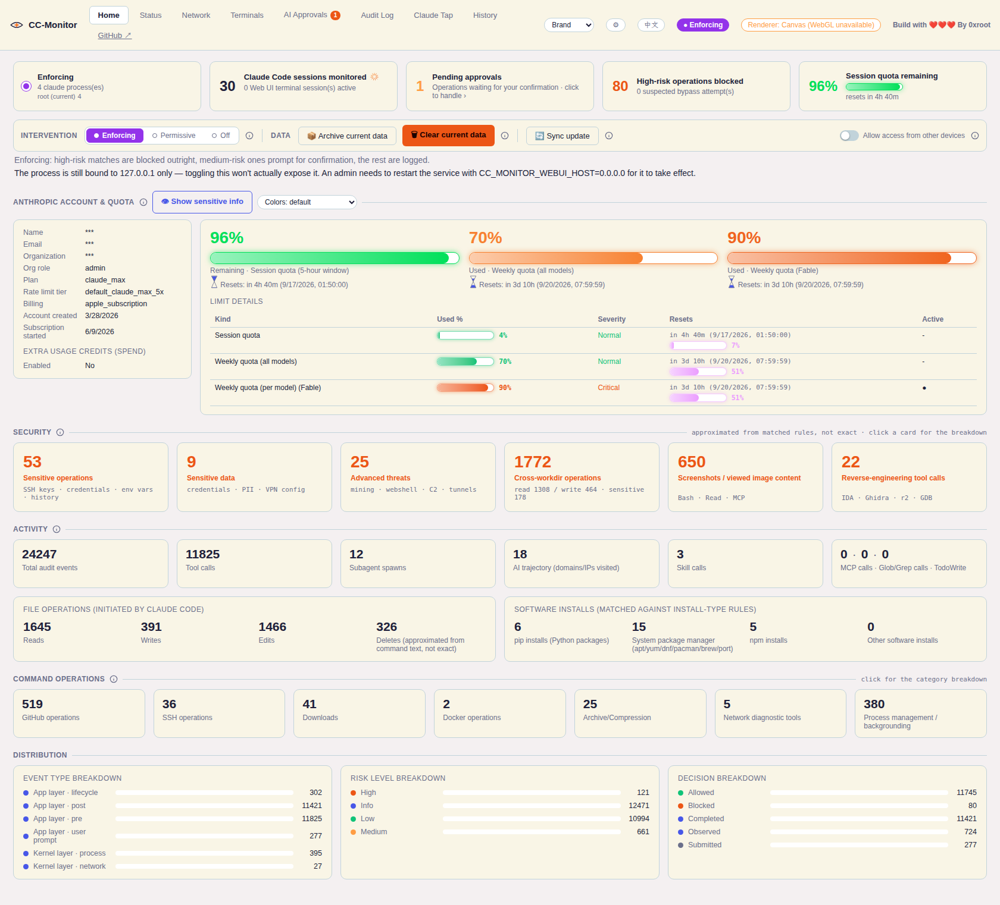
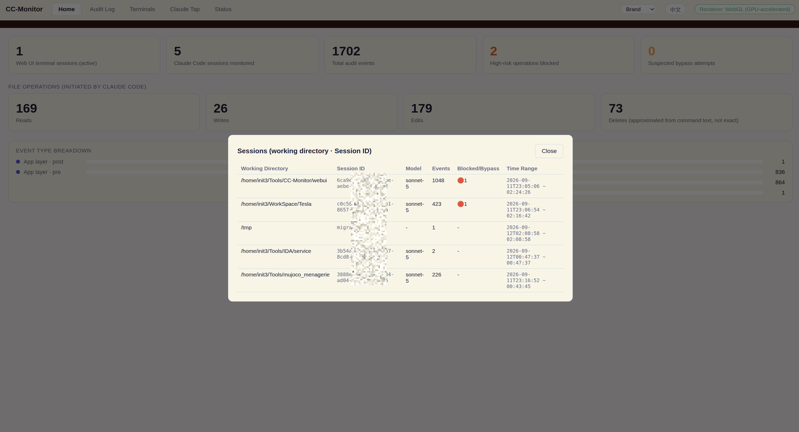
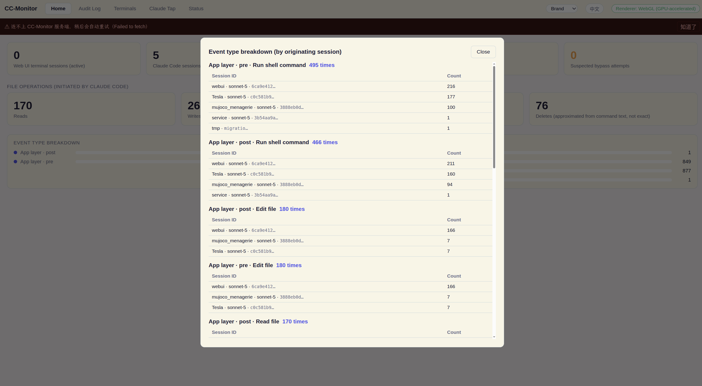
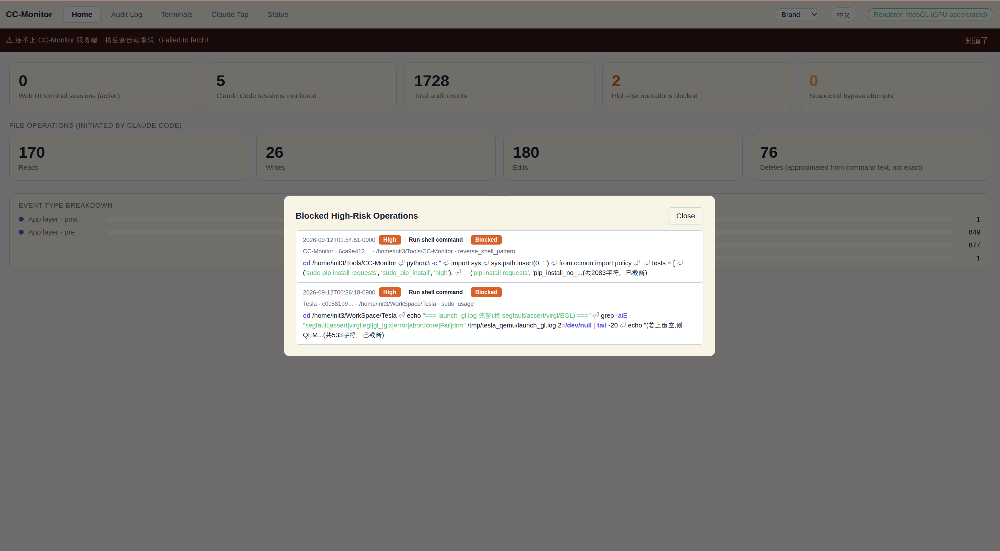
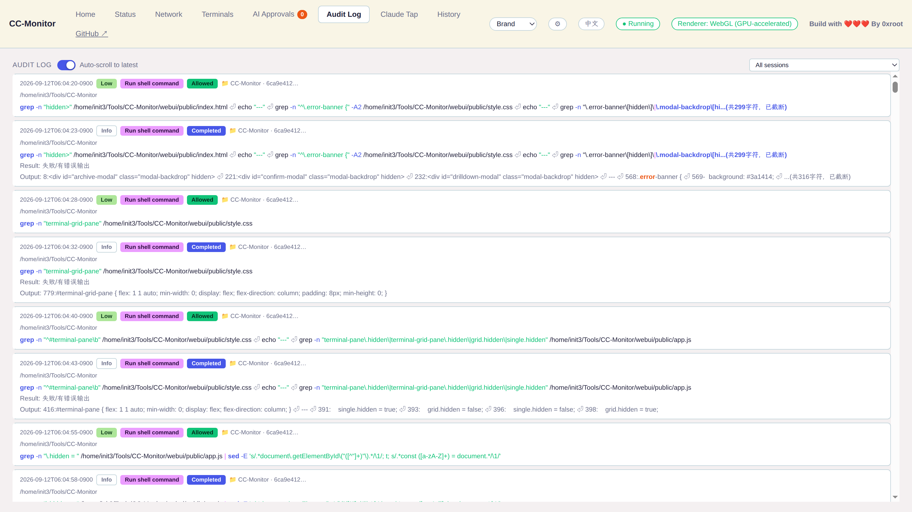

# CC-Monitor

English | [简体中文](./README.zh-CN.md)

Ever let an AI agent write code for you and had no idea what it actually did to your machine
along the way? Give this a try. It monitors what Claude Code does on your machine — file
reads/writes, shell command execution, network access — and blocks or asks for confirmation
on high-risk operations, so an AI coding agent can't quietly damage your system or leak data.
Everything is audit-logged. The technical design doc is available in
[English](./DESIGN.en.md) and [Chinese](./DESIGN.md). For what risks installing this actually
carries, what third-party modules it depends on, and where your data actually goes, see
[SECURITY.md](./SECURITY.en.md) ([Chinese](./SECURITY.md)).

Every release — what was added, changed and fixed — is recorded in
[CHANGELOG.md](./CHANGELOG.en.md) ([Chinese](./CHANGELOG.md)); the current release is
**v2.0**.

## Core capabilities at a glance

- **Two independent layers of monitoring**: Claude Code hooks capture semantic detail; a
  Linux eBPF / macOS nettop probe cross-verifies at the kernel/system level, independent of
  the hooks — so a bypassed or tampered hook config doesn't mean monitoring silently stops.
- **87 built-in detection rules, auto-triaged by risk**: high-risk operations get blocked
  outright (`rm -rf`, reverse shells, writing SSH keys…), medium-risk ones pop a confirmation
  prompt, low-risk ones are logged silently — you're not babysitting every single action.
- **Full audit trail**: every tool call's command, path, arguments, and decision are logged to
  SQLite in full. `CC-Monitor tail` gives you a live, syntax-highlighted view (command name,
  arguments, strings, pipes each get their own color) with one command.
- **Bypass detection**: cross-checks commands the system-layer probe actually observed against
  what the application-layer hooks recorded, specifically to catch the harder-to-notice case of
  monitoring being silently disabled.
- **Cross-workdir behavior detection**: regex rules can't see the cwd, so this layer fills the
  gap — every path a tool call is about to touch (file tools' `file_path`; Bash commands split
  into sub-commands with paths resolved, `cd` tracked, and redirects / `rm`/`cp`/`tee`-style
  writes recognized) is resolved to an absolute path and compared against the current project
  directory. Anything outside is tiered by location (hidden home-dir config/credentials, other
  users' homes, system directories, other project directories) × read/write: writes to sensitive
  locations prompt for confirmation, everything else is logged. Review them with `CC-Monitor workdir` or
  the "Cross-workdir operations" home-page card.
- **Network visibility**: eBPF captures the destination IP:port of every `connect()` call
  directly — no TLS termination, no CA certificate to install — with a connection detail table,
  GeoIP lookups, and a WebGL2 world map in the Web UI.
- **A full Web UI dashboard**: home-page stat cards, an AI approval desk (confirm from the web
  page, the terminal, or a desktop notification — whichever answers first wins), Claude Tap
  (reconstructs full conversations without packet capture), and live account quota display, all
  in one page.
- **Cross-platform**: works on both Linux and macOS (including real Apple Silicon M4 hardware
  verification), with the core feature set consistent across both.
- **Multi-agent**: not just Claude Code. Codex CLI, Gemini CLI, Cursor, OpenCode and ZCode plug into the
  same rules, approval desk and audit log through their own hooks / plugin; the system-layer probe
  recognises every agent's process tree via an agent registry, so hook-less agents like Aider are
  still observed at the OS level. See ["Supported AI agents"](#supported-ai-agents).

## Supported AI agents

| Agent | Application layer (rule blocking / approvals / audit) | System-layer probe (exec / connect) | Enable |
|---|---|---|---|
| Claude Code | ✅ hooks (default, unchanged) | ✅ by `comm` | `python3 install.py` |
| Codex CLI | ✅ `~/.codex/hooks.json` (protocol mirrors Claude Code's; `apply_patch` is split per file) | ✅ by `comm` | `python3 install.py --agent codex` |
| Gemini CLI | ✅ `hooks` block in `~/.gemini/settings.json` (`run_shell_command` etc. mapped to Claude Code tool names) | ✅ `/proc` scan by argv (node-hosted) | `python3 install.py --agent gemini-cli` |
| Cursor | ✅ `~/.cursor/hooks.json` (`beforeShellExecution` / `beforeMCPExecution` / `beforeReadFile` can block; `afterFileEdit` is log-only) | ➖ not applicable to an Electron IDE | `python3 install.py --agent cursor` |
| OpenCode | ✅ plugin bridge `~/.config/opencode/plugins/cc-monitor.js` (`tool.execute.before` calls the hook synchronously; exit 2 blocks) | ✅ by `comm` | `python3 install.py --agent opencode` |
| ZCode (Z.ai / GLM) | ✅ `hooks.events` in `~/.zcode/cli/config.json` (protocol mirrors Claude Code's; `type: process`) | ✅ desktop runtime by argv, `zcode` CLI by `comm` | `python3 install.py --agent zcode` |
| Aider / custom scripts | ➖ no hooks | ✅ `/proc` scan by argv | nothing to configure |

`python3 install.py --agent all` enables every agent detected on this machine; `CC-Monitor agents`
shows each agent's install / hook status and record count. How it works: other agents' tool names
and argument fields are translated into Claude Code's vocabulary before they reach the rule engine
(`run_shell_command` → `Bash`, `filePath` → `file_path`, …), so the 87 rules, cross-workdir
detection, approval desk and Web UI stats are one code path for every agent; the original tool
name is kept in the record's `native_tool`. Each agent's process signature, hook protocol, tool
mapping and session directory live in `cc_monitor/agents/<id>.json`; drop a same-named file in
`~/.cc-monitor/agents/` to override. The Web UI gains an agent filter in the top bar, a
"Monitored AI agents" card on the home page and agent badges on log / session / approval rows —
all hidden when only Claude Code is present, so the UI looks exactly as before. Usage guide, per-agent
details and how to add an agent: [MULTI-AGENT.md](./MULTI-AGENT.md); design and trade-offs:
[DESIGN-multi-agent.md](./DESIGN-multi-agent.md) (both Chinese).

> Each hook protocol is implemented from its official documentation; only Claude Code could be
> tested on the development machine. Still to verify on a machine with the agent installed: the
> default of Codex's `[features] hooks` flag, whether Gemini's `{"decision":"allow"}` skips its
> native prompt, whether Cursor's CLI runs hooks locally, OpenCode's session directory, and the
> process name of ZCode's bundled desktop runtime.

## Screenshots

| Home overview |
|---|
|  |

| Session list drilldown | Event type breakdown |
|---|---|
|  |  |

| Blocked high-risk operations | Audit log |
|---|---|
|  |  |

## Quick Install

```bash
git clone https://github.com/cn0xroot/CC-Monitor.git
cd CC-Monitor
./install.sh
```

`install.sh` runs 5 steps in order: the ccstatusline terminal statusline, hook
registration, Web UI dependencies, a system-layer probe check, and the GeoIP database —
each one idempotent and independently skippable (`--skip-ccstatusline` / `--skip-geoip`),
never overwriting anything you already have configured. Then run `./start.sh` to launch
the Web UI.

If you only want the core interception/audit capability and don't need the Web UI or
any of that, this one step is enough on its own:

```bash
python3 install.py
```

It does exactly one thing — registers the hooks into Claude Code's
`~/.claude/settings.json`. No npm or Python dependencies get installed (`cc_monitor/`
itself is standard-library-only Python). Add `--agent <id>` or `--agent all` to also enable
Codex / Gemini CLI / Cursor / OpenCode / ZCode (see ["Supported AI agents"](#supported-ai-agents)).
Once that's done, the `CC-Monitor
tail`/`rules`/`stats`/`verify` CLI commands already work; the Web UI is an entirely
optional, separate add-on you can install later whenever you want it. For the exact
flags each script takes, what `install.sh`'s 5 steps actually do, and installing to a
system path (`make install`), see the [Installation](#installation) section below.

## Intervention levels: picking one

Once installed, you decide how strict the tool is. There are three levels, and exactly one
is active at any time.

Think of it as a guard at the door:

| Level | What the guard does | Color |
|---|---|---|
| **Enforcing** | Stops anyone suspicious outright, asks you about the borderline cases, notes down the rest | Purple |
| **Permissive** | Writes everyone down, but stops nobody and never interrupts you | Green |
| **Off** | The guard went home and took the notebook with them | Yellow |

In concrete terms:

- **Enforcing** is the default; it's what you get if you change nothing after installing.
  Operations matching a high-risk rule are blocked outright, things like `rm -rf /`, reverse
  shells, or writing into `~/.ssh`. Medium-risk matches pop a confirmation and only proceed
  if you say so. Everything else is logged silently.
- **Permissive** records without stopping. Rules are still evaluated and the risk level and
  matched rule still land in the audit log, it just **never blocks and never prompts**. Two
  situations call for it: you're heads-down and don't want confirmation dialogs interrupting
  you but do want to know afterwards what the agent did; or you just installed the tool and
  don't yet know which rules your normal workflow trips, so you run it this way for a couple
  of days and read the log before tightening anything.
- **Off** is the only level that genuinely stops auditing. Nothing is evaluated, nothing is
  recorded, exactly as if the tool weren't installed. Its use is narrow: you suspect
  CC-Monitor itself is causing a problem and want to compare with it out of the picture.

**Permissive and Off are the easy pair to confuse.** Neither one will stop you. The
difference is whether there's anything to look at afterwards. Permissive keeps the log
filling; Off leaves a blank stretch you can never go back and inspect. So if you just want
fewer interruptions, pick Permissive, not Off.

You can switch from the command line:

```bash
CC-Monitor audit start        # Enforcing
CC-Monitor audit permissive   # Permissive (the old name, pause, still works)
CC-Monitor audit stop         # Off
CC-Monitor audit status       # Show the current level
```

Or in the browser, on the left of the home page toolbar: three levels side by side, click one
to switch, and the active one is highlighted in its color. Switching to Off asks once more
first, because that's the level that leaves a gap in the audit trail. A matching status pill
also sits permanently in the top bar, so you can tell the current level without going back
to the home page.

One thing to know: **the system-layer probe is not controlled by this switch**. As long as
the probe is running it keeps recording command execution and network connections at the
kernel level, whichever level you pick. That's deliberate. The probe's whole value is
observing independently of the hooks, so shutting it off alongside them would defeat the point.

## Web UI

`webui/` is a standalone Node.js service that provides a browser UI:

```bash
cd webui
npm install
node server.js          # listens on http://127.0.0.1:9999 by default, localhost-only
```

- **Home**:
  - **Intervention level**: Enforcing / Permissive / Off as a segmented control, so all
    three are visible at once and clicking one switches straight to it, with the active one
    highlighted in its color (purple / green / yellow). A line below the control explains
    whichever level is active. Switching to Off asks for confirmation. A matching status pill
    sits permanently in the top bar. See [Intervention levels](#intervention-levels-picking-one)
    above for what each level means.
  - **Claude Code identity check**: detects which OS user every running `claude` process
    belongs to (cross-platform, implemented via `ps`), and flags it prominently when that
    differs from the Web UI's own user — the Web UI and the hooks each resolve
    `~/.cc-monitor/` from their own process's `$HOME`, so a mismatch means the two sides
    silently write to completely different databases; this card makes that otherwise-
    invisible situation visible. Click through for each process's PID/user/working directory.
  - **Overview stats**: live terminal session count, total Claude Code sessions detected,
    total audit events (`hook_pre` + `hook_post` + system-layer events combined),
    blocked/suspected-bypass counts, **tool calls** (counts `hook_pre` only — a more direct
    "how many tool invocations actually happened" number than the raw event total), **MCP
    calls** (identified via the `mcp__<server>__<tool>` naming convention, click through for
    a per-server breakdown), and **AI trajectory** (domains/IPs Claude Code has visited,
    backed by the same data as the Network tab — a blend of two kinds of evidence: real
    connections the system-layer probe (eBPF/nettop) actually observed, plus targets inferred
    from the text of wget/curl/git clone/ssh/scp/… commands Claude ran, tagged "inferred" so
    they're never mistaken for confirmed probe data. Many people never start the system-layer
    probe by hand, so this card used to sit empty even when Claude had clearly run a pile of
    networked commands — now both kinds of evidence show up here, and on the world map too).
    The "total sessions" / "total events" / "blocked operations" / "tool calls" / "MCP calls" /
    "AI trajectory" cards are all clickable for drilldown detail.
  - **File operation stats**: read/write/edit/delete counts, each clickable for detail.
  - **Install operation stats**: grouped by which install-type rule matched — pip / system
    package manager (apt/yum/dnf/pacman/brew/port) / npm installs / other. The npm card combines
    two rules' totals: local (`npm install`/`npm i` without `-g`, log-level, never intrusive)
    and global (with `-g`/`--global`, confirm-level). Both run the same lifecycle scripts
    (`preinstall`/`postinstall`) with the same privileges, and both are a real supply-chain
    attack surface, but a global install sticks around on `$PATH` across every project, so only
    the global case asks for confirmation. Clicking the card splits the drilldown into separate
    "Global installs"/"Local installs" groups instead of flattening them together.
  - **Command-based operation stats** (GitHub/SSH/Download/Docker/Archive/Network
    Diagnostics/Process Management — seven groups): each group's home page footprint is a single
    summary card (the number is the sum across that group's categories); clicking it expands into
    a category breakdown table plus the full command list with syntax highlighting — avoiding a
    home page wall-papered with 33 sub-category cards across the seven groups (that's what it used
    to be, one full row per group). The drilldown interaction matches the existing MCP/Skill/
    Subagent call cards:
    - **GitHub operations**: git push / git clone / git commit / git pull-fetch / gh CLI
      (PR/Issue/API…) / other git operations, classified from the Bash command text itself (most
      git/gh commands don't violate any policy rule, so they never get a `matched_rule` and
      couldn't reuse the install-ops trick).
    - **SSH operations**: ssh (remote login/exec) / scp (file copy) / sftp (file transfer) / key
      management (`ssh-keygen`/`ssh-copy-id`/`ssh-add`/`ssh-agent`) / other (`autossh`/`sshpass`),
      classified the same way as GitHub operations (only the start of each sub-command, never a
      substring match against the whole text, so an `echo`'d string can't be misread as a real
      invocation).
    - **Downloads**: wget / curl (only counted when it writes to a file via `-o`/`-O`/`--output` —
      a bare curl call to an API isn't a "download") / aria2 / other (`axel`/`lftp`/`ftp`/`http`).
    - **Docker operations**: run (start a container) / build (build an image) / exec (run inside a
      running container) / compose (`docker compose` or the standalone `docker-compose`) / other
      (read-only inspection like `ps`/`logs`/`images`). run/build/exec are broken out separately
      since they can execute arbitrary code from an external image, Dockerfile, or a running
      container — a different risk tier than read-only inspection.
    - **Archive/compression operations**: tar / zip (incl. unzip) / 7z / gzip (incl. gunzip/zcat)
      / other (bzip2/xz/zstd/rar, etc.).
    - **Network diagnostic tools**: nc (incl. the ncat/netcat aliases) / nmap / telnet / other
      (socat) — purely a "was this tool used" visibility stat; an ordinary port probe like
      `nc -zv example.com 443` is still counted here without implying danger — an actual reverse
      shell is blocked separately by the policy rule below.
    - **Process management / backgrounding**: nohup / disown / background job (a bare trailing
      `&`) / other (setsid). "Background job" detection is deliberately narrow (requires the `&`
      not be part of `&&`/`2>&1`/`&>` syntax, and be immediately followed by the end of the
      command or a `;`), to avoid false-positiving on the `&` inside a URL query string like
      `curl 'http://x.com/a&b=c'`.
  - **Subagent spawn stats**: same approach as the MCP/Skill call stats, grouped by
    `subagent_type` (e.g. `general-purpose`/`Explore`/`Plan`/`fork`) — subagents consume
    independent resources and have their own full trail of operations, so they shouldn't be
    buried inside the generic "tool calls" count.
  - **Screenshot audit**: Claude Code has no built-in "screenshot" tool, so this is identified
    from three independent signals — a Bash command invoking a screenshot CLI (`scrot`,
    `gnome-screenshot`, `import`, `spectacle`, `flameshot`, `maim`, `grim`, `xwd`, macOS's
    `screencapture`, or the Wayland-typical `gdbus`/`dbus-send` call to
    `org.freedesktop.portal.Screenshot`); the `Read` tool opening a file that's itself an image
    (`.png`/`.jpg`/`.gif`/`.webp`/`.bmp` — deliberately broader than "screenshot," since viewing
    an existing image counts too); or an MCP/"computer use" tool's screenshot action (a tool
    name containing "screenshot," or a `computer` tool whose `action` field is `"screenshot"`).
    Click through for the exact session, timestamp, and the command run or file opened —
    **only that basic info is shown, the screenshot's own image content is never read or
    rendered**, to avoid exposing potentially sensitive desktop content through the web page.
  - **Anthropic account info**: name, email, organization, org role, plan type, rate-limit
    tier, billing type, and account/subscription creation dates, read straight from Claude
    Code's own local global config file (`~/.claude.json`'s `oauthAccount` field) — no
    network call, same source [ccstatusline](https://github.com/sirmalloc/ccstatusline)'s
    "Claude Account Email" widget uses. Plus account-level usage/quota (same data source as
    the Status tab — the session quota shows "remaining %" with a conky-style stepped
    palette, weekly quotas show "used %" with a continuous red→yellow→green gradient, and
    per-model quotas like Fable are detected dynamically rather than hardcoded), the
    `limits[]` breakdown (a progress bar, plus a purple "how far through this window" bar
    next to the reset time) and `spend` (whether pay-as-you-go usage credits are enabled, and
    how much has been used).
  - **Data management**: archive the current event data (a full SQLite `backup()` snapshot)
    or clear it to start counting from zero; breakdowns by log type and risk level.
- **Log Audit**: a full-width, live-updating audit log view (filterable by session — the session dropdown shows "folder · model · short ID" instead of an opaque ID string), reusing the same human-readable event-translation logic as the CLI. The data comes from `events.db` (what CC-Monitor's hooks captured and the policy engine judged), and the content is **deliberately redacted** per the project's privacy principle — Write/Edit show only "path (N bytes)", TodoWrite shows only an item count, screenshots show only metadata, never the actual content read or written. It answers "what operation happened, what was its risk level, was it allowed or blocked" — a security-audit question. For "what did this session actually say", see **Claude Tap** below.
- **Terminal Sessions**: open a Claude Code terminal directly in the browser (a PTY spawned via `node-pty`) instead of switching to a local terminal app; rendered with `xterm.js` + the WebGL addon, GPU-accelerated when available and falling back to Canvas otherwise. The sidebar can switch to a **grid view** (herdr-style) showing every live session on one screen at once; clicking a pane routes keyboard input to it.
- **Claude Tap**: view the **full conversation content** sent to/received from the model for a given session (not just "which tool was called") — text, thinking, tool calls, tool results, token usage, each field color-coded, and shown **unredacted**, including the model's thinking process that Log Audit can never show at all (hooks only see the world at the `PreToolUse`/`PostToolUse` boundary — thinking never crosses it; only the transcript file has it). You must pick one specific session first (there's no merged "all sessions" view here). It answers "what did this session actually say, what was Claude thinking" — a debugging/recap question, using a completely separate data source from Log Audit with a very different level of restraint, not two views onto the same data. The data source is Claude Code's own local transcript JSONL file (the `transcript_path` field in the hook payload) — not packet capture or MITM. CLI equivalent: `CC-Monitor tap [--session ID] [-f]`.
- **AI Approvals**: mirrors Claude Code's "allow this action?" confirmation into the Web UI
  — similar in spirit to [Vibe Island](https://vibeisland.app/) popping an Allow/Deny card in
  the Mac notch, except cross-platform (a web page instead of a Mac-only UI). Two kinds of
  prompts land here:
  - operations our own rule table flags as `confirm` (decided by our rules at `PreToolUse`);
  - **Claude Code's own native "Do you want to proceed?" dialog** (the `PermissionRequest`
    hook event — calls that matched no rule but that Claude Code's permission system wants
    a human to approve). An answer from the web page or the terminal is returned via
    `decision.behavior`; if nobody answers (90s timeout) or you press Enter at the terminal,
    the request is handed back untouched to the native dialog — installing CC-Monitor never
    removes that safety net.
  - The same request can be answered either at the terminal that triggered it (y/N) or from
    this page — whichever answers first wins. Choosing "allow" on the web page makes Claude
    Code skip its own native popup entirely, via the hook's `permissionDecision: allow`
    output, instead of asking twice.
  - Options: allow once, deny once, allow and don't ask again for 10/30 minutes, or always
    allow (scoped to this session only).
  - **Desktop app (Electron)** does not use the browser path (in an Electron renderer
    `Notification.permission` is always "granted", yet macOS silently refuses notifications
    from an app that isn't properly signed): the main process polls the pending list itself
    and on a new request plays the system alert sound + bounces the Dock icon + sets a badge
    count, plus a system notification when the OS allows one (click → approvals tab).
    `npm run electron` runs the ad-hoc-signed Electron.app from node_modules, so on macOS the
    system notification always fails (`UNErrorDomain error 1`) — you get sound/Dock/badge only;
    a Developer-ID-signed build is needed for real notifications. The hook side additionally
    sends one `osascript` notification per request (attributed to "Script Editor"); macOS asks
    once whether to allow it — if declined, re-enable it under System Settings → Notifications
    → Script Editor.
  - Supports browser desktop notifications (the Notification API) — new requests raise a
    system notification even when this tab isn't open, click it to jump straight back in.
  - **History table**: every resolved request stays on record (the underlying table is never
    purged by "clear current data"), with time, session, tool, matched rule, matched value,
    outcome, and resolved-via. For `notify`-kind records (`AskUserQuestion` and friends), it
    also captures the user's actual answer from the terminal.
- **Status**:
  - The same Anthropic account info (name/email/organization/plan) as the Home page, plus
    account-level usage (the 5-hour session window / weekly quota / per-model weekly quota +
    reset times, queried from the same `api.anthropic.com/api/oauth/usage` endpoint and OAuth
    credentials as [ccstatusline](https://github.com/sirmalloc/ccstatusline)).
  - **Model Usage table**: token usage summed by model (Sonnet/Opus/…) across every
    monitored session.
  - Per-session model, token usage, throughput (tok/s, estimated from the transcript), and a
    `ccstatusline`-compatible `Σ Total / Cached` token summary (same accounting: total =
    input+output+cached, cached = cache-read+cache-creation).
  - **Context window usage %**: estimated against a standard 200K context window (Claude
    Code doesn't report the exact window size to our hooks, so this is an approximation).
  - **Context compaction count**: a real detection of `compact_boundary` events in the
    transcript, not an estimate.
  - cwd, git branch, uptime, and blocked-operation counts.
- **Network**: the actual network connections the Claude Code process tree has made —
  destination IP/port, hostname, upload/download byte counts, connection count, plus a world
  map plotting roughly where those destinations are. All of this comes from the system-layer
  probe (`cc_monitor/probe_linux.bt.tmpl`, Linux + eBPF) — not packet capture or MITM.
  - **Domain capture**: a `uprobe:libc:getaddrinfo` records the hostname the moment the
    application resolves it, instead of reverse-DNS-ing the IP afterward — many cloud/CDN
    egress IPs never had a PTR record configured, so reverse DNS can't recover a domain that
    was never registered in reverse; this method isn't affected.
  - **Byte counts**: `tcp_sendmsg`/`tcp_cleanup_rbuf` kernel probes, since the probe
    previously only knew "connected to this IP:port," not how much data moved.
  - **IP geolocation**: a local database (no per-IP third-party API calls) — either MaxMind
    GeoLite2 or the no-signup-needed DB-IP Lite both work, see Requirements below; without
    one, the map and location column are simply empty and the page honestly says "no GeoIP
    database configured" instead of faking data.
  - **World map**: drawn entirely in WebGL2 (equirectangular projection + a bundled low-res
    coastline outline), following the approach from
    [BeeEye](https://github.com/cn0xroot/BeeEye)'s `WorldMap.jsx` — no map-tile service
    dependency.
  - **Connection detail**: "Connections" is clickable both per target row and on the two
    summary cards ("Total connections" / "Distinct IPs") — opens every connection's time,
    originating process, and PID.
  - With the probe not installed or not running, this page just shows empty data.
- **Appearance settings**: a ⚙ button in the top bar opens a settings dialog.
  - **Color theme**: a visual swatch grid — each of the 10 themes (Brand/Dark/Light/Dracula/
    Nord/Midnight/Ocean/Forest/Sunset/Rose, the last five ported from
    [AI_Web_Search](https://github.com/cn0xroot/AI_Web_Search)'s color scheme) shown as its
    own accent-color dot with an active highlight; the original top-bar theme dropdown still
    works too and stays in sync.
  - **Interface font** (system default / monospace / serif / rounded / Kaiti / Heiti
    (Source Han Sans) / Songti (Source Han Serif)) and **interface font size** (12–18px
    slider, applied at the root element with every `font-size` in the stylesheet in `rem`,
    so one change scales the whole app proportionally) — new settings, with a live
    preview, persisted to `localStorage`. The Chinese font options aren't bundled as font
    files (a full CJK glyph set is 17–21MB each, which would make the first font switch
    painfully slow) — they're plain font-name references that only render correctly where
    the visitor's system already has a matching font installed.
  - **Language toggle**: translation covers UI chrome (nav, buttons, titles, empty-state
    hints, risk/operation/status labels) but not the data itself (raw command text, tool
    output, transcript content). The risk/operation-type/status badges in the audit log use
    fixed, highly saturated colors that don't change with the theme; high-risk rows are shown
    in bold red.

Static assets are served with `Cache-Control: no-store` since this UI is still iterating fast — refresh the page after a code change and you'll see the latest version, no stale browser cache to worry about.

Binds to `127.0.0.1` only by default: this tool can spawn terminal processes directly and has
no authentication. The Home tab has an "Allow access from other devices" switch, but it only
sets a flag — the actual security boundary is the address the process was bound to at startup,
which a web page can't change at runtime. To really listen on all interfaces, an admin has to
explicitly set `CC_MONITOR_WEBUI_HOST=0.0.0.0` and restart the service; only then does the
switch actually do anything (it defaults to off even when bound to `0.0.0.0`, rejecting every
non-local request until turned on).

## Desktop app (Electron)

If you'd rather not open a browser and run `node server.js` by hand, `webui/` also has an
Electron wrapper — it directly `require`s the existing `server.js` (Express + ws + node-pty +
better-sqlite3) with zero server-side code changes, and runs as a standalone windowed app.

```bash
cd webui
npm install
npm run electron          # dev mode: runs directly, no packaging needed
```

Binds to `127.0.0.1:9998` (distinct from the web version's default 9999, so both can run at
the same time).

To build a distributable installer:

```bash
npm run dist:linux   # AppImage (x64 + arm64)
npm run dist:mac     # universal dmg (Intel + Apple Silicon)
```

Both scripts run `electron-rebuild` first to recompile `node-pty`/`better-sqlite3` against
Electron's bundled Node ABI — these packages ship prebuilt binaries that don't match
Electron's Node version out of the box, so this rebuild step is required, not an optional
optimization.

**Known status**: the Electron version pinned in `devDependencies` (`^44.0.0`) isn't
arbitrary — an earlier build on the default 33.x reproducibly segfaulted on startup on a
recent AMD CPU (Zen 5), and switching to 44.x fixed it; this looks like a Chromium/CPU
compatibility bug in that older Electron release, so don't roll the version back. So far only
the "packaged app starts and its embedded server listens correctly" path has been verified
end-to-end on Linux x64; the macOS and Linux ARM64 builds haven't been validated end-to-end
yet.

## Overview

CC-Monitor has a two-layer architecture:

- **Application layer (Claude Code Hooks)**: registers `PreToolUse`/`PostToolUse` hooks to get
  semantic info on every tool call (tool name, command, file path), then allows/blocks/asks based
  on configurable rules. This is the primary layer — cheap and broad coverage.
- **System layer (eBPF on Linux, nettop on macOS)**: `CC-Monitor-probe` uses `bpftrace` to
  independently trace, at the kernel level, every `execve`/`connect` made by the entire process
  subtree spawned by the `claude` process — completely independent of Claude Code's own
  cooperation. This is the second line of defense: it can still catch anomalies even if the
  hooks config itself gets tampered with or bypassed.
  - **macOS**: the same `CC-Monitor-probe` command switches to `cc_monitor/probe_darwin.py`, which
    samples the claude process tree's connections and byte counts every 2s with the built-in
    `nettop` — **no root needed**. Network only (traffic page / world map / AI trajectory): there
    is no `execve` observation (the bypass detection behind `CC-Monitor verify` stays Linux-only)
    and hostnames fall back to reverse DNS.

Capabilities:

| Capability | Description |
|---|---|
| Block high-risk operations | Operations matching a rule (`Bash`/`Write`/`Edit`/...) can be denied outright (e.g. `rm -rf /`, writing to `~/.ssh/`) |
| Interactive confirmation | Medium-risk operations prompt for confirmation in the terminal + a desktop notification; times out to "deny" if there's no tty |
| Audit log | Every event is persisted to SQLite, with the full `tool_input`/`tool_response` payload |
| Human-readable live log | `CC-Monitor tail` turns raw JSON into "event type + summary + result", auto-colored in a real terminal, with Bash commands syntax-highlighted (command name / flags / strings / variables / pipes) |
| Bypass detection | `CC-Monitor verify` cross-checks what the system probe observed against what the hooks recorded, and flags commands the probe saw but the hooks never logged |
| Network visibility | eBPF captures the destination IP:port of every `connect()` call directly — no TLS termination, no CA certificate to install |

## How It Works

The Overview above is *what* it does; this is *how*, and every mechanism maps directly onto the
source (full depth in [DESIGN.en.md](./DESIGN.en.md)):

- **Hook interception**: before and after every tool call, Claude Code writes a JSON payload to the
  configured hook command's stdin and waits synchronously for it to exit. `CC-Monitor-hook` exiting
  with code 2 means "deny" — whatever it printed to stderr gets surfaced back to Claude Code. It's a
  one-shot subprocess spawned per call, not a long-running daemon, so there's no "the monitor process
  died and now nothing is enforced" failure mode (and also no need to restart anything after editing
  rules — the next call picks them up immediately).
- **Rule engine**: `default_rules.json` is an ordered rule list; `policy.evaluate()` walks it in order
  and the first match wins, so more specific rules need to come before more general catch-alls. Each
  rule declares `tools` (which tools it applies to), `field` (which key to read out of `tool_input` —
  e.g. `command`/`file_path`/`url`), a regex `pattern`, and a `risk`/`action`. The rule file is copied
  from `default_rules.json` into `~/.cc-monitor/rules.json` on first use, and can be edited from there.
  Rules added to `default_rules.json` by later versions are merged into that file automatically by id
  (a rule you edited or deleted is never touched; see `rules.defaults_snapshot.json`).
- **System-layer eBPF probe**: `probe_linux.bt.tmpl` attaches to kernel tracepoints like `execve`/`connect`.
  It first recognizes Claude Code's own process via `comm=="claude"`, then listens for
  `sched_process_fork` events to propagate a "being monitored" flag down through every descendant
  process it spawns — tracking continues even if a child process renames itself. `CC-Monitor verify`
  matches commands the probe observed against what the hooks logged in the same time window (with
  quote-normalization to handle how zsh's snapshot wrapper escapes quotes), and flags anything the
  probe saw that the hooks never recorded.
- **Claude Tap**: the hook's JSON payload includes a `transcript_path` field pointing at Claude Code's
  own local conversation transcript JSONL file. Reading that file and parsing its `user`/`assistant`/
  `tool_use`/`tool_result` entries reconstructs the full conversation — no packet capture, no CA
  certificate, no MITM proxy involved.
- **Account usage display**: reads the OAuth token Claude Code itself stores (Linux:
  `~/.claude/.credentials.json`; macOS: no file — it lives in the login Keychain as the
  generic-password item `Claude Code-credentials`, read via `security find-generic-password`),
  then calls Anthropic's own
  `api.anthropic.com/api/oauth/usage` endpoint with that token (adding the
  `anthropic-beta: oauth-2025-04-20` header) — the exact same credential and endpoint
  [ccstatusline](https://github.com/sirmalloc/ccstatusline) uses, not a separately maintained usage
  tracker.
- **Web terminal**: `node-pty` spawns a real pseudo-terminal (PTY) — no different from opening a
  terminal window locally — then types `claude\r` into it automatically to launch Claude Code. The
  first time Claude Code opens a directory it hasn't seen before, it shows a "do you trust this
  folder?" prompt defaulting to "No, exit"; this is detected by watching for that exact banner text
  and answered automatically (down-arrow + enter, selecting "Yes, I trust this folder") — otherwise
  the very next stray Enter keypress would silently exit Claude Code back to a bare shell while the
  terminal still looked perfectly functional.
  - **New Window**: shares the same working-directory picker modal as "New Session," the only
    difference being it never types `claude\r` — for when you just want a terminal (running a
    script, poking around files) without being dropped straight into a Claude Code session.
    Backend-wise it's just `POST /api/sessions` with `launchClaude: false`.
- **Data persistence/archiving**: "Archive current data" on the Home tab uses SQLite's own `backup()`
  API to take a full snapshot of the current `events.db` (not a plain file copy — `backup()` correctly
  handles data that hasn't been checkpointed out of the WAL journal yet), saved under
  `~/.cc-monitor/archives/`; "Clear current data" runs `DELETE` against the same database and resets
  the autoincrement counter.

## Installation

### Requirements

- **Hooks (`cc_monitor/`)**: Python 3.8+, standard library only, no third-party packages. The
  system-layer probe additionally needs `bpftrace` on Linux (optional — the hooks work fine
  without it).
- **Web UI (`webui/`)**: Node.js **≥ 22** — not an arbitrary floor, it's what `better-sqlite3`
  itself declares in its `package.json` `engines` field (`express` only needs Node ≥ 18, but
  `better-sqlite3` requires 22; an older Node will likely fail during install or at startup).
  Check `node --version` before installing, e.g. via [nvm](https://github.com/nvm-sh/nvm).
- **Terminal statusline [ccstatusline](https://github.com/sirmalloc/ccstatusline) (optional)**:
  reads the same OAuth credential and calls the same Anthropic endpoint as CC-Monitor's own
  usage display (see "Account usage display" above), but it's an independently maintained
  third-party npm package — CC-Monitor never calls into it or bundles its code. Step 1 of
  `install.sh` checks whether it's already installed (`command -v ccstatusline`) and runs
  `npm install -g ccstatusline` if not; once installed, if `~/.claude/settings.json` has no
  `statusLine` entry yet, it wires one in automatically (never overwriting any existing
  `statusLine` config, whether it's ccstatusline or something else). `--skip-ccstatusline` or
  `CC_MONITOR_SKIP_CCSTATUSLINE=1` skips both the install and the wiring.
- **GeoIP location on the Network tab (optional)**: uses the `maxmind` npm package to read a
  local database file, which isn't shipped in this repo. Without one, the Network tab still
  works — the location column and map just have no data, and the page says so honestly
  rather than affecting the connection/byte-count stats. Two ways to get a database:
  - **No account needed (recommended — this is what `./install.sh` does by default)**:
    [sapics/ip-location-db](https://github.com/sapics/ip-location-db)
    republishes DB-IP Lite data ([CC BY 4.0](https://creativecommons.org/licenses/by/4.0/),
    city-level accuracy) as ready-to-use `.mmdb` files, updated automatically. Step 5 of
    `install.sh` downloads it to `~/.cc-monitor/dbip-city.mmdb` (skipped if any `.mmdb` is
    already there; a failed download only warns; set `CC_MONITOR_GEOIP_URL` to use a mirror).
    Manual download works too:
    ```bash
    curl -L -o ~/.cc-monitor/dbip-city.mmdb \
      https://github.com/sapics/ip-location-db/releases/download/latest/dbip-city-ipv4.mmdb
    ```
  - **Official MaxMind GeoLite2**: usually more accurate, but requires signing up for a free
    account at [MaxMind](https://www.maxmind.com/en/geolite2/signup), generating a license
    key, and manually downloading `GeoLite2-City.mmdb` to
    `~/.cc-monitor/GeoLite2-City.mmdb`.

  The two databases use different field layouts (MaxMind nests fields, DB-IP Lite is flat) —
  `geoip.js` recognizes both, no extra configuration needed either way. `CC_MONITOR_GEOIP_DB`
  can point at a different path than the defaults above.

**Verified working environment** (not the only one that works — just the one this has
actually been tested and confirmed on): Ubuntu 24.04 LTS (kernel 7.0, x86_64), AMD Ryzen 9
9950X (Zen 5), Node.js v22.17.1, npm 10.9.2, Python 3.13.5. The desktop (Electron) build was
additionally verified to crash on startup on this CPU with the originally-pinned Electron
33.x, and to run correctly after upgrading to 44.x (see the Desktop app section below) — which
is why that version isn't pinned back down.

**In a hurry?** `./install.sh` runs these 5 steps in order:

1. **ccstatusline** (optional terminal statusline): installs it globally via npm if missing,
   then wires it into `~/.claude/settings.json`'s `statusLine` field if that key isn't already
   set — `--skip-ccstatusline` / `CC_MONITOR_SKIP_CCSTATUSLINE=1` skips both
2. **Registers hooks** into Claude Code's `settings.json` (`python3 install.py`, see the manual
   steps below for details)
3. **Installs Web UI dependencies** (`cd webui && npm install`; skipped, Web UI only, if npm
   isn't found)
4. **Checks whether the system-layer probe can run**: on Linux, whether `bpftrace` is
   installed; on macOS, nothing extra is needed (uses the built-in `nettop`) — this step only
   detects and prints a hint, missing `bpftrace` never aborts the install
5. **GeoIP database** (optional, for the Network tab's location column): downloads DB-IP Lite
   to `~/.cc-monitor/dbip-city.mmdb` by default — `--skip-geoip` / `CC_MONITOR_SKIP_GEOIP=1`
   skips it

Then run `./start.sh` to launch the Web UI (it installs dependencies on first run if needed).
For more control, the manual steps are below.

There are two ways to install it, with identical end results — pick whichever fits:

### Option 1: run it in place (touches nothing outside this directory)

```bash
# 1. Put the whole CC-Monitor directory wherever you want it (assumed here: ~/Tools/CC-Monitor)
cd ~/Tools/CC-Monitor

# 2. Install the hooks into your Claude Code config (also chmod +x's everything under bin/)
python3 install.py                              # global install: writes ~/.claude/settings.json
python3 install.py --project /path/to/project    # project-scoped install
python3 install.py --target /path/to/settings.json  # explicit settings.json path (for cross-user installs)

# 3. (optional) install bpftrace if you want the system-layer probe
sudo apt install bpftrace        # Debian/Ubuntu
# see bpftrace's own docs for other distros; macOS needs nothing extra (the probe uses the built-in nettop)
```

The installer merges into the `PreToolUse`/`PostToolUse`/`PermissionRequest` hook arrays and de-duplicates by exact
`command` string, so it **never overwrites** any hooks you already have configured; a corrupted
`settings.json` gets backed up to `.json.bak` before being rebuilt. **Restart Claude Code** —
only new sessions pick up the updated config.

### Option 2: `make install` onto the system path

If you'd rather have a global command and not have to remember where this checkout lives:

```bash
sudo make install                          # defaults to /usr/local/lib/cc-monitor + /usr/local/bin
sudo make install PREFIX=/opt/cc-monitor   # or pick your own prefix

# afterwards, the commands work from any directory; still do step 2 from Option 1 to
# register the hooks (using the path make install prints out):
CC-Monitor tail -v
python3 /usr/local/lib/cc-monitor/install.py
```

`make install` only copies the code onto the system and sets up the command-line symlinks — it
**does not** touch your `~/.claude/settings.json` on its own; registering the hooks is a separate,
explicit `install.py` run (the exact path is printed at the end of `make install`). `sudo make
uninstall` reverses it (again, code and symlinks only — any hooks already registered in
`settings.json` need to be removed by hand).

## Build

CC-Monitor is pure Python (standard library only: `sqlite3`, `json`, `argparse`, `re`, ...) —
**there is no build/compile step**:

- `bin/CC-Monitor`, `bin/CC-Monitor-hook`, and `bin/CC-Monitor-probe` are executable scripts with a
  `#!/usr/bin/env python3` shebang; `install.py` chmod's them automatically.
- The system-layer probe depends on `bpftrace`, which is a prebuilt binary from your system's
  package manager — nothing to compile. `cc_monitor/probe_linux.bt.tmpl` is a bpftrace script, interpreted
  at runtime by `bpftrace` itself.
- `make install` in the `Makefile` isn't a build step either — it just copies files under `PREFIX`
  and creates command-line symlinks; see "Installation" above.
- It is **not** currently packaged as a single-file executable (e.g. via PyInstaller/Nuitka) —
  that's on the TODO list below.

## Usage

```bash
# Live-tail monitored events (Ctrl+C to quit)
./bin/CC-Monitor tail
./bin/CC-Monitor tail -v          # also print the raw JSON

# Show the currently active rules
./bin/CC-Monitor rules

# Show stats (counts by risk level / decision)
./bin/CC-Monitor stats

# System-layer probe (needs root; cross-checks whether hooks are being bypassed)
sudo ./bin/CC-Monitor-probe

# Show records the probe flagged as "possibly bypassing the hooks"
./bin/CC-Monitor verify
```

**Environment variables**:

| Variable | Effect |
|---|---|
| `CC_MONITOR_HOME` | Overrides the event DB / rules file directory (default `~/.cc-monitor/`) |
| `CC_MONITOR_COLOR` | `always`/`never` to force terminal color on/off (default: auto-detect a real tty) |
| `NO_COLOR` | Forces color off when set (standard convention) |

Events and rules live under `~/.cc-monitor/`: `events.db` (SQLite audit log) and `rules.json`
(editable rules — edits apply immediately, no restart needed; new default rules from later
versions are merged in automatically, tracked via `rules.defaults_snapshot.json`). Whenever the
effective rule set changes, the next hook invocation re-evaluates every historical `PreToolUse`
event against the new rules in a background process (only `risk`/`matched_rule` are rewritten,
never the original allow/block decision), so the home-page stat cards catch up instead of carrying
stale hits forever; `CC-Monitor rematch` previews that pass and `CC-Monitor rematch --apply` runs
it by hand.

**Rule format** (`rules.json` is an array of rules):

```json
{
  "id": "rule_name",
  "risk": "high | medium | low",
  "action": "block | confirm | log",
  "tools": ["Bash"],
  "field": "command | file_path | url",
  "pattern": "regular expression",
  "match": "search | segment"
}
```

- `match` (optional, default `search`): `search` runs the regex over the whole field value;
  `segment` splits a Bash command into top-level sub-commands (quotes and heredoc bodies are not
  split), strips `sudo`/`env`/`xargs`/`time` wrappers and executable path prefixes, and anchors the
  regex at the start of each sub-command. Use it for "is this command actually being run" rules
  (package installs, `sudo`); `search` stays for "does this text mention X anywhere" rules (paths,
  redirections, download-piped-into-shell). `bash -c "..."` and `osascript ... do shell script "..."`
  bodies are recursed into.

- `block`: deny outright; Claude Code receives the denial reason.
- `confirm`: prompts for confirmation in the terminal (waits for `y` on the tty) + a desktop
  notification; denies by default with no tty or on timeout.
- `log`: allow, but record it in the audit log.

Default rules live in [cc_monitor/default_rules.json](./cc_monitor/default_rules.json), covering: dangerous
deletes, disk-overwrite commands, `curl|bash`, recursive `chmod 777`, `sudo`, `git push --force`,
reading/writing SSH keys and credential files, writing to system directories, attempts to kill the
monitoring itself (`kill`/`pkill` targeting CC-Monitor's own probe process, `confirm` level; a
generic `kill`/`pkill` is `log`-only to avoid alert fatigue), reading SSH keys/`.env`/credential
files via `cat`/`less`/`head` and friends (a blind spot the `Read`-tool-only rule didn't cover),
dumping the whole environment via `env`/`printenv`/`export -p`, `su`/`pkexec` privilege escalation
(the same risk category as `sudo`), single-file non-recursive `chmod 777` (relative paths included,
not just filesystem-rooted ones), and destructive direct database commands (`mysql`/`psql`/
`redis-cli`/`mongo`/`sqlite3` followed by `DROP`/`DELETE`/`TRUNCATE`/`FLUSHALL`), reading shell
history files by any means (`cat`/`grep`/`python -c open(...)`/the `Read` tool, covering
`.zsh_history`, `.bash_history`, macOS Terminal's `.zsh_sessions/`, `$HISTFILE`, and Claude Code's
own `~/.claude/history.jsonl`) or running a bare `history`/`fc -l` (which can surface plaintext
credentials typed in the past), and reverse-shell/backdoor execution (covering `-e`/`-c` variants of
`nc`/`ncat`/`netcat`, `socat exec:`, and a `mkfifo`-plus-named-pipe reverse shell), tampering with
Claude Code's own config (`~/.claude/settings.json`/`.claude/hooks/`/`CLAUDE.md` — the
config-layer counterpart to the anti-bypass rules above), Docker-socket-mount container escapes
(`-v /var/run/docker.sock:...`), common secret formats appearing in written content
(AWS/GitHub/Anthropic/OpenAI/Slack/Google/npm/Stripe fixed prefixes plus private-key headers),
and git-hooks/git-config persistence (`core.hooksPath`, `url....insteadOf`), and more.

## Development Progress

For exactly what shipped in each version, see [CHANGELOG.en.md](./CHANGELOG.en.md)
([中文](./CHANGELOG.md)).

### Implemented

- [x] Application-layer hook interceptor (`PreToolUse`/`PostToolUse`), covering Bash/Write/Edit/Read/WebFetch and other tools
- [x] Policy engine: regex rule matching + three actions (block/confirm/log) + three risk tiers
- [x] SQLite audit log (`events.db`), retaining the full hook input/output for every event
- [x] CLI: `CC-Monitor tail` (live view) / `rules` (view rules) / `stats` (stats) / `verify` (bypass detection)
- [x] Human-readable event formatting: raw JSON turned into "event type + summary + result"
- [x] Terminal color output: independent coloring for risk level / decision / rule name, with `NO_COLOR`/`CC_MONITOR_COLOR` support
- [x] Bash command syntax highlighting (command name / flags / strings / variables / pipes & redirects, each colored separately)
- [x] Terminal confirmation (`/dev/tty` interaction) + desktop notification (`notify-send`/`osascript`)
- [x] Installer: safely merges hooks into `settings.json` (global / project / custom-path modes) without touching existing config
- [x] System-layer probe (`CC-Monitor-probe`, eBPF on Linux): tracing of the Claude Code process tree's `execve`/`connect` (network-only coverage on macOS via nettop, see below)
- [x] Bypass detection: fuzzy-matches what the probe observed against hook records (process tree + time window + quote-stripped substring match), flagging `hook_bypass_suspected`
- [x] Network visibility: eBPF captures `connect()` destination IP:port; domain names come from
      a `uprobe:libc:getaddrinfo` that records the hostname the moment the application resolves
      it (reverse DNS as a fallback) — no MITM proxy needed
- [x] Network byte-count stats: `tcp_sendmsg`/`tcp_cleanup_rbuf` kernel probes, aggregated upload/download bytes per (ip, port)
- [x] Web UI Network tab: connection detail table + GeoIP location (local MaxMind/DB-IP Lite database) + WebGL2 world map, with connection counts clickable for per-connection time/process/PID detail
- [x] Claude Code identity check: cross-platform (`ps`) detection of which OS user every `claude` process runs as, flagged when it differs from the Web UI's own user
- [x] Four Home stat cards — tool calls, MCP calls, Skill calls, AI trajectory — all with click-through drilldowns showing Session ID/folder/timestamp
- [x] AI Approvals supports an `action: "notify"` rule type (Claude Code clarifying questions, e.g. `AskUserQuestion`) and keeps a long-term history table, capturing the user's actual terminal answer for `notify`-kind records
- [x] AI Approvals also covers Claude Code's native `PermissionRequest` dialog: operations that
      matched no rule but that Claude Code's own permission system wants to ask "Do you want to
      proceed?" about now show up on the page too (`kind='permission'`); a 90s timeout or
      pressing Enter at the terminal silently hands the request back to the native dialog —
      installing CC-Monitor never removes that safety net
- [x] Anthropic account profile (name/email/organization/plan/rate-limit tier) read from the local `~/.claude.json`, zero network calls
- [x] Per-session `Σ Total / Cached` token summary on the Status page (same accounting as ccstatusline)
- [x] Model Usage table, Limits table, context window usage %, and Context compaction count (real detection, not an estimate) on the Status page
- [x] Home page GitHub Operations stats (push/clone/commit/pull-fetch/gh CLI/other git operations)
- [x] Home page SSH Operations (ssh/scp/sftp/key management/other) and Downloads
      (wget/curl/aria2/other) cards, classified from Bash command text
- [x] The "AI Trajectory" card and world map now also include command-text-inferred network
      targets: when Claude runs wget/curl/git clone/ssh/scp/…, the target hostname is
      extracted from the command, resolved to an IP, and geo-located, then merged alongside
      real system-layer-probe data with an "inferred" tag (not guaranteed to have actually
      connected, and no byte counts) — many people never start the probe by hand, so this used
      to be empty entirely
- [x] World map gained an animated "this machine ↔ destination" arc with a travelling light
      dot (modeled on [BeeEye](https://github.com/cn0xroot/BeeEye)'s approach): each connection
      draws an arc from a schematic anchor (fixed at (0,0), open ocean — explicitly not this
      machine's real location; no extra request is made to ask a third party for the public
      IP just for this) to the destination, with the dot's direction following whichever
      direction moved more bytes (download-heavy animates back toward the anchor; inferred
      targets have no real byte counts, so they default to animating outward). Falls back to
      Canvas 2D when WebGL2 isn't available, so the map never disappears entirely just because
      WebGL2 is missing — both rendering paths were verified with real screenshots from a
      headless browser, confirming both the animation and the direction logic
- [x] Terminal Sessions gained a "New Window" button: shares the same working-directory picker
      modal as "New Session," the only difference being it never types `claude\r` into the
      PTY — for when you just want a terminal without being dropped into a Claude Code
      session. `POST /api/sessions` takes a `launchClaude: false` flag; verified over a real
      WebSocket connection that the "New Window" shell prompt never has `claude` typed in
      front of it, while "New Session" does
- [x] Home page Screenshot Audit: identifies Bash screenshot CLI commands / image files opened
      via Read / MCP screenshot-type tool actions; the drilldown shows only basic info (command
      / file path), never the screenshot's own image content
- [x] New kill/pkill monitoring-tamper detection rules: specifically flags kill/pkill targeting
      CC-Monitor's own probe/hook processes (`confirm` level); a generic kill/pkill is `log`-only
      to avoid alert fatigue
- [x] Home page Docker Operations stats (run/build/exec/compose/other), classified from Bash
      command text; run/build/exec are broken out separately since they're a different risk tier
      than read-only inspection
- [x] Sensitive-file-read detection extended to Bash commands: `cat`/`less`/`head` and friends
      reading SSH keys/`.env`/credential files are now covered (previously only the `Read` tool
      opening them directly was), plus new detection for `env`/`printenv`/`export -p` dumping the
      whole environment
- [x] New `su`/`pkexec` privilege-escalation detection (same risk category as `sudo`, previously
      a complete blind spot)
- [x] New single-file, non-recursive `chmod 777` detection: relative-path, single-file cases
      weren't covered by any existing rule before
- [x] New destructive direct-database-command detection: `mysql`/`psql`/`redis-cli`/`mongo`/
      `mongosh`/`sqlite3` followed by `DROP`/`DELETE`/`TRUNCATE`/`FLUSHALL`/`FLUSHDB` had zero
      rule coverage before
- [x] New shell-history-read detection: `cat .bash_history` / running bare `history` had no rule
      coverage before — command history can retain plaintext credentials typed in the past
- [x] Strengthened reverse-shell/backdoor-execution detection: the previous
      `reverse_shell_pattern` only recognized `nc -e` — expanded to cover the `-c` variant,
      the `ncat`/`netcat` aliases, `socat exec:`, and a `mkfifo`-plus-named-pipe reverse shell,
      verified not to false-positive on ordinary network diagnostics like `nc -zv`/`nmap`
- [x] New "Archive/Compression Operations" home card (tar/zip/7z/gzip/other), classified from
      Bash command text
- [x] New "Network Diagnostic Tools" home card (nc/nmap/telnet/other) — a pure visibility stat,
      a separate concern from the reverse-shell risk judgment
- [x] New "Process Management / Backgrounding" home card (nohup/disown/background job/other) —
      "background job" is detected via an isolated trailing `&`, deliberately narrowed to avoid
      false-positiving on the `&` inside a URL query string
- [x] New "Subagent spawns" home card: grouped by `subagent_type`, previously buried inside the
      generic "tool calls" count with no dedicated visibility
- [x] Collapsed the GitHub/SSH/Download/Docker/Archive/Network-Diagnostics/Process-Management
      home cards (33 sub-category cards across 7 rows) down to one summary card per group;
      clicking one now shows a category breakdown table plus the full command list, the same
      interaction as the MCP/Skill/Subagent call cards
- [x] New detection for tampering with Claude Code's own config (`settings.json`/
      `.claude/hooks/`/`CLAUDE.md`) — the biggest anti-bypass gap found so far, since rewriting
      the config is stealthier than killing the probe process
- [x] Docker privileged/mount detection extended to Docker-socket mounts, risk bumped from
      medium to high
- [x] New secret-format scanning on written content (`secret_pattern_in_write`): no longer
      judged by file path alone — recognizes AWS/GitHub/Anthropic/OpenAI/Slack/Google/npm/Stripe
      fixed prefixes plus private-key headers; `policy.py` gained a multi-candidate `content`
      field mapping (Write's `content`, Edit's `new_string`, NotebookEdit's `new_source`)
- [x] New git-hooks/git-config persistence-attack-surface detection (`core.hooksPath`,
      `url....insteadOf`, direct writes into `.git/hooks/`) — same risk category as the existing
      crontab/systemd persistence rules, previously a complete blind spot for git
- [x] Appearance settings dialog: color-theme swatch grid, interface font, interface font size (new settings)
- [x] Session quota shows "remaining %" with a conky-style stepped palette; weekly quotas show "used %" with a continuous red→yellow→green gradient; per-model quotas like Fable are detected dynamically
- [x] **macOS platform support**: hooks (`PreToolUse`/`PostToolUse`/`PermissionRequest`), AI
      Approvals, usage display (reading credentials from the login Keychain), the Web Terminal
      (fixed a `node-pty` spawn-helper permissions issue), the system-layer network probe
      (`cc_monitor/probe_darwin.py`, sampling via the built-in `nettop`, no root needed), and
      desktop-app approval alerts (Dock bounce + badge + best-effort system notification) all
      work and have been verified; Linux remains the most polished and thoroughly tested
      platform. **Verified on real Apple Silicon (M4) hardware**: the batch of fixes in
      v1.7.1 (the `match: "segment"` matching mode, the `history_read` rewrite, automatic
      default-rule merging / automatic rematch of historical events) was extracted and
      merged after being found and fixed against a real M4-chip macOS machine running an
      actual firmware reverse-engineering workflow (IDA/Ghidra/GDB debugging sessions, heavy
      shell scripting) — not a scenario only ever exercised on Linux

### Not implemented / TODO

- [ ] **macOS system-layer bypass detection (Endpoint Security Framework)**: the design doc's
      planned approach — observing `execve` at the kernel/system-extension level to cross-check
      whether hooks have been bypassed or tampered with (what `CC-Monitor verify` does on Linux
      via eBPF) — requires a signed system extension and user-granted Full Disk Access; the
      current macOS probe only covers the network side (see above), this layer is still
      unimplemented
- [ ] **Mandatory sandboxing** (Phase 3): Landlock LSM / bubblewrap (Linux), `sandbox-exec` /
      containerization (macOS) — currently the tool can only block-and-alert, not actually cage
      Claude Code inside a hard sandbox
- [ ] **Making `CC-Monitor-probe` persistent**: currently started manually with `sudo`; no systemd
      unit / autostart yet — whether to run it as a persistent service is left as the user's own decision
- [ ] **Tamper-resistant audit log**: the log runs under the same user privileges as the monitored
      process, so it could in theory be deleted/altered by that same user; hardening (off-host
      forwarding, append-only permissions via `chattr +a`, etc.) is not done yet
- [ ] **Cross-machine log aggregation / a shared rule-set community** (Phase 3): currently a
      purely local, single-machine tool
- [ ] **Semantic rule matching**: currently pure regex; no lightweight-model-assisted intent
      detection (e.g. recognizing an equivalently dangerous operation phrased differently)
- [ ] **Packaging as a single-file executable**: currently runs directly against the system Python
      install; no PyInstaller/Nuitka-style packaging

## Known Limitations

> The fuller disclaimer, the supply-chain/system-stability risk Q&A, and the privacy notes live
> separately in [SECURITY.md](./SECURITY.en.md) — this section only lists concrete, code-level
> known limitations.

- **Only operations initiated by Claude Code are monitored; commands you type in your own
  terminal are invisible.** Every application-layer event comes from Claude Code's hooks
  (PreToolUse/PostToolUse and friends), so a `brew install`/`sudo port install` you run by hand
  in a terminal, a command run with the `!` prefix inside the Claude Code prompt, or a command
  Claude hands back to you because `sudo` needs a password never reaches the audit DB or the stat
  cards. That is the product boundary, not a missed detection; to verify a rule, ask Claude Code
  to run the command in the conversation.
- **The Web UI process and the terminal(s) you normally run `claude` in must be the same OS
  user**, or each writes to its own separate `~/.cc-monitor/` database and neither can see the
  other's data (confirmation prompts and audit events from your terminal simply never appear on
  the Web UI's AI Approvals / audit log pages) — `CONFIG_DIR` is derived from the current
  process's `$HOME`, not a shared global path. This bites you if you start the Web UI with
  `sudo`/as root while your normal `claude` usage runs under your own account; `start.sh` warns
  when it detects a root launch, and the Web UI itself logs its effective username on startup so
  you can double-check.
- `confirm` requires `/dev/tty`; with no interactive terminal (CI, headless environments) it
  denies by default.
- The probe's bypass detection is fuzzy matching, not precise semantic analysis; under heavy
  system load the probe's processing can lag a few seconds, so `CC-Monitor verify` may need a moment
  before showing the latest results.
- The network layer only sees IP:port, not the real hostname (best-effort reverse DNS, not always
  accurate). Byte-count stats only cover IPv4 TCP connections (`skc_family == AF_INET`); IPv6
  and UDP traffic still show up on the CONNECT timeline but aren't counted toward
  upload/download totals.
- The world map / location data depends on you configuring a MaxMind GeoLite2 database
  yourself — with none configured, this data is simply empty, not a bug. Even configured,
  accuracy is whatever GeoLite2's free tier gives you (coarser than the paid GeoIP2 database,
  especially for mobile/CDN egress IPs that often resolve to a carrier's datacenter rather
  than the user's actual location) — an inherent limitation of IP geolocation, not something
  CC-Monitor can fix.

## Disclaimer

CC-Monitor is an individually-maintained open-source project, provided "as is" under the
[MIT License](./LICENSE), without any warranty of any kind, express or implied. Before you rely
on it:

- **The policy engine does approximate matching, not formal verification.** Every rule is, at its
  core, a regex matched against command text, file paths, or written content — there will always
  be phrasings that slip past a rule, and always be legitimate operations that get misjudged.
  **Don't treat it as your only line of defense**; when working with code/repos you genuinely
  don't trust, the usual additional protections (container isolation, read-only mounts, a
  dedicated sandboxed account) are still necessary.
- **The system-layer probe currently only audits — it doesn't enforce isolation.** It can see and
  record signs that the application-layer hooks were bypassed, but seeing it doesn't automatically
  stop it — real mandatory isolation (Landlock/sandboxing) is still on the roadmap, not
  implemented.
- **The author is not liable for any direct or indirect loss arising from use or misuse of this
  tool** (work interruption from a rule false-positive, a security incident from a rule
  false-negative, an anomaly from the probe's permissions, or issues from your own modifications
  to the rules/code). Use at your own risk — it's worth running it in a non-production environment
  first and understanding what the default rules actually block.
- **Some features (such as reading account usage/quota info) may invalidate your existing Claude
  Code login session, requiring you to log back in.** These features read Claude Code's own local
  credentials (`~/.claude/.credentials.json` on Linux, the login keychain on macOS) and don't
  modify the credential file themselves, but edge cases around how/when they're read (concurrent
  access, etc.) can't be fully ruled out as a trigger for an unexpected login-state issue. If
  staying logged in matters to you right now (e.g. a long-running task in progress), make sure
  you're OK with the possibility of a re-login before turning these features on.

For the fuller Q&A on third-party dependencies, supply-chain risk, system-stability risk, and
where your data actually goes, see the dedicated
[SECURITY.md](./SECURITY.en.md) ([Chinese](./SECURITY.md)).

## License

[MIT](./LICENSE)

## Acknowledgments

CC-Monitor's hooks/probe layer (`cc_monitor/`) is Python standard library only, no
third-party packages. The Web UI (`webui/`) builds on these open-source projects:

**Runtime dependencies**
- [better-sqlite3](https://github.com/WiseLibs/better-sqlite3) (MIT) — the audit event/session database
- [express](https://github.com/expressjs/express) (MIT) — the Web UI's HTTP server
- [ws](https://github.com/websockets/ws) (MIT) — the terminal/live-update WebSocket transport
- [node-pty](https://github.com/microsoft/node-pty) (MIT) — the real PTY behind the Web Terminal
- [xterm.js](https://github.com/xtermjs/xterm.js) (MIT) — the in-browser terminal, plus its `xterm-addon-fit` and `xterm-addon-webgl` addons
- [maxmind](https://github.com/runk/node-maxmind) (MIT) — reading local GeoIP `.mmdb` files for the Network tab's location data
- [https-proxy-agent](https://github.com/TooTallNate/proxy-agents/tree/main/packages/https-proxy-agent) (MIT) — proxying the Anthropic usage-API request when `HTTPS_PROXY` is set
- [Electron](https://github.com/electron/electron) (MIT), [electron-builder](https://github.com/electron-userland/electron-builder) (MIT), [@electron/rebuild](https://github.com/electron/rebuild) (MIT) — the desktop build and its native-module packaging

**Data & tooling**
- [bpftrace](https://github.com/bpftrace/bpftrace) (Apache-2.0) — the eBPF tracer the Linux system-layer probe (`probe_linux.bt.tmpl`) is built on
- [sapics/ip-location-db](https://github.com/sapics/ip-location-db) — republishes [DB-IP](https://db-ip.com/) Lite data ([CC BY 4.0](https://creativecommons.org/licenses/by/4.0/)) as ready-to-use `.mmdb` files; `install.sh` downloads this by default for the Network tab's GeoIP lookups
- [MaxMind GeoLite2](https://www.maxmind.com/en/geolite2/signup) — the alternative, usually more accurate GeoIP database option, self-hosted by the user under MaxMind's own license
- [Keep a Changelog](https://keepachangelog.com/) — the loosely-followed format for `CHANGELOG.md`/`CHANGELOG.en.md`

**Inspiration / prior art**
- [ccstatusline](https://github.com/sirmalloc/ccstatusline) — CC-Monitor's account/usage display independently re-implements the same OAuth-credential lookup and Anthropic usage-API call ccstatusline uses (no code shared, no dependency on it); `install.sh` also offers to install and wire it up as a companion terminal statusline
- [Vibe Island](https://vibeisland.app/) — the interaction model AI Approvals is modeled after (an Allow/Deny card for pending actions), reimplemented here as a cross-platform web page instead of a macOS-only notch UI
- [BeeEye](https://github.com/cn0xroot/BeeEye) (another project by author) — the Network tab's world map (WebGL2 equirectangular projection, coastline rendering, glowing points, the connection arc/travelling-dot animation, Canvas 2D fallback) is a direct port of its `WorldMap.jsx`, borrowed between the two projects
- [slowmist-agent-security](https://github.com/evilcos/slowmist-agent-security) (SlowMist) — a manual security-review checklist for AI agents/MCP servers/skills, not a rule library; reading through it surfaced several policy-engine rule ideas for `default_rules.json` (credential-harvesting `grep` scans, `npx`/`pipx run` one-shot execution, reading another process's `/proc/<pid>/environ`/`cmdline`, browser cookie/login-data file access, and dynamic-exec code — `eval(`/`exec(`/`os.system(` — appearing in written content), all now implemented as `credential_grep_scan`/`npx_pipx_ephemeral_run`/`proc_env_read`/`browser_credential_read`(`_bash`)/`dynamic_exec_in_write` (see CHANGELOG)
- [suricata-rules](https://github.com/al0ne/suricata-rules) (al0ne) — a network-layer Suricata IDS ruleset (CobaltStrike/Metasploit/Empire/DNS tunneling/crypto-mining/webshells, etc.); a different detection layer from CC-Monitor entirely (packet content vs. Claude Code's own tool calls) so its rules aren't directly portable, but its category breakdown surfaced several attack-technique classes CC-Monitor had no coverage for at all, now implemented as `crypto_miner_pool_domain_command`(`_write`) (mining-pool domains / the `stratum://` protocol), `db_arbitrary_file_write`(`_content`) (MySQL logging/export features abused as an arbitrary-file-write primitive to drop a webshell), `webshell_pattern_in_write` (the classic one-liner shapes behind China Chopper/Behinder/Weevely-style webshells), `curl_download_then_exec` (the download-then-run-separately variant of `curl_pipe_shell`), `c2_framework_execution`/`pentest_recon_tool_execution` (pentest/C2-framework tool invocations), and `covert_tunnel_tool_execution` (DNS/ICMP tunneling tool invocations) — 9 rules in total
- [GTFOBins](https://github.com/GTFOBins/GTFOBins.github.io) — the security community's canonical reference cataloguing dozens of common Unix binaries and the exact command shapes that turn them into a local-restriction bypass/privesc/shell primitive. A natural fit for CC-Monitor's regex-matching model, and it surfaced a category CC-Monitor had zero coverage for: not "a dangerous tool was invoked" but "an everyday, harmless-looking utility's own built-in exec feature is being used to escape into a shell" — implemented as a single `shell_escape_via_utility` rule (covering `find -exec`, `awk system()`, `perl exec`, Python's `pty.spawn`/`os.system`, `tar --checkpoint-action=exec`, `vim -c ':!sh'`, `zip --unzip-command`, `script -c`, and `ssh` `ProxyCommand` — the classic shapes)
