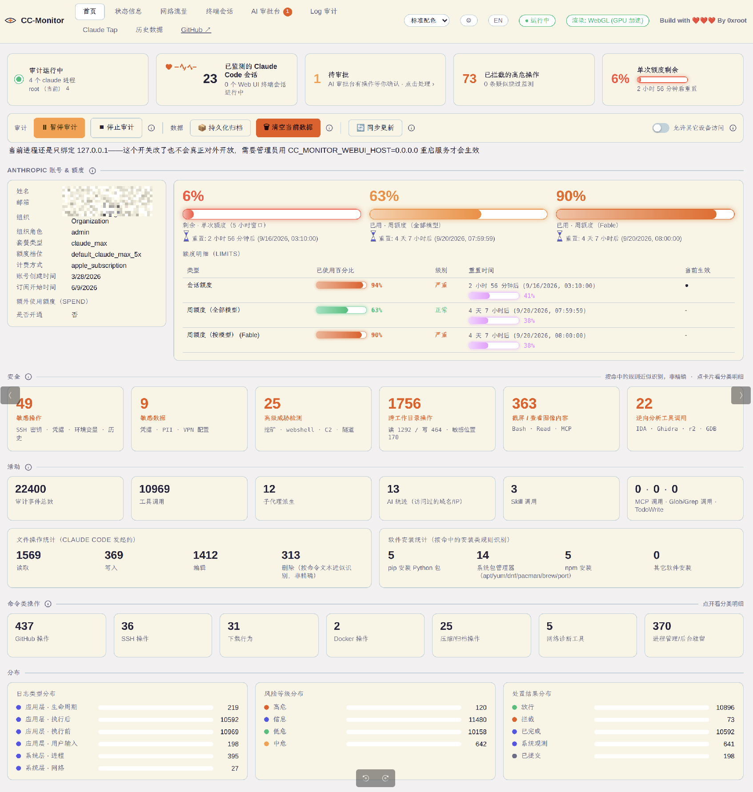
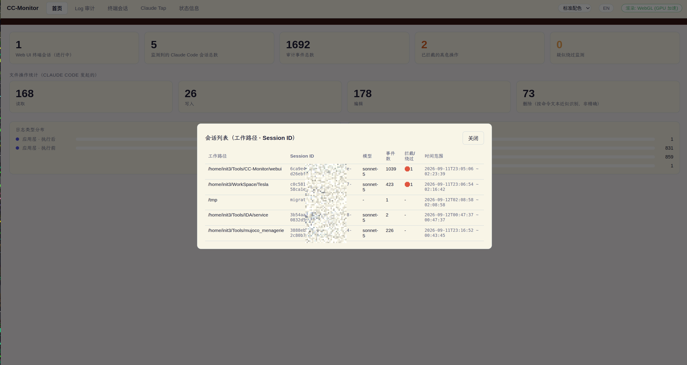
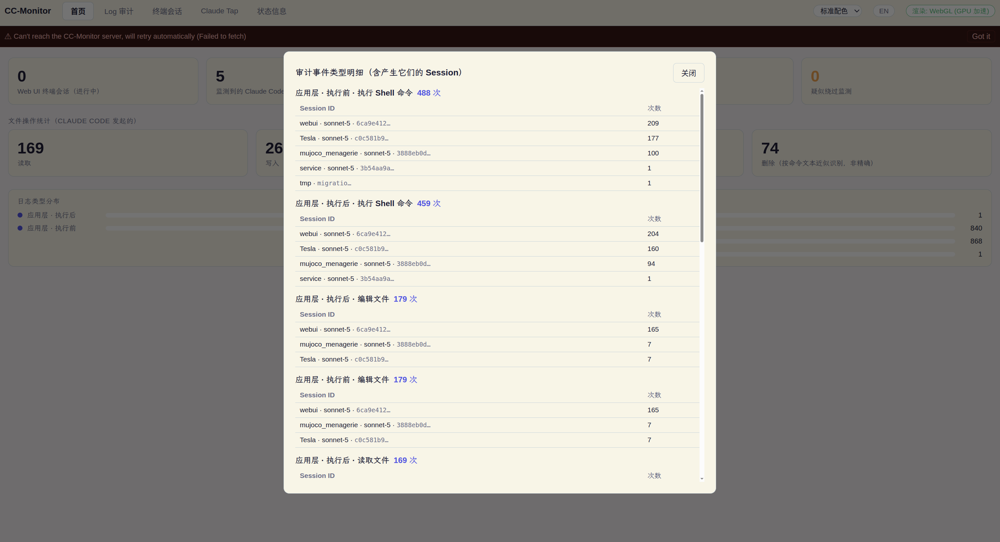
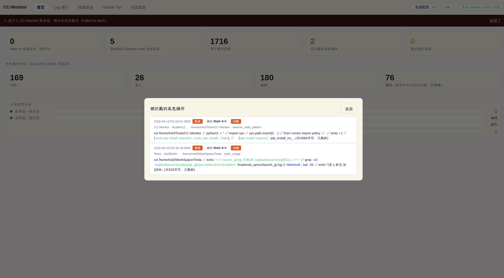
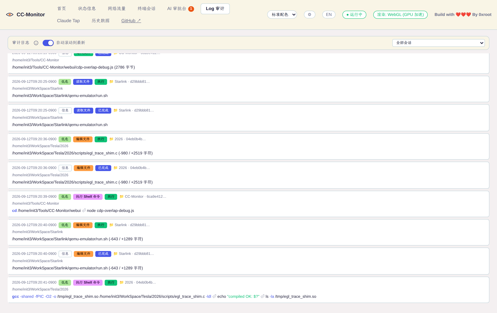

# CC-Monitor

[English](./README.md) | 简体中文

还在为 AI 开发时不知道 AI Agent 在你的电脑上执行了哪些操作吗？试试这个工具吧，实时监测
Claude Code 在本机的文件读写、命令执行、网络访问等操作，对高危操作拦截/确认，全部操作
留痕审计，避免 AI 工具误操作破坏系统或泄露数据。技术方案见
[DESIGN.md](./DESIGN.md)（[English](./DESIGN.en.md)）；装这个工具会带来哪些风险、
依赖了哪些第三方模块、你的数据到底存在哪——见
[SECURITY.md](./SECURITY.md)（[English](./SECURITY.en.md)）。

## 截图

| 首页概览 |
|---|
|  |

| 会话列表详情 | 事件类型明细 |
|---|---|
|  |  |

| 被拦截的高危操作 | 审计日志 |
|---|---|
|  |  |

## 快速安装

```bash
git clone https://github.com/cn0xroot/CC-Monitor.git
cd CC-Monitor
./install.sh
```

`install.sh` 一键按顺序装好 5 件事：ccstatusline 终端状态栏、hooks 注册、Web UI
依赖、系统层探针检测、GeoIP 数据库——每一步都是幂等、可单独跳过的（`--skip-ccstatusline`
/ `--skip-geoip`），不会覆盖你已有的任何配置。装完用 `./start.sh` 启动 Web UI。

只想要最核心的拦截/审计能力、不需要 Web UI 和这些周边功能的话，只跑这一步就够：

```bash
python3 install.py
```

这一步只做一件事——把 hooks 注册进 Claude Code 的 `~/.claude/settings.json`，不装
任何 npm/Python 依赖（`cc_monitor/` 本身只用 Python 标准库）。装完 `CC-Monitor tail`
/`rules`/`stats`/`verify` 这些 CLI 命令已经能直接用，Web UI 是完全独立的可选项，
随时可以后补装。两种装法的详细参数、`install.sh` 具体做了哪 5 步、以及装到系统路径
（`make install`）的方式，见下面["安装"](#安装)一节。

## Web UI

`webui/` 是一个独立的 Node.js 服务，提供浏览器界面：

```bash
cd webui
npm install
node server.js          # 默认监听 http://127.0.0.1:9999，只绑定 localhost
```

- **首页**：
  - **审计开关**：开始 / 暂停 / 停止三态切换（合并成一个按钮 + 一个独立的停止按钮）。
    `暂停`时规则照常判定、正常记录，但从不真的拦截或弹确认框；`停止`时完全不介入，
    不判定也不记录。顶栏常驻一个状态指示灯。
  - **Claude Code 运行身份检测**：检测机器上所有 `claude` 进程分别是什么操作系统用户
    在跑（跨平台，`ps` 实现），跟 Web UI 自己的运行用户不一致时会有醒目提示——Web UI
    和 hook 各自按自己进程的 `$HOME` 找 `~/.cc-monitor/`，不是同一个用户的话两边写的
    是完全不相干的数据库，这个功能就是把这种"看起来正常、实际互相看不到"的情况变得
    看得见。点卡片能看每个进程的 PID/用户/工作目录明细。
  - **概览统计**：进行中的终端会话数、监测到的 Claude Code 会话总数、审计事件总数
    （`hook_pre`+`hook_post`+系统层事件全部加一起）、拦截/疑似绕过次数、**工具调用**
    （只数 `hook_pre`，比"审计事件总数"更贴近"到底调用了多少次工具"这个直觉）、
    **MCP 调用**（按 `mcp__<server>__<tool>` 命名规则识别，点开看按 server 分组的
    次数）、**AI 轨迹**（Claude Code 访问过的域名/IP，数据来自网络流量页，点开是同一份
    连接明细——两种证据混在一起：系统层探针（eBPF/nettop）实测到的真实连接，加上
    Claude 执行 wget/curl/git clone/ssh/scp 等命令时从命令文本推断出的目标，后者带
    "推断"标签区分，不冒充成探针实测数据；很多人从没手动启动过系统层探针，之前这种
    情况下这张卡片是空的，即使 Claude 明明执行过一堆联网命令，现在两种数据都会体现
    出来，世界地图上也会一并标出来）。"会话总数"/"审计事件总数"/"已拦截的高危操作"/
    "工具调用"/"MCP 调用"/"AI 轨迹"这几张卡片都能点开查看详情。
  - **文件操作统计**：读/写/编辑/删除次数，各自可以点开看具体是哪些操作。
  - **软件安装统计**：按命中的安装类规则分组——pip / 系统包管理器（apt/yum/dnf/pacman/brew/port）
    / npm 安装 / 其它。npm 这张卡片合并了本地（`npm install`/`npm i`，不带 `-g`，
    只是 `log` 级别不会打扰你）和全局（带 `-g`/`--global`，`confirm` 级别）两条规则的
    总数——两者生命周期脚本（`preinstall`/`postinstall`）的执行权限是一样的，都可能
    是供应链投毒的入口，但全局安装会长期驻留在 `$PATH` 上、影响所有项目，风险明显
    更大，所以只有全局的需要人工确认。点开卡片详情会分成"全局安装"/"本地安装"两组
    分别列出，不会混在一起看不出哪些是高风险的。
  - **命令类操作统计**（GitHub/SSH/下载/Docker/压缩/网络诊断/进程管理，共七组）：
    每组首页只放一张汇总卡片（数字是这组所有分类的合计），点开才展开分类小计表
    + 带语法高亮的完整命令明细，避免七组细分类卡片铺满首页——这七组原来每组各
    占一整排（合计 33 张），点开详情的交互模式跟 MCP/Skill/子代理调用卡片一致：
    - **GitHub 操作**：git push / git clone / git commit / git pull-fetch / gh CLI
      （PR/Issue/API…）/ 其它 git 操作，按 Bash 命令文本分类识别（大部分 git/gh
      命令不违反任何 policy 规则，没法像软件安装统计那样复用规则引擎判断结果）。
    - **SSH 操作**：ssh（远程登录/执行）/ scp（文件复制）/ sftp（文件传输）/
      密钥管理（`ssh-keygen`/`ssh-copy-id`/`ssh-add`/`ssh-agent`）/ 其它
      （`autossh`/`sshpass`），判断方式跟 GitHub 操作统计一致（只看子命令开头，
      不做整条命令的子串匹配，避免 `echo "ssh 一般用来..."` 这种输出内容被误判）。
    - **下载行为**：wget / curl（只在带 `-o`/`-O`/`--output` 这类落盘参数时才算，
      裸 curl 调 API 不算下载）/ aria2 / 其它（`axel`/`lftp`/`ftp`/`http`）。
    - **Docker 操作**：run（启动容器）/ build（构建镜像）/ exec（进入容器执行）/
      compose（`docker compose`/`docker-compose`）/ 其它（`ps`/`logs`/`images`
      等只读查看类）。run/build/exec 单独拆出来是因为这三个会执行任意外部
      镜像/Dockerfile/容器内命令，风险跟纯只读查看不是一个量级。
    - **压缩/归档操作**：tar / zip（含 unzip）/ 7z / gzip（含 gunzip/zcat）/
      其它（bzip2/xz/zstd/rar 等）。
    - **网络诊断工具**：nc（含 ncat/netcat 别名）/ nmap / telnet / 其它
      （socat），纯粹是"用过这些工具没有"的可见性统计，`nc -zv example.com 443`
      这种正常端口探测也会计入，不代表危险——真正的反弹 shell 由下面的策略规则
      单独拦截。
    - **进程管理/后台驻留**：nohup / disown / 后台任务（命令末尾裸 `&`）/ 其它
      （setsid）。"后台任务"识别故意收窄（要求 `&` 前后不是 `&&`/`2>&1`/`&>`
      这类语法，且后面紧跟命令末尾或 `;`），换取不误伤 `curl 'http://x.com/a&b=c'`
      这类 URL 查询字符串里的 `&`。
  - **子代理派生统计**：跟 MCP/Skill 调用统计同一个思路，按 `subagent_type`（子代理
    类型，比如 `general-purpose`/`Explore`/`Plan`/`fork`）分组，子代理会消耗独立
    资源、有自己的一整套操作轨迹，不该混在笼统的"工具调用"计数里。
  - **截屏审计**：Claude Code 没有内置"截图"工具，识别靠三条独立信号——Bash 命令调用
    截图类 CLI 工具（`scrot`/`gnome-screenshot`/`import`/`spectacle`/`flameshot`/`maim`/
    `grim`/`xwd`/macOS 的 `screencapture`，以及 Wayland 下常见的 `gdbus`/`dbus-send`
    调用 `org.freedesktop.portal.Screenshot`）、`Read` 工具打开的文件本身是图片
    （`.png`/`.jpg`/`.gif`/`.webp`/`.bmp`，范围比纯截图宽——用户查看已有图片内容
    也算进来）、MCP/"computer use" 类工具的截图动作（工具名带 "screenshot" 字样，
    或 `computer` 工具 `action` 字段等于 `"screenshot"`）。点开看具体是哪个 session、
    什么时候、执行的什么命令或打开的什么文件——**只显示命令/文件路径这类基本信息，
    不读取、不展示截图本身的图像内容**，避免把可能包含敏感桌面信息的图片经由网页
    暴露出去。
  - **Anthropic 账号信息**：姓名、邮箱、组织、组织角色、套餐类型、额度档位、计费方式、
    账号/订阅创建时间——直接读 Claude Code 自己维护的本地全局配置文件
    （`~/.claude.json` 的 `oauthAccount` 字段），不发任何网络请求，跟
    [ccstatusline](https://github.com/sirmalloc/ccstatusline) 的 "Claude Account
    Email" 挂件同一个数据源。再加上账号级用量/额度（跟下面"状态信息"是同一份数据源，
    单次额度显示"剩余百分比"、conky 风格分段配色，周额度显示"已用百分比"、红→黄→绿
    连续渐变配色，Fable 等按模型限额动态识别不写死模型名）、`limits[]` 明细（百分比
    进度条 + 重置时间旁的紫色"窗口已过去多少"进度条）和 `spend`（是否开通了额度外的
    按量付费、已经花了多少）。
  - **数据管理**：把当前事件数据持久化归档（SQLite `backup()` API 做完整快照）或者
    清空重新统计；日志类型与风险等级分布图。
- **Log 审计**：全宽的实时审计日志查看（按会话过滤，会话下拉框显示"文件夹 · 模型 · 短ID"而不是一串看不出区别的 ID），复用 CLI 那套人类可读的事件翻译逻辑。
- **终端会话**：直接在浏览器里开一个 Claude Code 终端对话（node-pty 起 PTY），不用再切到本地终端软件；用 `xterm.js` + WebGL 插件渲染，有 GPU 就用 GPU 加速，没有自动退化成 Canvas。侧边栏可以切换到**网格视图**（herdr 风格），同屏显示所有进行中的会话，点哪个面板就给哪个发键盘输入。
- **Claude Tap**：查看某个会话发给/收到模型的**完整对话内容**（不只是"调用了哪个工具"）——文本、思考、工具调用、工具结果、token 用量，按字段分色渲染。数据来源是 Claude Code 自己写在本地的 transcript JSONL 文件（hook payload 里的 `transcript_path`），不是抓包/MITM。CLI 等价命令：`CC-Monitor tap [--session ID] [-f]`。
- **AI 审批台**：把 Claude Code 的"是否允许执行"确认框同步到网页上——效果类似 Mac 平台
  [Vibe Island](https://vibeisland.app/) 在灵动岛里弹卡片让你点 Allow/Deny，区别是跨平台
  （网页而不是 Mac 专属 UI）。两类询问都会出现在这里：
  - 规则表里标为 `confirm` 的操作（`PreToolUse` 阶段由我们的规则判出来的）；
  - **Claude Code 自己的原生 "Do you want to proceed?" 确认框**（`PermissionRequest` hook 事件，
    没命中任何规则、但 Claude Code 的权限系统要问人的那些）——网页/终端给了答案就通过
    `decision.behavior` 替你答掉；没人答（90s 超时）或在终端里敲回车，就原样交还给终端里的
    原生确认框，不会因为装了 CC-Monitor 就把安全网撤了。
  - 同一条请求既可以在触发它的终端里直接按 y/N，也可以在网页上点按钮，谁先给结果就用
    谁的；网页选"允许"会通过 hook 的 `permissionDecision: allow` 直接让 Claude Code
    跳过原生弹窗，不会二次询问。
  - 选项：允许一次、拒绝一次、批准且 10/30 分钟内不再询问、一直允许（仅当前 session）。
  - 支持浏览器桌面通知（Notification API），没开着这个页面也能弹系统通知，点一下直接
    跳回来处理。
  - **桌面版（Electron）** 不走浏览器那条路（Electron 渲染进程里 `Notification.permission`
    永远是 "granted"，但 macOS 会静默拒绝未正式签名 app 的通知）：由主进程自己轮询待批准
    列表，新请求 → 系统提示音 + Dock 图标跳动 + 角标数字，能弹系统通知就一并弹（点了跳到
    审批台）。`npm run electron` 跑的是 node_modules 里 ad-hoc 签名的 Electron.app，macOS
    上系统通知必定弹不出来（`UNErrorDomain error 1`），只有提示音/Dock/角标；要系统通知
    得用 Developer ID 签名打包的版本。hook 那边每条请求还会额外用 `osascript` 发一条通知
    （以 "Script Editor" 名义），第一次会问你要不要允许，拒绝了就去"系统设置 → 通知 →
    Script Editor" 打开。
  - **历史记录表格**：每条处理完的请求都留底（底层表没有任何清空逻辑，"清空当前数据"
    按钮不会碰它），记录时间、Session、工具、命中规则、匹配内容、结果、处理方式；
    `notify` 类记录（`AskUserQuestion` 这类）还会存下用户在终端里实际给的答案。
- **状态信息**：
  - 跟首页一样的 Anthropic 账号信息（姓名/邮箱/组织/套餐）+ 账号级额度（单次 5 小时
    窗口 / 周额度 / 分模型周额度 + 重置时间，跟 [ccstatusline](https://github.com/sirmalloc/ccstatusline)
    读同一份 Claude Code OAuth 凭证查询同一个 `api.anthropic.com/api/oauth/usage`
    接口）。
  - **模型使用统计**：按模型（Sonnet/Opus/…）汇总所有已监测会话的 token 用量。
  - 每个会话的模型、token 用量、吞吐速率（tok/s，由 transcript 估算）、跟 ccstatusline
    同一套口径的 `Σ Total / Cached` token 汇总（Total = input+output+cached，
    Cached = cache_read+cache_creation）。
  - **上下文窗口使用率**：按 200K 标准窗口估算（Claude Code 不会把精确窗口大小告诉
    我们的 hooks，这是近似值）。
  - **Context compaction 次数**：真实检测 transcript 里的 `compact_boundary` 事件，
    不是估算。
  - cwd、git 分支、活跃时长、拦截情况。
- **网络流量**：Claude Code 进程树实际发起过的网络连接——目标 IP/端口、域名、上传/下载
  字节数、连接次数，外加一张世界地图标出连接目的地的大致位置。数据完全来自系统层探针
  （Linux：`cc_monitor/probe_linux.bt`，eBPF；macOS：`cc_monitor/probe_darwin.py`，`nettop`
  采样），不是抓包/中间人。**探针不跑这页就是空的**——启动 Web UI 不会自动拉起探针。
  - 注意：Claude Code 走了本地代理（`HTTPS_PROXY=http://127.0.0.1:xxxx`）的话，任何进程级
    探针看到的远端都只会是 `127.0.0.1:<代理端口>`，真正的目标在代理进程那边，地图上自然
    没有可定位的点——这不是探针的 bug。
  - **域名捕获**：用 `uprobe:libc:getaddrinfo` 在应用层解析域名的那一刻就记下来，而不是
    事后对 IP 做反向 DNS——很多云厂商/CDN 出口 IP 根本没配 PTR 记录，反向解析注定拿不到
    域名，这个办法不受影响。
  - **字节数统计**：`tcp_sendmsg`/`tcp_cleanup_rbuf` 内核探点，之前的探针只知道"连过哪个
    IP:port"，不知道传了多少数据。
  - **IP 归属地**：查本地数据库（不逐个 IP 发第三方 API 请求）——MaxMind GeoLite2 或者
    不用注册账号的 DB-IP Lite 都行，具体见下面"环境要求"；没配置的话地图和归属地列就是
    空的，页面如实标"未配置 GeoIP 数据库"，不拿假数据充数。
  - **世界地图**：纯 WebGL2 自绘（等距柱状投影 + 本地打包的低精度海岸线轮廓），参考
    [BeeEye](https://github.com/cn0xroot/BeeEye) 项目 `WorldMap.jsx` 的做法，不依赖
    任何地图瓦片服务。
  - **连接明细**：目标地址行的连接次数、以及"总连接次数"/"不同 IP 数"两张汇总卡片都能
    点开看每次连接的时间、发起进程、PID。
  - 没装探针/探针没在跑的时候这个页面如实显示空数据。
- **外观设置**：顶栏 ⚙ 按钮打开设置弹窗。
  - **主题配色**：可视化色块网格，10 个主题各自的强调色圆点 + 高亮选中态（标准配色/
    深色/浅色/Dracula/Nord/Midnight/Ocean/Forest/Sunset/Rose，后 5 个移植自
    [AI_Web_Search](https://github.com/cn0xroot/AI_Web_Search) 的配色方案）；顶栏
    原来的主题下拉框还在，两边保持同步。
  - **界面字体**（系统默认/等宽/衬线/圆体/楷体/黑体（思源黑体）/宋体（思源宋体））和
    **界面字号**（12～18px 滑块，作用在根元素上，样式表里所有 font-size 都是相对
    根字号的 `rem`，调一次整站同比例缩放，不会出现"只有部分文字变了"）——新增设置项，
    带实时预览，存 `localStorage`。中文字体选项没有打包字体文件（完整 CJK 字库一个
    17～21MB，打包会拖慢首次切换），是纯字体名引用，访问者本机装了对应字体才会
    生效。
  - **中英文切换**：右上角语言按钮，翻译范围是界面文案（导航、按钮、标题、空状态提示、
    风险/操作/状态标签），不翻译数据本身（命令文本、工具输出、transcript 对话原文）；
    审计日志的风险/操作类型/状态徽章用固定的高饱和配色（不随主题变化），高危操作整行
    标红加粗。

因为这个 UI 还在快速迭代，静态资源都设了 `Cache-Control: no-store`——改完代码直接刷新页面就能看到最新效果，不用担心浏览器缓存旧版本。

默认只绑定 `127.0.0.1`，因为这是个能直接开终端 spawn 进程的工具，没做认证。首页有个
"允许其它设备访问"开关，但它只是设置一个标志位——安全边界始终是进程启动时绑定的地址，
不是运行时能被网页动态改掉的东西：真要监听所有网卡，需要显式设
`CC_MONITOR_WEBUI_HOST=0.0.0.0` 重启服务，那个开关才会真正生效（默认关，绑成
`0.0.0.0` 之后也是先拒绝所有非本机请求，开关打开才放行）。

## 桌面版（Electron）

不想开浏览器手动跑 `node server.js` 的话，`webui/` 下也有一个 Electron 套壳版本——
直接 `require` 现有的 `server.js`（Express + ws + node-pty + better-sqlite3），不用改
一行服务端代码，跑起来是一个独立窗口的桌面应用。

```bash
cd webui
npm install
npm run electron          # 开发模式：直接跑，不用先打包
```

固定监听 `127.0.0.1:9998`（跟网页版默认的 9999 不冲突，两种用法能同时开着）。

打包成可分发的安装包：

```bash
npm run dist:linux   # AppImage（x64 + arm64）
npm run dist:mac     # universal dmg（Intel + Apple Silicon 通用）
```

打包前会自动跑 `electron-rebuild` 把 `node-pty`/`better-sqlite3` 这两个原生模块
重新编译成匹配 Electron 内置 Node 版本的 ABI（这两个包本身用的是预编译的 prebuilds，
跟 Electron 的 Node 版本对不上直接用会崩，rebuild 这一步是必须的，不是可选优化）。

**已知情况**：`devDependencies` 里的 Electron 版本锁在 `^44.0.0`，不是随便挑的——
早期用默认的 33.x 时，在一台 AMD 最新款 CPU（Zen 5 架构）上打包出来的桌面版一启动
就必现 segfault，换成 44.x 后问题消失，怀疑是那个版本内置 Chromium 对这颗 CPU 某个
新指令集的支持有 bug，不建议把这个版本号往回调。目前只在 Linux x64 上完整验证过
"打包出来的桌面版能正常启动、内嵌服务正常监听"这条链路；macOS 和 Linux ARM64 的
打包产物还没有做过端到端验证。

## 功能介绍

CC-Monitor 是双层监测架构：

- **应用层（Claude Code Hooks）**：注册 `PreToolUse`/`PostToolUse` hook，拿到每次工具调用的
  语义信息（工具名、命令、文件路径），按规则判定放行/拦截/需要确认。这是主力，成本低、覆盖面广。
- **系统层（Linux 用 eBPF，macOS 用 nettop）**：`CC-Monitor-probe` 用 `bpftrace` 独立于 Claude Code 之外，直接在
  内核层跟踪 `claude` 进程派生出的所有子进程的 `execve`/`connect`，交叉验证应用层 hooks
  有没有被绕过或篡改——这是第二道防线，即使 hooks 配置被破坏也能兜底发现异常。
  - **macOS**：同一个 `CC-Monitor-probe` 命令自动切到 `cc_monitor/probe_darwin.py`——用系统
    自带的 `nettop` 每 2 秒采样 claude 进程树的连接和字节数，**不需要 root**。只覆盖网络
    部分（网络流量页/世界地图/AI 轨迹），没有 `execve` 观测（`CC-Monitor verify` 的绕过
    检测仍是 Linux 独有），域名只能靠反向 DNS 兜底。

具体能力：

| 能力 | 说明 |
|---|---|
| 高危操作拦截 | 命中规则的 `Bash`/`Write`/`Edit` 等操作可以直接拒绝（如 `rm -rf /`、写 `~/.ssh/`） |
| 人工确认 | 中风险操作在终端弹出确认提示 + 桌面通知，超时/无 tty 默认拒绝 |
| 审计日志 | 所有事件落盘 SQLite，`tool_input`/`tool_response` 全量留存 |
| 人类可读实时日志 | `CC-Monitor tail` 把原始 JSON 翻译成"事件类型 + 摘要 + 结果"，终端自动彩色高亮，Bash 命令按语法（命令名/参数/字符串/变量/管道）着色 |
| 绕过检测 | `CC-Monitor verify` 比对系统层探针观测到的命令和 hook 记录，标出"探针看到了、但 hook 没记录"的可疑命令 |
| 网络层可视化 | eBPF 直接抓 `connect()` 目标 IP:port，不解密 TLS、不用装 CA 证书 |

## 实现原理

功能介绍是"能做什么"，这里是"怎么做到的"，每条机制都能在源码里直接对上号（完整版见 [DESIGN.md](./DESIGN.md)）：

- **Hook 拦截**：Claude Code 每次调用工具前后，会把一份 JSON payload 通过 stdin 传给
  `settings.json` 里配置的 hook 命令，同步等它退出。`CC-Monitor-hook` 退出码是 2 就代表拒绝——
  stderr 里的原因会被 Claude Code 展示出来。它是每次调用都拉起的一次性子进程，不是常驻服务，
  所以也没有"进程挂了监控就失效"这种问题（但也意味着改完规则不用重启任何东西，下一次调用直接生效）。
- **规则引擎**：`default_rules.json` 是一份有序规则表，`policy.evaluate()` 按顺序逐条尝试，
  第一条命中就生效（first-match-wins），所以更具体的规则要写在更通用的规则前面。每条规则声明
  `tools`（适用哪些工具）、`field`（从 `tool_input` 里取哪个字段，比如 `command`/`file_path`/`url`）、
  `pattern`（正则）、`risk`/`action`。规则文件首次使用时从 `default_rules.json` 拷贝到
  `~/.cc-monitor/rules.json`，之后可以自己改。
- **系统层 eBPF 探针**：`probe_linux.bt` 挂在内核的 `execve`/`connect` 等 tracepoint 上，先用
  `comm=="claude"` 认出 Claude Code 自己的进程，再监听 `sched_process_fork` 事件，把"正在被监控"
  这个标记沿着进程树一路传给它 fork 出来的所有子进程——不管子进程改名叫什么都跟得上。
  `CC-Monitor verify` 拿探针观测到的命令去匹配同一时间窗口内 hook 记录的命令文本（做了引号归一化，
  兼容 zsh 快照包装命令时对引号的转义），标出"探针看到了、hook 却没记录"的可疑差异。
- **Claude Tap**：hook 的 JSON payload 里有个 `transcript_path` 字段，指向 Claude Code 自己写在本地
  的对话 transcript JSONL 文件。直接读这个文件、解析里面的 `user`/`assistant`/`tool_use`/`tool_result`
  等条目就能还原完整对话——不抓包、不用装 CA 证书、不需要中间人代理。
- **账号额度显示**：读 Claude Code 自己保存的 OAuth token（Linux 在 `~/.claude/.credentials.json`，
  macOS 不落文件、存在登录钥匙串里 service 名为 `Claude Code-credentials` 的那一条，用
  `security find-generic-password` 读），拿它去调 Anthropic 官方的 `api.anthropic.com/api/oauth/usage` 接口（带上
  `anthropic-beta: oauth-2025-04-20` 请求头）——跟 [ccstatusline](https://github.com/sirmalloc/ccstatusline)
  读的是同一份凭证、查的是同一个接口，不是我们自己另外维护了一套用量统计。
- **Web 终端**：用 `node-pty` 起一个真正的伪终端（PTY），跟你在本地开一个终端窗口没有本质区别；
  创建之后自动往这个 PTY 里"敲"`claude\r`帮你启动。Claude Code 第一次打开一个没信任过的目录时会弹
  一个"是否信任这个文件夹"的确认框，默认高亮选项是"No, exit"——这里检测到这段提示文本后会自动按
  方向键+回车替你选"Yes, I trust this folder"，不然这个确认框没人处理的话，后续任何一次正常的回车
  操作都会把 Claude Code 意外退出，界面上却看起来"终端明明是好的"。
  - **新建窗口**：跟"新建会话"共用同一个选目录的弹窗，唯一区别是不会自动敲
    `claude\r`——单纯想要一个终端、不想一打开就被拉进 Claude Code 会话的场景，
    比如只是想跑个脚本、看看文件。后端就是 `POST /api/sessions` 多传一个
    `launchClaude: false`。
- **数据持久化/归档**：首页"持久化归档"用的是 SQLite 官方的 `backup()` API 给当前 `events.db`
  做一次完整快照（不是简单复制文件——`backup()` 会正确处理 WAL 模式下还没落盘的数据），存到
  `~/.cc-monitor/archives/` 下；"清空当前数据"则是对同一个库执行 `DELETE` 并重置自增 ID。

## 安装

### 环境要求

- **hooks（`cc_monitor/`）**：Python 3.8 及以上，标准库即可，无第三方包依赖。系统层探针
  额外依赖 Linux 的 `bpftrace`（可选功能，没装也不影响 hooks 正常工作）。
- **Web UI（`webui/`）**：Node.js **≥ 22**——不是随便定的下限，是 `better-sqlite3`
  这个依赖自己在 `package.json` 的 `engines` 字段里写死的要求（`express` 本身只要
  Node ≥ 18，但 `better-sqlite3` 卡在 22，装了低于这个版本的 Node 大概率会在装依赖
  或者启动阶段直接报错）。用 [nvm](https://github.com/nvm-sh/nvm) 之类工具确认一下
  `node --version` 再装。
- **终端状态栏 [ccstatusline](https://github.com/sirmalloc/ccstatusline)（可选）**：跟 CC-Monitor
  额度页读的是同一份 OAuth 凭证、查的是同一个 Anthropic 接口（详见上面"账号额度显示"），但它是
  一个独立维护的第三方 npm 包，CC-Monitor 不调用它、也不内置它的代码。`install.sh` 的第 1 步
  会检测系统上有没有装（`command -v ccstatusline`），没有就跑 `npm install -g ccstatusline`；
  装好之后如果 `~/.claude/settings.json` 里还没有 `statusLine` 配置，会自动接上（不会覆盖你已有
  的任何 statusLine 定制，不管是不是 ccstatusline）。`--skip-ccstatusline` 或
  `CC_MONITOR_SKIP_CCSTATUSLINE=1` 可以两件事都跳过。
- **网络流量页的 GeoIP 归属地（可选）**：装了 `maxmind` 这个 npm 包读本地数据库文件，
  数据库本身不随仓库分发。不配置的话网络流量页照样能用，只是归属地列和世界地图上的点
  没有数据，页面上会诚实标出来，不影响连接明细/字节数统计。两种拿数据库的方式：
  - **不用注册账号（推荐，`./install.sh` 默认就是这个）**：[sapics/ip-location-db](https://github.com/sapics/ip-location-db)
    项目每天/每月自动转出 DB-IP Lite 数据（[CC BY 4.0](https://creativecommons.org/licenses/by/4.0/) 开放许可，city 级精度）。
    `install.sh` 的第 5 步会自动把它下到 `~/.cc-monitor/dbip-city.mmdb`（已有任何 `.mmdb`
    就不重复下；下载失败只提示不中断；GitHub 访问不畅可用 `CC_MONITOR_GEOIP_URL` 指向镜像）。
    手动下载也行：
    ```bash
    curl -L -o ~/.cc-monitor/dbip-city.mmdb \
      https://github.com/sapics/ip-location-db/releases/download/latest/dbip-city-ipv4.mmdb
    ```
  - **MaxMind 官方 GeoLite2**：精度通常更高，但要去 [MaxMind 官网](https://www.maxmind.com/en/geolite2/signup)
    注册免费账号、生成 license key、手动下载 `GeoLite2-City.mmdb`，放到
    `~/.cc-monitor/GeoLite2-City.mmdb`。

  两种数据库字段格式不一样（MaxMind 是嵌套字段，DB-IP Lite 是平铺字段），`geoip.js`
  里两种都识别，不用额外配置区分。也可以用 `CC_MONITOR_GEOIP_DB` 环境变量指定其它路径。

**已验证可以正常运行的环境**（不代表其它环境跑不了，只是这是实际测过、确认没问题的）：
Ubuntu 24.04 LTS（内核 7.0，x86_64）、AMD Ryzen 9 9950X（Zen 5 架构）、Node.js
v22.17.1、npm 10.9.2、Python 3.13.5。桌面版（Electron）额外验证过：早期锁定的
Electron 33.x 在这颗 CPU 上打包出来的应用启动即崩溃（详见下面"桌面版"一节），换成
44.x 后正常——这也是为什么 `webui/package.json` 里 Electron 版本没有随便往回调的
原因。

**赶时间的话**：`./install.sh` 一键按顺序做完这 5 件事：

1. **ccstatusline**（可选，终端状态栏）：没装就 `npm install -g ccstatusline`，装好后如果
   `~/.claude/settings.json` 里还没有 `statusLine` 配置就自动接上——`--skip-ccstatusline` /
   `CC_MONITOR_SKIP_CCSTATUSLINE=1` 跳过
2. **注册 hooks** 到 Claude Code 的 `settings.json`（`python3 install.py`，见下方手动步骤）
3. **安装 Web UI 依赖**（`cd webui && npm install`，没装 npm 就跳过、只影响 Web UI）
4. **检测系统层探针**能不能用：Linux 看有没有装 `bpftrace`，macOS 不用装任何东西（用系统
   自带 `nettop`）——只是检测和提示，没装 bpftrace 不会中断安装
5. **GeoIP 数据库**（可选，网络流量页归属地用）：默认下载 DB-IP Lite 到
   `~/.cc-monitor/dbip-city.mmdb`——`--skip-geoip` / `CC_MONITOR_SKIP_GEOIP=1` 跳过

装完用 `./start.sh` 一键启动 Web UI（没装过依赖会先自动装一次）。想更细粒度控制的话，
往下看手动步骤。

有两种装法，效果一样，选一种就行：

### 方式一：直接在当前目录用（不动系统路径）

```bash
# 1. 把整个 CC-Monitor 目录放到你想要的位置（这里假设已经在 ~/Tools/CC-Monitor）
cd ~/Tools/CC-Monitor

# 2. 安装 hooks 到 Claude Code 配置（会自动 chmod +x bin/ 下的脚本）
python3 install.py                       # 全局安装：写入 ~/.claude/settings.json
python3 install.py --project /path/to/proj   # 只对某个项目生效
python3 install.py --target /path/to/settings.json  # 显式指定 settings.json（跨用户安装时用）

# 3.（可选）如果要用系统层探针，装 bpftrace
sudo apt install bpftrace        # Debian/Ubuntu
# 其它发行版参考 bpftrace 官方文档；macOS 不需要装任何东西（探针用系统自带的 nettop）
```

安装脚本按 `command` 字段去重合并写入 `PreToolUse`/`PostToolUse`/`PermissionRequest` hook 数组，**不会覆盖**你已有
的其它 hooks 配置；遇到损坏的 `settings.json` 会自动备份成 `.json.bak` 再重建。安装后**重启
Claude Code** 新开的会话才会读到新配置。

### 方式二：`make install` 装到系统路径

想要有个全局命令、不用记着这份代码放在哪个目录，可以装到系统里：

```bash
sudo make install                    # 默认装到 /usr/local/lib/cc-monitor + /usr/local/bin
sudo make install PREFIX=/opt/cc-monitor   # 或者自定义前缀

# 装完之后，任意目录都能直接用命令，再照方式一的第 2 步注册 hooks（用装完之后打印出来的路径）：
CC-Monitor tail -v
python3 /usr/local/lib/cc-monitor/install.py
```

`make install` 只负责"把代码放到系统里、建好命令行链接"，**不会**自动改你的
`~/.claude/settings.json`——注册 hooks 这一步需要自己手动跑一遍 `install.py`（命令行结尾会
打印出装好之后的准确路径）。卸载用 `sudo make uninstall`（同样只删代码和命令链接，`settings.json`
里的 hooks 条目需要自己手动删）。

## 编译方式

CC-Monitor 是纯 Python 实现（标准库 `sqlite3`/`json`/`argparse`/`re` 等，无第三方依赖），**不需要编译**：

- `bin/CC-Monitor`、`bin/CC-Monitor-hook`、`bin/CC-Monitor-probe` 都是带 `#!/usr/bin/env python3` shebang 的可执行脚本，`install.py` 会自动给它们加执行权限。
- 系统层探针依赖的 `bpftrace` 是系统包管理器直接安装的现成二进制，不需要自己编译；`cc_monitor/probe_linux.bt` 是 bpftrace 脚本，运行时由 `bpftrace` 解释执行，同样不需要编译。
- `Makefile` 里的 `make install` 不是编译，只是把文件拷到 `PREFIX` 下再建命令行链接，见上面"安装"一节。
- 目前**没有**打包成单文件可执行程序（比如用 PyInstaller/Nuitka），这属于待办事项，见下方"开发进展"。

## 使用方式

```bash
# 实时查看监测到的事件（Ctrl+C 退出）
./bin/CC-Monitor tail
./bin/CC-Monitor tail -v          # 额外打印原始 JSON

# 查看当前生效的规则
./bin/CC-Monitor rules

# 查看统计（按风险等级/决策结果计数）
./bin/CC-Monitor stats

# 系统层探针（需要 root，用于交叉验证 hooks 有没有被绕过）
sudo ./bin/CC-Monitor-probe

# 查看探针标记的"可能绕过监测"的记录
./bin/CC-Monitor verify
```

**环境变量**：

| 变量 | 作用 |
|---|---|
| `CC_MONITOR_HOME` | 覆盖事件库/规则文件目录（默认 `~/.cc-monitor/`） |
| `CC_MONITOR_COLOR` | `always`/`never` 强制开关终端配色（默认按是否为真终端自动判断） |
| `NO_COLOR` | 设置后强制关闭配色（通用约定） |

事件与规则存放在 `~/.cc-monitor/`：`events.db`（SQLite 审计日志）、`rules.json`（可编辑规则，改了
立即生效不用重启）。

**规则格式**（`rules.json` 是规则数组）：

```json
{
  "id": "规则名",
  "risk": "high | medium | low",
  "action": "block | confirm | log",
  "tools": ["Bash"],
  "field": "command | file_path | url",
  "pattern": "正则表达式"
}
```

- `block`：直接拦截，Claude Code 收到拒绝原因。
- `confirm`：终端弹出确认提示（等待 tty 输入 `y` 才放行）+ 桌面通知，无 tty/超时默认拒绝。
- `log`：放行但记录审计日志。

默认规则见 [cc_monitor/default_rules.json](./cc_monitor/default_rules.json)，涵盖：危险删除、磁盘覆写
命令、`curl|bash`、递归 777、`sudo`、`git push --force`、读写 SSH 密钥/凭据文件、写系统目录、
试图关掉监控自身（`kill`/`pkill` 命中 CC-Monitor 探针进程名，`confirm` 级别；通用 `kill`/`pkill`
只是 `log` 级别，避免日常开发太常见而造成警报疲劳）、用 `cat`/`less`/`head` 等命令读 SSH 密钥/
`.env`/凭据文件（`Read` 工具之外的盲区）、`env`/`printenv`/`export -p` 打印全部环境变量、`su`/
`pkexec` 提权（跟 `sudo` 同一类风险）、单文件 `chmod 777`（非递归、相对路径也覆盖到）、
`mysql`/`psql`/`redis-cli`/`mongo`/`sqlite3` 接 `DROP`/`DELETE`/`TRUNCATE`/`FLUSHALL` 这类直连
数据库的破坏性命令、读取 shell 历史文件或执行裸 `history` 命令（可能翻出过去输入过的明文
凭据）、反弹 shell / 后门执行（覆盖 `nc`/`ncat`/`netcat` 的 `-e`/`-c` 两种写法、`socat exec:`、
`mkfifo` 配合命名管道拼出来的反弹 shell 等多种变体）、篡改 Claude Code 自身配置
（`~/.claude/settings.json`/`.claude/hooks/`/`CLAUDE.md`，防绕过的配置层版本）、
Docker socket 挂载逃逸（`-v /var/run/docker.sock:...`）、写入内容里出现常见密钥格式
（AWS/GitHub/Anthropic/OpenAI/Slack/Google/npm/Stripe 等固定前缀 + 私钥文件头）、
git hooks/config 持久化攻击面（`core.hooksPath`、`url....insteadOf`）等。

## 功能开发进展

每个版本具体实现了什么功能，见 [CHANGELOG.md](./CHANGELOG.md)（[English](./CHANGELOG.en.md)）。

### 已实现

- [x] 应用层 Hook 拦截器（`PreToolUse`/`PostToolUse`），覆盖 Bash/Write/Edit/Read/WebFetch 等全部工具
- [x] 策略引擎：正则规则匹配 + 三种动作（block/confirm/log）+ 三级风险分类
- [x] SQLite 审计日志（`events.db`），事件对 hook 输入/输出全量留存
- [x] CLI：`CC-Monitor tail`（实时查看）/`rules`（查看规则）/`stats`（统计）/`verify`（绕过检测）
- [x] 人类可读事件格式化：把原始 JSON 翻译成"事件类型 + 摘要 + 结果"
- [x] 终端彩色输出：风险等级/决策结果/规则名独立配色，支持 `NO_COLOR`/`CC_MONITOR_COLOR`
- [x] Bash 命令语法高亮（命令名/参数/字符串/变量/管道重定向分色）
- [x] 终端确认（`/dev/tty` 交互）+ 桌面通知（`notify-send`/`osascript`）
- [x] 安装脚本：安全合并 hooks 到 `settings.json`（全局/项目/自定义路径三种模式），不覆盖已有配置
- [x] 系统层探针（`CC-Monitor-probe`，Linux 用 eBPF）：跟踪 Claude Code 进程树的 `execve`/`connect`（macOS 上只覆盖网络部分，用 nettop，见下方）
- [x] 绕过检测：探针观测到的命令与 hook 记录模糊比对（进程树 + 时间窗口 + 去引号子串匹配），标记 `hook_bypass_suspected`
- [x] 网络层可视化：eBPF 直接抓 `connect()` 目标 IP:port，域名靠 `uprobe:libc:getaddrinfo`
      在应用层解析域名的那一刻记下来（反向 DNS 兜底），不用 MITM 代理
- [x] 网络流量字节数统计：`tcp_sendmsg`/`tcp_cleanup_rbuf` 内核探点，按 (ip, port) 聚合上传/下载字节数
- [x] Web UI 网络流量页：连接明细表 + GeoIP 归属地（本地 MaxMind/DB-IP Lite 数据库）+ WebGL2 世界地图
- [x] Claude Code 运行身份检测：跨平台（`ps`）识别机器上所有 `claude` 进程的运行用户，跟 Web UI 自己不一致时提示
- [x] 首页新增工具调用/MCP 调用/Skill 调用/AI 轨迹四张统计卡片，均支持点击查看详情，详情
      带 Session ID（前面带文件夹名）、文件夹路径、时间戳
- [x] AI 审批台支持 `action: "notify"` 规则类型（Claude Code 澄清性问题，如 `AskUserQuestion`）
- [x] AI 审批台历史记录：长期保存的已处理请求列表，notify 类记录额外存下用户实际的终端回答
- [x] AI 审批台接管 Claude Code 原生 `PermissionRequest` 确认框：没命中规则表、但 Claude
      Code 自己要弹 "Do you want to proceed?" 的操作也会同步到网页（`kind='permission'`），
      90 秒无人应答或终端敲回车就静默交还原生确认框，不会因为装了 CC-Monitor 就把安全网撤了
- [x] Anthropic 账号资料（姓名/邮箱/组织/套餐/额度档位），读本地 `~/.claude.json`，零网络请求
- [x] 状态信息页每会话 `Σ Total / Cached` token 汇总统计（跟 ccstatusline 同一口径）
- [x] 状态信息页新增"模型使用统计"表格、"额度明细"表格、上下文窗口使用率、Context
      compaction 次数（真实检测，非估算）
- [x] 首页新增"GitHub 操作统计"（push/clone/commit/pull-fetch/gh CLI/其它 git 操作）
- [x] 首页新增"SSH 操作统计"（ssh/scp/sftp/密钥管理/其它）和"下载行为统计"
      （wget/curl/aria2/其它），按 Bash 命令文本识别
- [x] "AI 轨迹"卡片和世界地图新增命令文本推断的网络目标：Claude 执行 wget/curl/
      git clone/ssh/scp 等命令时，从命令里提取目标主机名、解析成 IP、查 GeoIP，
      跟系统层探针实测数据合并展示，用"推断"标签区分（不保证命令真的连通，也没有
      字节数）——很多人从没手动启动过探针，之前这块完全是空的
- [x] 世界地图新增"本机 ↔ 目的地"连线弧光点动画（参考
      [BeeEye](https://github.com/cn0xroot/BeeEye) 的做法）：每条连接画一条从示意起点
      （固定在 (0,0) 海面，明确标注不是本机真实位置——不会为了这个另外发请求去问
      公网 IP）到目的地的弧线，头部带一个跑动的光点，方向跟着这条连接上传/下载哪个
      字节数更多走（下载为主就从目的地往回跑，推断出来的目标没有真实字节数，默认
      往外跑）。WebGL2 不可用时自动退化成 Canvas 2D 画同一套内容，不会因为拿不到
      WebGL2 地图就整个消失——两条渲染路径都用无头浏览器实测截图验证过，动画和
      方向都正确
- [x] "终端会话"新增"新建窗口"：跟"新建会话"共用选目录的弹窗，唯一区别是不会
      自动往 PTY 里敲 `claude\r`——单纯想要个终端、不想一打开就被拉进 Claude
      Code 会话的场景。后端 `POST /api/sessions` 多传一个 `launchClaude: false`，
      用真实 WebSocket 连接对比过两种模式下的终端输出，确认"新建窗口"的 shell
      提示符前完全没有 `claude` 字样，"新建会话"能看到 `claude\r` 被写入
- [x] 首页新增"截屏审计"：识别 Bash 截图 CLI 命令 / Read 打开的图片文件 / MCP 截图类工具
      动作，点开只显示命令/文件路径等基本信息，不读取截图图像内容本身
- [x] 新增 kill/pkill 监控进程检测规则：专门识别针对 CC-Monitor 自身探针/hook 进程的
      kill/pkill（`confirm` 级别），通用 kill/pkill 单独 `log` 级别兜底，避免警报疲劳
- [x] 首页新增"Docker 操作统计"（run/build/exec/compose/其它），按 Bash 命令文本识别，
      run/build/exec 单独拆出来是因为风险跟纯只读查看不是一个量级
- [x] 敏感文件读取检测扩展到 Bash 命令：`cat`/`less`/`head` 等读 SSH 密钥/`.env`/凭据
      文件的场景新增覆盖（之前只有 `Read` 工具直接打开才算），另外新增 `env`/`printenv`/
      `export -p` 打印全部环境变量的检测
- [x] 新增 `su`/`pkexec` 提权检测（跟 `sudo` 同一类风险，之前完全漏检）
- [x] 新增单文件 `chmod 777`（非递归）检测：相对路径、单文件的写法之前不在任何规则的
      覆盖范围内
- [x] 新增数据库直连破坏性命令检测：`mysql`/`psql`/`redis-cli`/`mongo`/`mongosh`/
      `sqlite3` 接 `DROP`/`DELETE`/`TRUNCATE`/`FLUSHALL`/`FLUSHDB` 之前完全没有规则覆盖
- [x] 新增历史指令读取检测：`cat .bash_history`/裸执行 `history` 之前没有规则覆盖，
      命令历史里可能留着过去输入过的明文凭据
- [x] 加强反弹 shell / 后门执行检测：原来的 `reverse_shell_pattern` 只认 `nc -e`
      一种写法，扩展覆盖 `-c` 参数变体、`ncat`/`netcat` 别名、`socat exec:`、
      `mkfifo` 配合命名管道拼出来的反弹 shell，同时验证过不会误伤 `nc -zv`/`nmap`
      这类正常网络诊断用途
- [x] 首页新增"压缩/归档操作统计"（tar/zip/7z/gzip/其它），按 Bash 命令文本识别
- [x] 首页新增"网络诊断工具统计"（nc/nmap/telnet/其它），纯可见性统计，跟反弹 shell
      风险判断是两回事
- [x] 首页新增"进程管理/后台驻留统计"（nohup/disown/后台任务/其它），"后台任务"靠
      识别命令末尾独立的 `&` 实现，故意收窄避免误伤 URL 查询字符串里的 `&`
- [x] 首页新增"子代理派生"统计卡片：按 `subagent_type` 分组，之前混在笼统的"工具
      调用"计数里没有单独可见性
- [x] 首页折叠 GitHub/SSH/下载/Docker/压缩/网络诊断/进程管理这七组统计卡片：原来
      七排合计 33 张细分类卡片改成每组一张汇总卡片，点开才展示分类小计表 + 带
      语法高亮的完整命令明细，交互模式跟 MCP/Skill/子代理调用卡片一致
- [x] 新增 Claude Code 自身配置文件篡改检测（`settings.json`/`.claude/hooks/`/
      `CLAUDE.md`），目前发现的最大防绕过缺口——改配置比杀探针进程更隐蔽
- [x] Docker 特权/挂载检测新增 Docker socket 挂载识别，risk 从 medium 提到 high
- [x] 新增写入内容密钥格式扫描（`secret_pattern_in_write`）：不再只按文件路径
      判断，AWS/GitHub/Anthropic/OpenAI/Slack/Google/npm/Stripe 等固定前缀 +
      私钥文件头都能识别，`policy.py` 新增 `content` 字段的多候选映射
      （Write 用 `content`、Edit 用 `new_string`、NotebookEdit 用 `new_source`）
- [x] 新增 git hooks / git config 持久化攻击面检测（`core.hooksPath`、
      `url....insteadOf`、直接写入 `.git/hooks/`），跟 crontab/systemd 持久化
      同一类风险，之前完全是盲区
- [x] 网络流量页"连接次数"支持点击查看每次连接的时间/进程/PID 明细
- [x] 外观设置弹窗：主题色块网格、界面字体、界面字号（新设置项，之前没有）
- [x] 单次额度显示"剩余百分比"（conky 分段配色），周额度"已用百分比"用红→黄→绿连续
      渐变，Fable 等按模型限额动态识别
- [x] **macOS 平台支持**：hooks（`PreToolUse`/`PostToolUse`/`PermissionRequest`）、AI 审批台、
      额度显示（从登录钥匙串读凭证）、Web 终端（`node-pty` spawn-helper 权限修复）、
      系统层网络探针（`cc_monitor/probe_darwin.py`，用系统自带 `nettop` 采样，不需要
      root）、桌面版审批提醒（Dock 跳动 + 角标 + 系统通知兜底）都已跑通并实测验证过；
      Linux 仍是打磨最完整、测试最充分的平台

### 未实现 / 待办

- [ ] **macOS 系统层绕过检测（Endpoint Security Framework）**：设计文档里规划的方案——
      在内核/系统扩展层面观测 `execve`，交叉验证 hook 有没有被绕过或篡改（`CC-Monitor
      verify` 在 Linux 上靠 eBPF 做的这件事）——需要签名的系统扩展 + 用户手动授权 Full
      Disk Access，目前 macOS 上的探针只覆盖网络部分（见上），这一层仍未实现
- [ ] **强制沙箱**（Phase 3）：Landlock LSM / bubblewrap（Linux）、`sandbox-exec`/容器化（macOS），
      目前只能拦截+告警，不能把 Claude Code 关进一个真正强制隔离的沙箱里
- [ ] **`CC-Monitor-probe` 常驻化**：目前需要手动 `sudo` 启动，没有 systemd unit / 开机自启，需要用户自己决定要不要装成常驻服务
- [ ] **审计日志防篡改**：日志和被监测进程同一用户权限，理论上可被同用户进程删除/篡改；异地转发、只追加权限（`chattr +a`）等加固手段还没做
- [ ] **多机日志集中上报 / 规则库社区化**（Phase 3）：目前是纯本地单机工具
- [ ] **规则语义化判断**：目前纯正则匹配，没有轻量模型辅助判断命令意图（比如识别用自然语言描述的等价危险操作）
- [ ] **打包为单文件可执行程序**：目前依赖系统 Python 环境直接跑，没有用 PyInstaller/Nuitka 之类打包

## 已知限制

> 免责声明、供应链/系统稳定性风险 Q&A、隐私说明这些更完整的内容单独放在了
> [SECURITY.md](./SECURITY.md)，这里只列代码层面的具体已知限制。

- **Web UI 进程和你平时跑 `claude` 的终端必须是同一个操作系统用户**，否则各写各的
  `~/.cc-monitor/` 数据库，互相看不到彼此（终端里的确认框、审计事件，Web UI 的
  "AI 审批台"/审计日志页面会完全是空的）——`CONFIG_DIR` 是按当前进程的 `$HOME` 算的，
  不是全局共享的路径。启动 Web UI 时如果用了 `sudo`/root 而你平时跑 `claude` 是普通
  账号，会命中这个问题；`start.sh` 检测到用 root 启动会打印提醒，Web UI 自己启动时
  也会在日志里打出当前运行用户，方便核对。
- `confirm` 依赖 `/dev/tty`，无交互终端（CI/无头环境）时直接拒绝。
- 探针的绕过检测是模糊匹配，不是精确语义分析；系统负载高、探针处理有延迟时，`CC-Monitor verify`
  可能需要稍等片刻才能看到最新结果。
- 网络层只看 IP:port，看不到真实域名（靠反向 DNS 尽力还原，不一定准）。字节数统计
  只认 IPv4 TCP 连接（`skc_family == AF_INET` 才处理），IPv6 和 UDP 流量目前不计入
  上传/下载统计（能被 CONNECT 那条时间线记录到，只是没有字节数）。
- 世界地图/归属地信息依赖你自己配置的 MaxMind GeoLite2 数据库，没配的话这部分数据
  是空的，不是 bug；配了以后精度也只到 GeoLite2 免费版本身的精度（比付费的 GeoIP2
  数据库粗一些，尤其是移动网络/CDN 出口 IP 经常定位到运营商机房而不是用户实际位置，
  这是 IP 地理定位技术本身的局限，不是 CC-Monitor 能修的）。
- Claude Tap 的"思考"内容在部分模型下永远是空的——这是 Anthropic API 的 `display`
  参数决定的，不是 CC-Monitor 的问题：Sonnet 5 / Opus 5 / Opus 4.8 / Opus 4.7 这些
  较新模型默认 `display: "omitted"`，思考正文根本不会出现在 API 响应里，Claude Code
  本地 transcript 里对应的 `thinking` 字段自然也是空的（只留一个用于多轮校验的
  `signature`），终端实时显示和本地文件持久化都拿不到正文。Claude Code 目前没有暴露
  本地开关能把这个参数改成会返回正文的 `"summarized"`（`showThinkingSummaries` 只
  控制 UI 怎么渲染 API 已经返回的内容，新模型下开着也没用）；Opus 4.6 / Sonnet 4.6
  及更早的模型默认就是 `"summarized"`，会有正文。CC-Monitor 的"显示思考详情"开关
  在有正文的时候能完整展开，没有正文时如实说明原因，不会假装能变出不存在的数据。

## 免责声明

CC-Monitor 是个人维护的开源项目，按 [MIT 协议](./LICENSE)"现状"提供，不附带任何
明示或暗示的担保。使用前请知悉：

- **策略引擎是近似识别，不是形式化证明**。所有规则本质上是正则表达式匹配命令
  文本/文件路径/写入内容——总能找到没被规则覆盖的写法绕过去，也总能找到被规则
  误判的正常操作。**不要把它当成唯一的防线**，处理确实不信任的代码/仓库时，
  容器隔离、只读挂载、专用沙箱账号这些防护该有的还是要有。
- **系统层探针目前只做审计，不做强制隔离**。能看到、能记录应用层 hook 被绕过
  的迹象，但看到之后并不会自动阻止——真正的强制隔离（Landlock/沙箱化）还在
  路线图里，属于未实现。
- **作者不对因使用/误用本工具造成的任何直接或间接损失负责**（规则误拦截导致
  的工作中断、规则漏检导致的安全事件、探针权限问题导致的异常，或你自己修改
  规则/代码引入的问题）。风险自负，建议先在非生产环境跑一遍、看懂默认规则都
  在拦什么。

依赖了哪些第三方模块、会不会有供应链风险、会不会让系统变得不稳定、你的数据
到底存在哪——这些更完整的 Q&A 和隐私说明见专门的
[SECURITY.md](./SECURITY.md)（[English](./SECURITY.en.md)）。

## 许可协议

[MIT](./LICENSE)

## 致谢

CC-Monitor 的 hooks/探针这一层（`cc_monitor/`）只用 Python 标准库，没有第三方依赖。
Web UI（`webui/`）构建在下面这些开源项目之上：

**运行时依赖**
- [better-sqlite3](https://github.com/WiseLibs/better-sqlite3)（MIT）—— 审计事件/会话数据的存储
- [express](https://github.com/expressjs/express)（MIT）—— Web UI 的 HTTP 服务
- [ws](https://github.com/websockets/ws)（MIT）—— 终端/实时更新用的 WebSocket 传输层
- [node-pty](https://github.com/microsoft/node-pty)（MIT）—— Web 终端背后真正的伪终端（PTY）
- [xterm.js](https://github.com/xtermjs/xterm.js)（MIT）—— 浏览器里的终端渲染，以及 `xterm-addon-fit`、`xterm-addon-webgl` 两个插件
- [maxmind](https://github.com/runk/node-maxmind)（MIT）—— 读取本地 GeoIP `.mmdb` 文件，给网络流量页提供归属地数据
- [https-proxy-agent](https://github.com/TooTallNate/proxy-agents/tree/main/packages/https-proxy-agent)（MIT）—— 配置了 `HTTPS_PROXY` 时，代理对 Anthropic 用量接口的请求
- [Electron](https://github.com/electron/electron)（MIT）、[electron-builder](https://github.com/electron-userland/electron-builder)（MIT）、[@electron/rebuild](https://github.com/electron/rebuild)（MIT）—— 桌面版打包和原生模块的重新编译

**数据与工具**
- [bpftrace](https://github.com/bpftrace/bpftrace)（Apache-2.0）—— Linux 系统层探针（`probe_linux.bt`）依赖的 eBPF 追踪工具
- [sapics/ip-location-db](https://github.com/sapics/ip-location-db) —— 把 [DB-IP](https://db-ip.com/) Lite 数据（[CC BY 4.0](https://creativecommons.org/licenses/by/4.0/) 协议）转成现成的 `.mmdb` 文件，`install.sh` 默认下载的就是这份，用于网络流量页的 GeoIP 归属地查询
- [MaxMind GeoLite2](https://www.maxmind.com/en/geolite2/signup) —— 精度通常更高的备选 GeoIP 数据库，需要用户自己按 MaxMind 的许可条款注册获取
- [Keep a Changelog](https://keepachangelog.com/) —— `CHANGELOG.md`/`CHANGELOG.en.md` 大致参考的格式规范

**灵感来源**
- [ccstatusline](https://github.com/sirmalloc/ccstatusline) —— CC-Monitor 的账号额度显示是独立实现的同一套 OAuth 凭证读取逻辑和 Anthropic 用量接口调用（不共享代码、不依赖它）；`install.sh` 也提供自动安装并接线它作为配套终端状态栏的选项
- [Vibe Island](https://vibeisland.app/) —— "AI 审批台"参照的交互模型（弹卡片让你 Allow/Deny 待处理操作），这里重新实现成了跨平台的网页，而不是 macOS 专属的灵动岛 UI
- [BeeEye](https://github.com/cn0xroot/BeeEye)（作者的另一个项目）—— 网络流量页的世界地图（WebGL2 等距柱状投影、海岸线画法、发光点、连线弧光点动画、Canvas 2D 兜底渲染）直接参考了它的 `WorldMap.jsx`，两个项目互相借用
- [slowmist-agent-security](https://github.com/evilcos/slowmist-agent-security)（慢雾科技）—— 一份面向 AI Agent/MCP server/skill 的人工安全审查清单，不是规则库；翻读之后发现了几条值得加进 `default_rules.json` 的策略引擎规则思路（凭据搜刮式 `grep` 扫描、`npx`/`pipx run` 一次性执行、读取其它进程的 `/proc/<pid>/environ`/`cmdline`、浏览器 Cookie/登录态文件访问、写入内容里出现 `eval(`/`exec(`/`os.system(` 这类动态执行代码），已经全部落地为 `credential_grep_scan`/`npx_pipx_ephemeral_run`/`proc_env_read`/`browser_credential_read`(`_bash`)/`dynamic_exec_in_write` 这几条规则（详见 CHANGELOG）
